---
output:
  html_document:
    toc: yes
  html_notebook: default
  pdf_document:
    toc: yes
---


## Data visualization


This section discusses the important topic of data visualization and how to produce appropriate graphics to describe your data visually. You should always visualize your data first. 

<div class="figure" style="text-align: center">

<p class="caption">(\#fig:unnamed-chunk-3)source: https://twitter.com/heyblake/status/1432070055949258752?s=20</p>
</div>

The plots we created in the previous chapters used R's in-built functions. In this section, we will be using the `ggplot2` package by Hadley Wickham. It has the advantage of being fairly straightforward to learn and being very flexible when it comes to building more complex plots. For a more in depth discussion you can refer to chapter 4 of the book "Discovering Statistics Using R" by Andy Field et al. or read the following chapter from the book <a href="http://r4ds.had.co.nz/data-visualisation.html" target="_blank">"R for Data science"</a> by Hadley Wickham as well as <a href="https://r-graphics.org/" target="_blank">"R Graphics Cookbook"</a> by Winston Chang.

ggplot2 is built around the idea of constructing plots by stacking layers on top of one another. Every plot starts with the ```ggplot(data)``` function, after which layers can be added with the "+" symbol. The following figures show the layered structure of creating plots with ggplot. 

<p style="text-align:center;">
&nbsp;&nbsp;&nbsp;

</p>

### Categorical variables


#### Bar plot

To give you an example of how the graphics are composed, let's go back to the frequency table from the previous chapter, where we created a table showing the relative frequencies of categories in the sales data set.  


``` r
library(tidyverse)
sales_data <- read.csv2("https://raw.githubusercontent.com/WU-RDS/RMA/refs/heads/main/data/data_visualization.csv", sep = ";") %>% # pipe data into mutate
  mutate(Date = as.Date(Date), # convert to date
         Store = as.factor(Store), # convert to factor w. new labels
         Category = as.factor(Category), # convert to factor with values as labels
         Brand = as.factor(Brand)) %>%
  filter(!is.na(Sales_Amount)) 

head(sales_data)
```

<div data-pagedtable="false">
  <script data-pagedtable-source type="application/json">
{"columns":[{"label":["Date"],"name":[1],"type":["date"],"align":["right"]},{"label":["Store"],"name":[2],"type":["fct"],"align":["left"]},{"label":["Category"],"name":[3],"type":["fct"],"align":["left"]},{"label":["Brand"],"name":[4],"type":["fct"],"align":["left"]},{"label":["Sales_Amount"],"name":[5],"type":["dbl"],"align":["right"]},{"label":["Units_Sold"],"name":[6],"type":["int"],"align":["right"]},{"label":["Customer_Age"],"name":[7],"type":["int"],"align":["right"]}],"data":[{"1":"2023-11-30","2":"Store 3","3":"Grocery","4":"Trader Joe's","5":"26.32","6":"17","7":"29"},{"1":"2023-08-04","2":"Store 1","3":"Toys","4":"Mattel","5":"270.08","6":"5","7":"32"},{"1":"2023-02-26","2":"Store 6","3":"Clothing","4":"Puma","5":"372.76","6":"1","7":"31"},{"1":"2023-07-17","2":"Store 7","3":"Electronics","4":"LG","5":"1235.69","6":"3","7":"38"},{"1":"2023-11-03","2":"Store 4","3":"Furniture","4":"West Elm","5":"825.87","6":"1","7":"31"},{"1":"2023-06-03","2":"Store 1","3":"Grocery","4":"Walmart","5":"61.04","6":"9","7":"18"}],"options":{"columns":{"min":{},"max":[10]},"rows":{"min":[10],"max":[10]},"pages":{}}}
  </script>
</div>
How can we plot this kind of data? Since we have a categorical variable ("category" is a "group" that unites several individual products), we will use a **bar plot**. However, to be able to use the table for your plot, you first need to assign it to an object as a data frame using the ```as.data.frame()```-function.


``` r
table_plot_rel <- as.data.frame(prop.table(table(sales_data$Category)))  #relative frequencies
head(table_plot_rel)
```

<div data-pagedtable="false">
  <script data-pagedtable-source type="application/json">
{"columns":[{"label":["Var1"],"name":[1],"type":["fct"],"align":["left"]},{"label":["Freq"],"name":[2],"type":["dbl"],"align":["right"]}],"data":[{"1":"Clothing","2":"0.2530"},{"1":"Electronics","2":"0.0980"},{"1":"Furniture","2":"0.0572"},{"1":"Grocery","2":"0.3492"},{"1":"Sports","2":"0.1206"},{"1":"Toys","2":"0.1220"}],"options":{"columns":{"min":{},"max":[10]},"rows":{"min":[10],"max":[10]},"pages":{}}}
  </script>
</div>

Since ```Var1``` is not a very descriptive name, let's rename the variable to something more meaningful


``` r
table_plot_rel <- dplyr::rename(table_plot_rel, Category = "Var1")
head(table_plot_rel)
```

<div data-pagedtable="false">
  <script data-pagedtable-source type="application/json">
{"columns":[{"label":["Category"],"name":[1],"type":["fct"],"align":["left"]},{"label":["Freq"],"name":[2],"type":["dbl"],"align":["right"]}],"data":[{"1":"Clothing","2":"0.2530"},{"1":"Electronics","2":"0.0980"},{"1":"Furniture","2":"0.0572"},{"1":"Grocery","2":"0.3492"},{"1":"Sports","2":"0.1206"},{"1":"Toys","2":"0.1220"}],"options":{"columns":{"min":{},"max":[10]},"rows":{"min":[10],"max":[10]},"pages":{}}}
  </script>
</div>

Once we have our data set we can begin constructing the plot. As mentioned previously, we start with the ```ggplot()``` function, with the argument specifying the data set to be used. Within the function, we further specify the scales to be used using the aesthetics argument, specifying which variable should be plotted on which axis. In our example, we would like to plot the categories on the x-axis (horizontal axis) and the relative frequencies on the y-axis (vertical axis). The first layer of the plot is simply an empty space with defined axes but without any "filling".


``` r
ggplot(table_plot_rel, aes(x = Category, y = Freq))
```

<div class="figure" style="text-align: center">
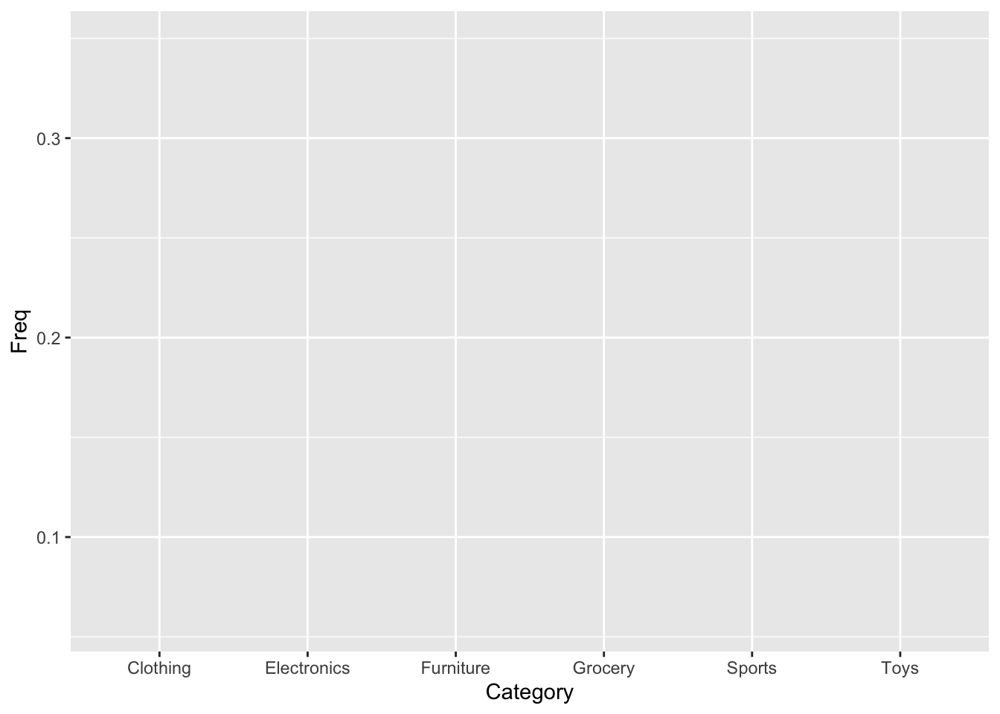
<p class="caption">(\#fig:unnamed-chunk-7)Bar chart (step 1)</p>
</div>

You can see that the coordinate system is empty. This is because so far, we have told R only which variables we would like to plot but we haven't specified which geometric figures (points, bars, lines, etc.) we would like to use. This is done using the ```geom_xxx()``` function (where "xxx" is replaced with the type of figure that you need: geom_line(), geom_boxplot(), etc.) A good overview of the various geom functions can be found <a href="https://github.com/rstudio/cheatsheets/blob/a9d72b61746ceabb94ef247af14b263ab5fbf15f/data-visualization-2.1.pdf" target="_blank">here</a>. In our case, we would like to use a bar chart for which ```geom_col``` is appropriate.


``` r
ggplot(table_plot_rel, aes(x = Category, y = Freq)) +
    geom_col()
```

<div class="figure" style="text-align: center">
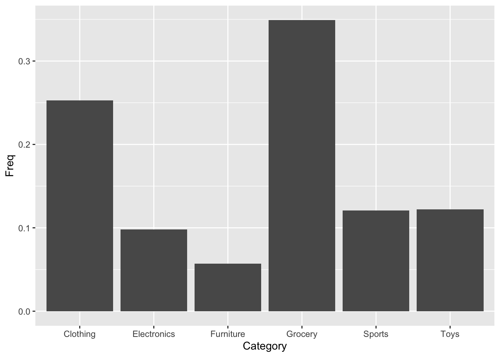
<p class="caption">(\#fig:unnamed-chunk-8)Bar chart (step 2)</p>
</div>

Now we have specified the data (table_plot_rel and specific variables from it - Categories and Freq) and the shape (columns). Specifying this information is essential for plotting data using ggplot. Everything that follows now just serves the purpose of making the plot look nicer by modifying the appearance of the plot. How about some more meaningful axis labels? We can specify the axis labels using the ```ylab()``` and ```xlab()``` functions:


``` r
ggplot(table_plot_rel, aes(x = Category, y = Freq)) +
    geom_col() + ylab("Relative frequency") + xlab("Category")
```

<div class="figure" style="text-align: center">
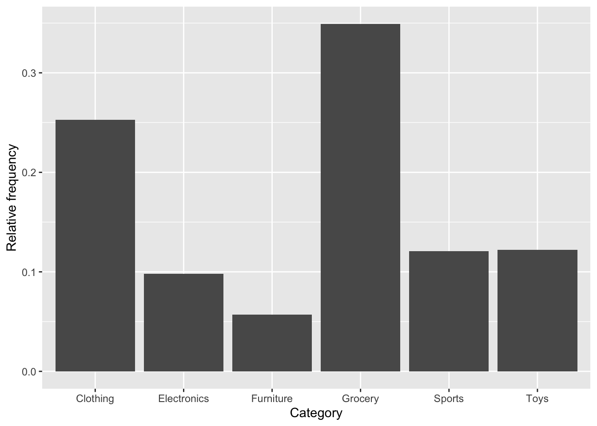
<p class="caption">(\#fig:unnamed-chunk-9)Bar chart (step 3)</p>
</div>

How about adding some value labels to the bars? This can be done using ```geom_text()```. Note that the ```sprintf()``` function is not mandatory and is only added to format the numeric labels here. The function takes two arguments: the first specifies the format wrapped in two ```%``` signs. Thus, ```%.0f``` means to format the value as a fixed point value with no digits after the decimal point, and ```%%``` is a literal that prints a "%" sign. The second argument is simply the numeric value to be used. In this case, the relative frequencies multiplied by 100 to obtain the percentage values. Using the ```vjust = ``` argument, we can adjust the vertical alignment of the label. In this case, we would like to display the label slightly above the bars.  


``` r
ggplot(table_plot_rel, aes(x = Category, y = Freq)) +
    geom_col() + ylab("Relative frequency") + xlab("Category") +
    geom_text(aes(label = sprintf("%.0f%%", Freq *
        100)), vjust = -0.2)
```

<div class="figure" style="text-align: center">

<p class="caption">(\#fig:unnamed-chunk-10)Bar chart (step 4)</p>
</div>

We could go ahead and specify the appearance of every single element of the plot now. However, there are also pre-specified themes that include various formatting steps in one singe function. For example ```theme_minimal()``` would make the plot appear like this: 


``` r
ggplot(table_plot_rel, aes(x = Category, y = Freq)) +
    geom_col() + ylab("Relative frequency") + xlab("Category") +
    geom_text(aes(label = sprintf("%.1f%%", Freq/sum(Freq) *
        100)), vjust = -0.2) + theme_minimal()
```

<div class="figure" style="text-align: center">

<p class="caption">(\#fig:unnamed-chunk-11)Bar chart (step 5)</p>
</div>

In a next step, let's prevent the axis labels from overlapping by rotating the labels.


``` r
ggplot(table_plot_rel, aes(x = Category, y = Freq)) +
    geom_col() + ylab("Relative frequency") + xlab("Category") +
    geom_text(aes(label = sprintf("%.1f%%", Freq/sum(Freq) *
        100)), vjust = -0.2) + theme_minimal() + theme(axis.text.x = element_text(angle = 45,
    vjust = 0.75))
```

<div class="figure" style="text-align: center">
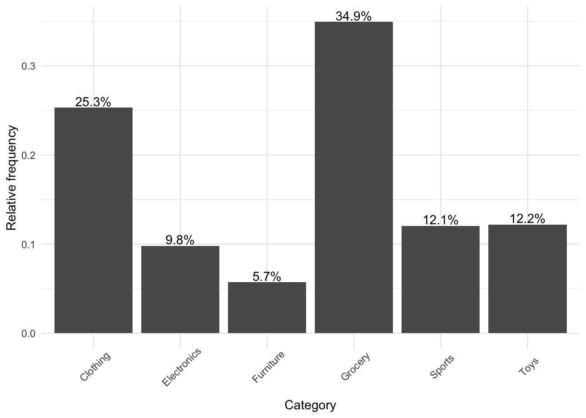
<p class="caption">(\#fig:unnamed-chunk-12)Bar chart (options 1)</p>
</div>

We could also add a title and combine all labels using the `labs` function.  


``` r
ggplot(table_plot_rel, aes(x = Category, y = Freq)) +
    geom_col() + labs(x = "Category", y = "Relative frequency",
    title = "Purchases by category") + geom_text(aes(label = sprintf("%.1f%%",
    Freq/sum(Freq) * 100)), vjust = -0.2) + theme_minimal() +
    theme(axis.text.x = element_text(angle = 45, vjust = 0.75),
        plot.title = element_text(hjust = 0.5, color = "#666666"))
```

<div class="figure" style="text-align: center">
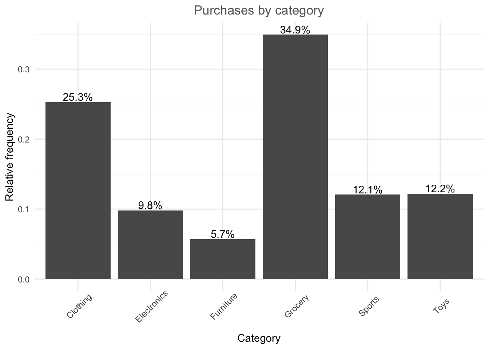
<p class="caption">(\#fig:unnamed-chunk-13)Bar chart (options 1)</p>
</div>

We could also add some color to the bars using the `colorspace` library, which comes with a range of <a href="https://colorspace.r-forge.r-project.org/articles/ggplot2_color_scales.html" target="_blank">color palettes</a>. For example the shading of the bar could reflect the frequency:


``` r
library(colorspace)
ggplot(table_plot_rel, aes(x = Category, y = Freq)) +
    geom_col(aes(fill = Freq)) + labs(x = "Category",
    y = "Relative frequency", title = "Purchases by category") +
    geom_text(aes(label = sprintf("%.1f%%", Freq/sum(Freq) *
        100)), vjust = -0.2) + theme_minimal() + ylim(0,
    0.5) + scale_fill_continuous_sequential(palette = "Blues") +
    theme(axis.text.x = element_text(angle = 45, vjust = 0.75),
        plot.title = element_text(hjust = 0.5, color = "#666666"),
        legend.title = element_blank())
```

<div class="figure" style="text-align: center">
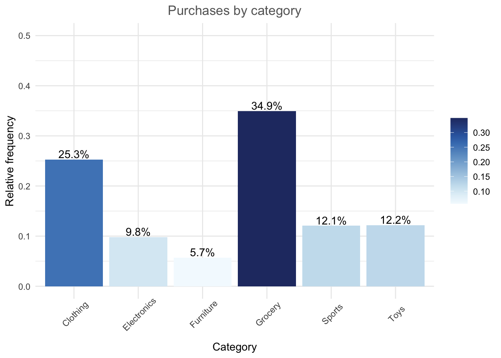
<p class="caption">(\#fig:unnamed-chunk-14)Bar chart (options 1)</p>
</div>

Finally, we can reorder the bars by size using `fct_reorder`. The first argument to the function is the `factor` we want to reorder (genre) and the second the variable by which we want to order it (frequency):


``` r
ggplot(table_plot_rel, aes(x = Category, y = Freq)) +
    geom_col(aes(x = fct_reorder(Category, Freq), fill = Freq)) +
    labs(x = "Category", y = "Relative frequency",
        title = "Purchases by category") + geom_text(aes(label = sprintf("%.1f%%",
    Freq/sum(Freq) * 100)), vjust = -0.2) + theme_minimal() +
    ylim(0, 0.5) + scale_fill_continuous_sequential(palette = "Blues") +
    theme(axis.text.x = element_text(angle = 45, vjust = 0.75),
        plot.title = element_text(hjust = 0.5, color = "#666666"),
        legend.title = element_blank())
```

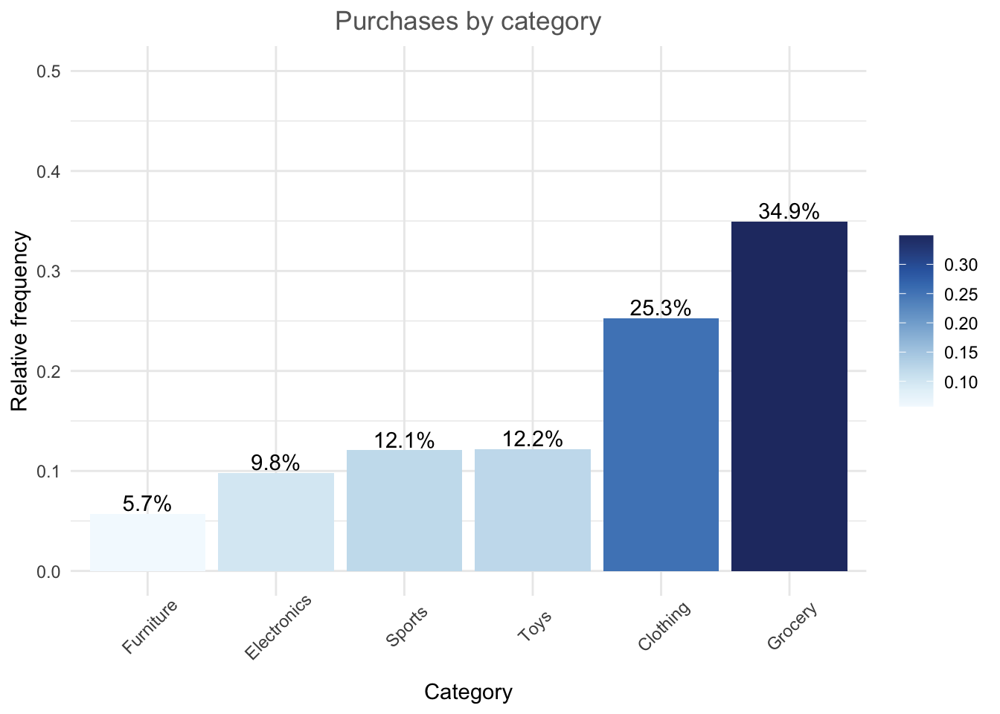


::: {.infobox_orange .hint data-latex="{hint}"}
The default theme in `ggplot` is ```theme_classic()```. For even more options, check out the ```ggthemes``` package, which includes formats for specific publications. You can check out the different themes <a href="https://cran.r-project.org/web/packages/ggthemes/vignettes/ggthemes.html" target="_blank">here</a>. For example ```theme_economist()``` uses the formatting of the journal "The Economist". 
There are various similar packages with pre-specified themes, like the <a href="https://github.com/cttobin/ggthemr" target="_blank">`ggthemr`</a> package, the <a href="https://github.com/ricardo-bion/ggtech" target="_blank">`ggtech`</a> package, the <a href="https://github.com/johnmackintosh/rockthemes" target="_blank">`rockthemes`</a> package, or the <a href="https://github.com/Ryo-N7/tvthemes" target="_blank">`tvthemes`</a> package. 
:::

In a next step, we might want to investigate whether the relative frequencies differ between categories in, for exmple, two selected stores: Store 1 and Store 2. For this purpose we first construct the conditional relative frequency table from the previous chapter again. Recall that the latter gives us the relative frequency within a group (in our case genres), as compared to the relative frequency within the entire sample.


``` r
store_1_store_2 <- sales_data %>%
    filter(Store %in% c("Store 1", "Store 2")) %>%
    mutate(Store = factor(Store))
table(select(store_1_store_2, Category, Store))
```

```
##              Store
## Category      Store 1 Store 2
##   Clothing        130     140
##   Electronics      44      42
##   Furniture        27      29
##   Grocery         170     180
##   Sports           55      62
##   Toys             68      61
```

``` r
table_plot_cond_rel <- as.data.frame(prop.table(table(select(store_1_store_2,
    Category, Store)), 2))  #conditional relative frequencies
table_plot_cond_rel
```

<div data-pagedtable="false">
  <script data-pagedtable-source type="application/json">
{"columns":[{"label":["Category"],"name":[1],"type":["fct"],"align":["left"]},{"label":["Store"],"name":[2],"type":["fct"],"align":["left"]},{"label":["Freq"],"name":[3],"type":["dbl"],"align":["right"]}],"data":[{"1":"Clothing","2":"Store 1","3":"0.26315789"},{"1":"Electronics","2":"Store 1","3":"0.08906883"},{"1":"Furniture","2":"Store 1","3":"0.05465587"},{"1":"Grocery","2":"Store 1","3":"0.34412955"},{"1":"Sports","2":"Store 1","3":"0.11133603"},{"1":"Toys","2":"Store 1","3":"0.13765182"},{"1":"Clothing","2":"Store 2","3":"0.27237354"},{"1":"Electronics","2":"Store 2","3":"0.08171206"},{"1":"Furniture","2":"Store 2","3":"0.05642023"},{"1":"Grocery","2":"Store 2","3":"0.35019455"},{"1":"Sports","2":"Store 2","3":"0.12062257"},{"1":"Toys","2":"Store 2","3":"0.11867704"}],"options":{"columns":{"min":{},"max":[10]},"rows":{"min":[10],"max":[10]},"pages":{}}}
  </script>
</div>
We can now take these tables to construct plots grouped by explicitness. To achieve this we simply need to add the `facet_wrap()` function, which replicates a plot multiple times, split by a specified grouping factor. Note that the grouping factor has to be supplied in R’s formula notation, hence it is preceded by a “~” symbol.


``` r
ggplot(table_plot_cond_rel, aes(x = fct_reorder(Category,
    Freq), y = Freq)) + geom_col(aes(fill = Freq)) +
    facet_wrap(~Store) + labs(x = "", y = "Relative frequency",
    title = "Distribution of categories for Store 1 and Store 2") +
    geom_text(aes(label = sprintf("%.0f%%", Freq *
        100)), vjust = -0.2) + theme_minimal() + ylim(0,
    1) + scale_fill_continuous_sequential(palette = "Blues") +
    theme(axis.text.x = element_text(angle = 45, vjust = 1.1,
        hjust = 1), plot.title = element_text(hjust = 0.5,
        color = "#666666"), legend.position = "none")
```

<div class="figure" style="text-align: center">
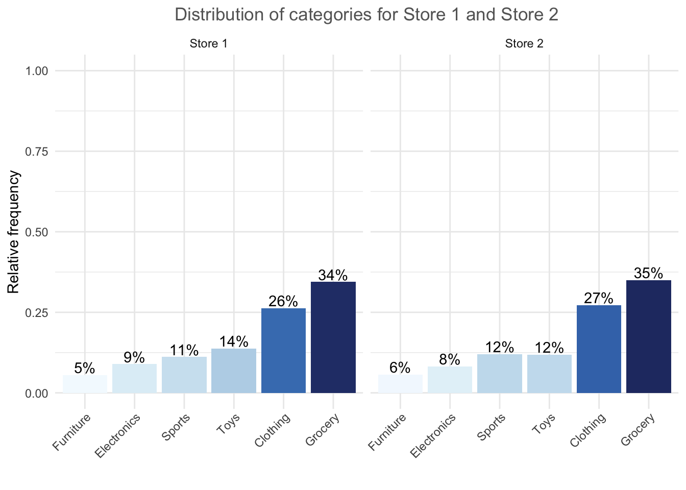
<p class="caption">(\#fig:unnamed-chunk-17)Grouped bar chart (facet_wrap)</p>
</div>


### Continuous variables


#### Histogram

Histograms can be created for continuous data using the ```geom_histogram()``` function. Note that the ```aes()``` function only needs one argument here, since a histogram is a plot of the distribution of only one variable. As an example, let's consider our data set containing the sales data: 


``` r
head(sales_data)
```

<div data-pagedtable="false">
  <script data-pagedtable-source type="application/json">
{"columns":[{"label":["Date"],"name":[1],"type":["date"],"align":["right"]},{"label":["Store"],"name":[2],"type":["fct"],"align":["left"]},{"label":["Category"],"name":[3],"type":["fct"],"align":["left"]},{"label":["Brand"],"name":[4],"type":["fct"],"align":["left"]},{"label":["Sales_Amount"],"name":[5],"type":["dbl"],"align":["right"]},{"label":["Units_Sold"],"name":[6],"type":["int"],"align":["right"]},{"label":["Customer_Age"],"name":[7],"type":["int"],"align":["right"]}],"data":[{"1":"2023-11-30","2":"Store 3","3":"Grocery","4":"Trader Joe's","5":"26.32","6":"17","7":"29"},{"1":"2023-08-04","2":"Store 1","3":"Toys","4":"Mattel","5":"270.08","6":"5","7":"32"},{"1":"2023-02-26","2":"Store 6","3":"Clothing","4":"Puma","5":"372.76","6":"1","7":"31"},{"1":"2023-07-17","2":"Store 7","3":"Electronics","4":"LG","5":"1235.69","6":"3","7":"38"},{"1":"2023-11-03","2":"Store 4","3":"Furniture","4":"West Elm","5":"825.87","6":"1","7":"31"},{"1":"2023-06-03","2":"Store 1","3":"Grocery","4":"Walmart","5":"61.04","6":"9","7":"18"}],"options":{"columns":{"min":{},"max":[10]},"rows":{"min":[10],"max":[10]},"pages":{}}}
  </script>
</div>

Now we can create the histogram using ```geom_histogram()```. The argument ```binwidth``` specifies the range that each bar spans, ```col = "white"``` specifies the border of the bars to be white and ```fill = "lavenderblush3"``` sets the inner color of the bars to lavender color. For brevity, we have now also started naming the x and y axis with the single function ```labs()```, instead of using the two distinct functions ```xlab()``` and ```ylab()```. Let's look at the distribution of streams of R&B songs:


``` r
sales_data |>
    filter(Store == "Store 1") %>%
    ggplot(aes(Sales_Amount)) + geom_histogram(binwidth = 50,
    col = "white", fill = "lavenderblush3") + labs(x = "Amount of sales",
    y = "Frequency", title = "Distribution of sales in Store 1") +
    theme_minimal()
```

<div class="figure" style="text-align: center">
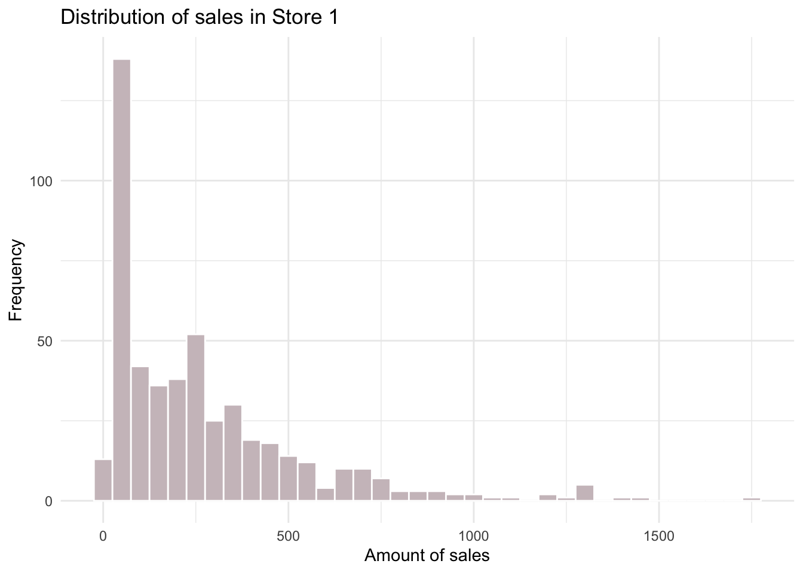
<p class="caption">(\#fig:unnamed-chunk-19)Histogram</p>
</div>

If you would like to highlight certain points of the distribution, you can use the `geom_vline` (short for vertical line) function to do this. For example, we may want to highlight the mean and the median of the distribution.


``` r
sales_data |>
    filter(Store == "Store 1") %>%
    ggplot(aes(Sales_Amount)) + geom_histogram(binwidth = 50,
    col = "white", fill = "lavenderblush3") + labs(x = "Amount of sales",
    y = "Frequency", title = "Distribution of sales in Store 1",
    subtitle = "Red vertical line = mean, green vertical line = median") +
    geom_vline(aes(xintercept = mean(Sales_Amount)),
        color = "red", size = 1) + geom_vline(aes(xintercept = median(Sales_Amount)),
    color = "green", size = 1) + theme_minimal()
```

<div class="figure" style="text-align: center">
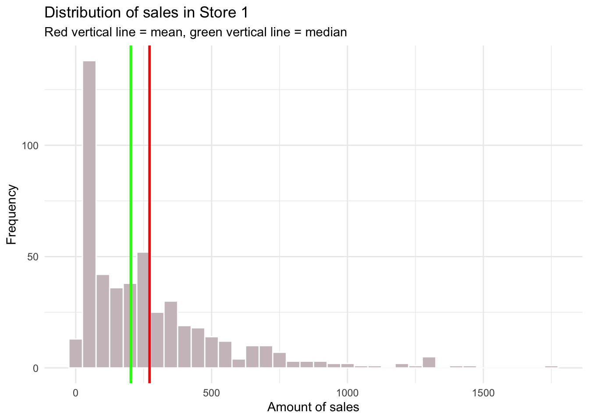
<p class="caption">(\#fig:unnamed-chunk-20)Histogram 2</p>
</div>

In this case, you should indicate what the lines refer to. In the plot above, the 'subtitle' argument was used to add this information to the plot. 

::: {.infobox_orange .hint data-latex="{hint}"}
Note the difference between a bar chart and the histogram. While a bar chart is used to visualize the **frequency of observations** for each category of the selected categorical variable, the histogram shows the **frequency distribution** for continuous variables.    
:::

#### Boxplot

Another common way to display the distribution of continuous variables is through boxplots. ggplot will construct a boxplot if given the geom ```geom_boxplot()```. In our case we might want to show the difference in sales amount between the categories. 


``` r
ggplot(sales_data, aes(x = fct_reorder(Category, Sales_Amount),
    y = Sales_Amount)) + geom_boxplot(coef = 3) + labs(x = "Category",
    y = "Revenue per purchase") + theme_minimal() +
    theme(plot.title = element_text(hjust = 0.5, color = "#666666"),
        legend.position = "none")
```

<div class="figure" style="text-align: center">
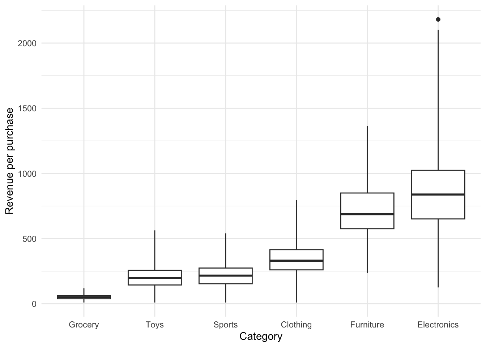
<p class="caption">(\#fig:unnamed-chunk-21)Boxplot by group</p>
</div>
The following graphic shows you how to interpret the boxplot:


It is often meaningful to augment the boxplot with the data points using ```geom_jitter()```. This way, differences in the distribution of the variable between the genres become even more apparent. 


``` r
ggplot(sales_data, aes(x = fct_reorder(Category, Sales_Amount),
    y = Sales_Amount)) + geom_jitter(colour = "red",
    alpha = 0.1) + geom_boxplot(coef = 3, alpha = 0.1) +
    labs(x = "Category", y = "Revenue per purchase") +
    theme_minimal()
```

<div class="figure" style="text-align: center">
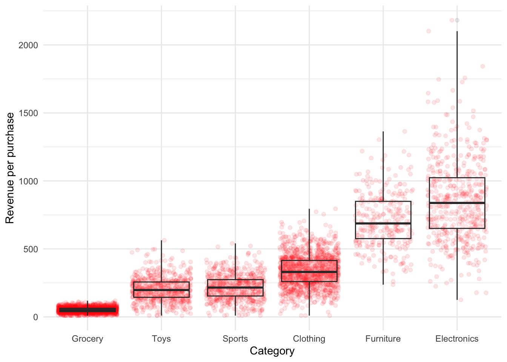
<p class="caption">(\#fig:unnamed-chunk-22)Boxplot by group</p>
</div>

In case you would like to create the boxplot on the total data (i.e., not by group), just leave the ```x = ``` argument within the ```aes()``` function empty: 


``` r
ggplot(sales_data, aes(x = "", y = Sales_Amount)) +
    geom_boxplot(coef = 3, alpha = 0.1) + labs(x = "",
    y = "Revenue per purchase") + theme_minimal()
```

<div class="figure" style="text-align: center">
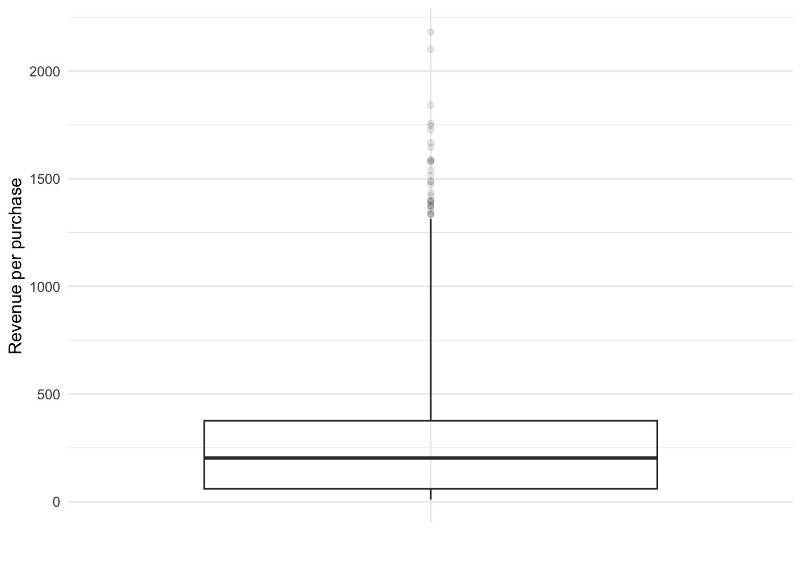
<p class="caption">(\#fig:unnamed-chunk-23)Single Boxplot</p>
</div>


#### Plot of means

Another way to get an overview of the difference between two groups is to plot their respective means with confidence intervals. The mean and confidence intervals will enter the plot separately, using the geoms ```geom_bar()``` and ```geom_errorbar()```. Don't worry if you don't know exactly how to interpret the confidence interval at this stage - we will cover this topic in the next chapter. Let's assume we would like to plot the difference in sales amounts between the Groceries and all other categories. For this, we first need to create a dummy variable (i.e., a categorical variable with two levels) that indicates if a purchase is from the Groceries category or from any of the other categories. We can use the `ifelse()` function to do this, which takes 3 arguments, namely 1) the if-statement, 2) the returned value if this if-statement is true, and 3) the value if the if-statement is not true.   


``` r
sales_data$category_dummy <- as.factor(ifelse(sales_data$Category ==
    "Electronics", "Electronics", "other"))
```

To make plotting the desired comparison easier, we can compute all relevant statistics first, using the ```summarySE()``` function from the `Rmisc` package.  


``` r
library(Rmisc)
mean_data <- summarySE(sales_data, measurevar = "Sales_Amount",
    groupvars = c("category_dummy"))
mean_data
```

<div data-pagedtable="false">
  <script data-pagedtable-source type="application/json">
{"columns":[{"label":["category_dummy"],"name":[1],"type":["fct"],"align":["left"]},{"label":["N"],"name":[2],"type":["dbl"],"align":["right"]},{"label":["Sales_Amount"],"name":[3],"type":["dbl"],"align":["right"]},{"label":["sd"],"name":[4],"type":["dbl"],"align":["right"]},{"label":["se"],"name":[5],"type":["dbl"],"align":["right"]},{"label":["ci"],"name":[6],"type":["dbl"],"align":["right"]}],"data":[{"1":"Electronics","2":"490","3":"854.8122","4":"300.0149","5":"13.553291","6":"26.629872"},{"1":"other","2":"4510","3":"216.7648","4":"197.7309","5":"2.944329","6":"5.772328"}],"options":{"columns":{"min":{},"max":[10]},"rows":{"min":[10],"max":[10]},"pages":{}}}
  </script>
</div>

The output tells you how many observations there are per group, the mean number of sales amount per group, as well as the group-specific standard deviation, the standard error, and the confidence interval (more on this in the next chapter). You can now create the plot as follows:


``` r
ggplot(mean_data, aes(x = category_dummy, y = Sales_Amount)) +
    geom_bar(position = position_dodge(0.9), colour = "white",
        fill = "lavenderblush3", stat = "identity",
        width = 0.65) + geom_errorbar(position = position_dodge(0.9),
    width = 0.15, aes(ymin = Sales_Amount - ci, ymax = Sales_Amount +
        ci)) + labs(x = "Category", y = "Average amount of sales",
    title = "Average amount of sales by category") +
    theme_minimal() + theme(plot.title = element_text(hjust = 0.5,
    color = "#666666"))
```

<div class="figure" style="text-align: center">
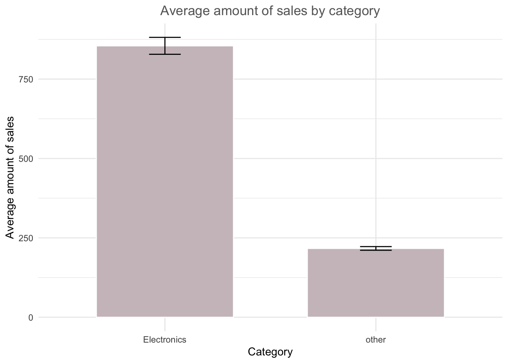
<p class="caption">(\#fig:unnamed-chunk-26)Plot of means</p>
</div>

As can be seen, there is a large difference between the categories with respect to the average amount of sales. 


#### Grouped plot of means

We might also be interested to investigate a second factor. Say, we would like to find out if there is a difference between categories with respect to the store (i.e., whether the purchase vas made in Store 1 or Store 2). Can we find evidence that products from electronics category sell better in one store than in another. We can compute the statistics using the ```summarySE()``` function by simply adding the second variable (Store) to the 'groupvars' argument.  


``` r
mean_data2 <- sales_data %>%
    filter(Store %in% c("Store 1", "Store 2")) %>%
    mutate(Store = factor(Store))
mean_data2 <- summarySE(mean_data2, measurevar = "Sales_Amount",
    groupvars = c("category_dummy", "Store"))
mean_data2
```

<div data-pagedtable="false">
  <script data-pagedtable-source type="application/json">
{"columns":[{"label":["category_dummy"],"name":[1],"type":["fct"],"align":["left"]},{"label":["Store"],"name":[2],"type":["fct"],"align":["left"]},{"label":["N"],"name":[3],"type":["dbl"],"align":["right"]},{"label":["Sales_Amount"],"name":[4],"type":["dbl"],"align":["right"]},{"label":["sd"],"name":[5],"type":["dbl"],"align":["right"]},{"label":["se"],"name":[6],"type":["dbl"],"align":["right"]},{"label":["ci"],"name":[7],"type":["dbl"],"align":["right"]}],"data":[{"1":"Electronics","2":"Store 1","3":"44","4":"854.8859","5":"338.5617","6":"51.040098","7":"102.93217"},{"1":"Electronics","2":"Store 2","3":"42","4":"881.1724","5":"315.5578","6":"48.691625","7":"98.33473"},{"1":"other","2":"Store 1","3":"450","4":"214.6190","5":"185.9798","6":"8.767174","7":"17.22979"},{"1":"other","2":"Store 2","3":"472","4":"215.7474","5":"195.2139","6":"8.985447","7":"17.65652"}],"options":{"columns":{"min":{},"max":[10]},"rows":{"min":[10],"max":[10]},"pages":{}}}
  </script>
</div>

Now we obtained the results for four different groups (2 categories x 2 stores) and we can amend the plot easily by adding the 'fill' argument to the ```ggplot()``` function. The ```scale_fill_manual()``` function is optional and specifies the color of the bars manually. 


``` r
ggplot(mean_data2, aes(x = category_dummy, y = Sales_Amount,
    fill = Store)) + geom_bar(position = position_dodge(0.9),
    colour = "white", stat = "identity") + geom_errorbar(position = position_dodge(0.9),
    width = 0.2, aes(ymin = Sales_Amount - ci, ymax = Sales_Amount +
        ci)) + scale_fill_manual(values = c("lavenderblush3",
    "grey90")) + labs(x = "Category", y = "Average amount of sales",
    title = "Average amount of sales by category and store") +
    theme_minimal() + theme(plot.title = element_text(hjust = 0.5,
    color = "#666666"))
```

<div class="figure" style="text-align: center">
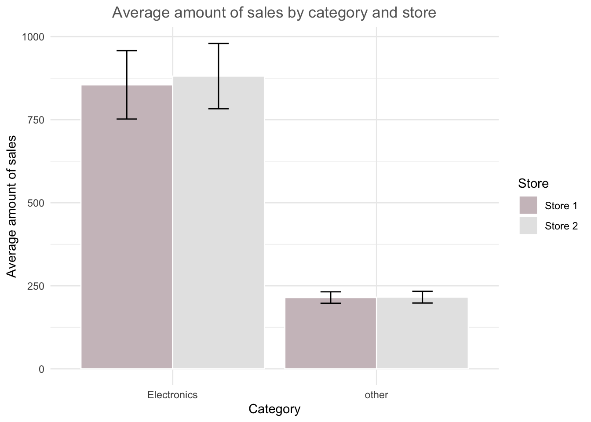
<p class="caption">(\#fig:unnamed-chunk-28)Grouped plot of means</p>
</div>
The results of the analysis show that also in the there is no big difference between sales of electronic products in two stores.

#### Scatter plot

The most common way to show the **relationship** between two continuous variables is a scatterplot. As an example, let's investigate if there is an association between the sales amount and the customer age. The following code creates a scatterplot with some additional components. The ```geom_smooth()``` function creates a smoothed line from the data provided. In this particular example we tell the function to draw the best possible straight line (i.e., minimizing the distance between the line and the points) through the data (via the argument ```method = "lm"```). Note that the "shape = 1" argument passed to the ```geom_point()``` function produces hollow circles (instead of solid) and the "fill" and "alpha" arguments passed to the ```geom_smooth()``` function specify the color and the opacity of the confidence interval, respectively. 


``` r
ggplot(sales_data, aes(Sales_Amount, Customer_Age)) +
    geom_point(shape = 1) + labs(x = "Genre", y = "Relative frequency") +
    geom_smooth(method = "lm", fill = "blue", alpha = 0.1) +
    labs(x = "Amount spent", y = "Customer age", title = "Scatterplot of amount spent and customer age") +
    theme_minimal() + theme(plot.title = element_text(hjust = 0.5,
    color = "#666666"))
```

<div class="figure" style="text-align: center">
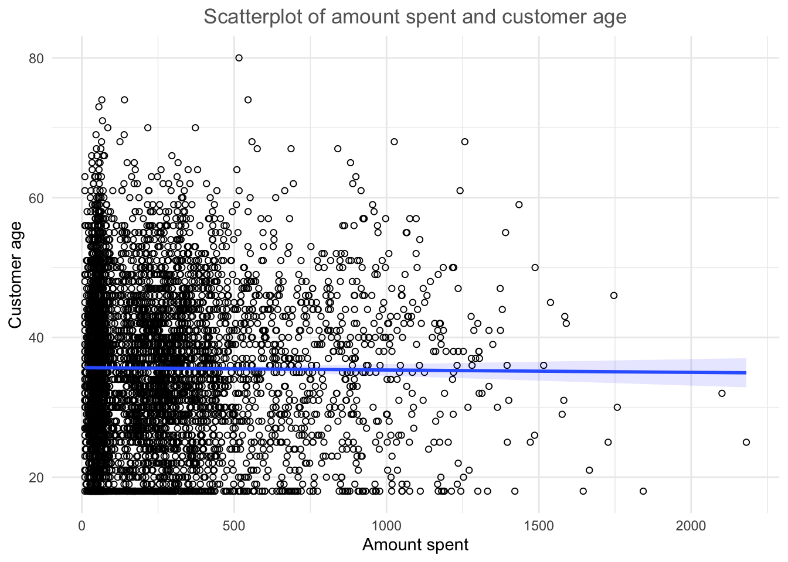
<p class="caption">(\#fig:unnamed-chunk-29)Scatter plot</p>
</div>
As you can see, there appears to not be any strong relationship between sales amount and customer age.

##### Grouped scatter plot

It could be that customers of different ages shop differently by category. We can visually capture such differences with a grouped scatter plot. By adding the argument ```colour = Category``` to the aesthetic specification, ggplot automatically treats the categories as distinct groups and plots accordingly. 


``` r
ggplot(sales_data, aes(Sales_Amount, Customer_Age,
    colour = Category)) + geom_point(shape = 1) + geom_smooth(method = "lm",
    alpha = 0.1) + labs(x = "Revenue per purchase",
    y = "Age", title = "Scatterplot of revenue and age by product category",
    colour = "Category") + scale_color_manual(values = c("lightblue",
    "darkblue", "lavenderblush3", "red3", "green4",
    "gold2")) + theme_minimal() + theme(plot.title = element_text(hjust = 0.5,
    color = "#666666"))
```

<div class="figure" style="text-align: center">
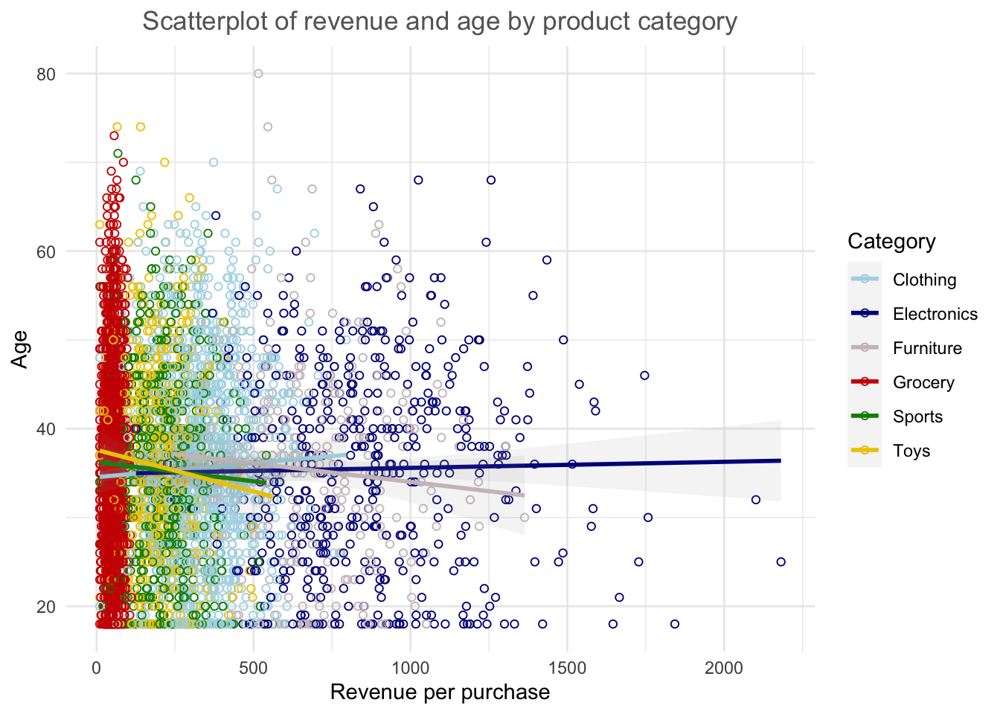
<p class="caption">(\#fig:unnamed-chunk-30)Grouped scatter plot</p>
</div>

It appears from the plot that there is a reverse association between sales amount and customer age in, for example, toys category. 


#### Line plot

Another important type of plot is the line plot used if, for example, you have a variable that changes over time and you want to plot how it develops over time. To demonstrate this we will investigate the same data set but focus on sales amount over time. Let's start with subsetting the data from only one category, for example, Clothing.


``` r
sales_data_clothing <- filter(sales_data, Category ==
    "Clothing")
```

Given the correct ```aes()``` and geom specification ggplot constructs the correct plot for us. In order to make large numbers more readable we use the `label_comma` function from the `scales` package in the `scale_y_continuous` layer. 


``` r
sales_data_clothing %>%
    group_by(Date) %>%
    dplyr::summarize(total_sales = sum(Sales_Amount)) %>%
    ggplot(., aes(x = Date, y = total_sales)) + geom_line(color = "lavenderblush4") +
    labs(x = "", y = "Total sales of clothing (EUR)",
        title = "Daily revenues in clothing category") +
    theme_minimal() + scale_y_continuous(labels = scales::label_comma()) +
    theme(plot.title = element_text(hjust = 0.5, color = "#666666"))
```

<div class="figure" style="text-align: center">
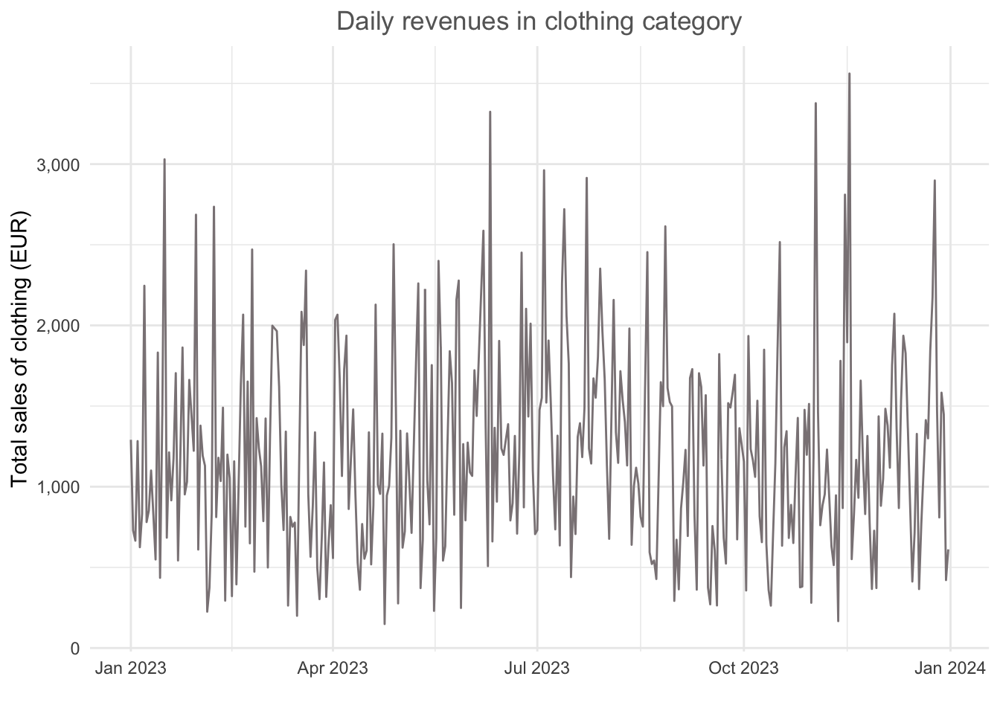
<p class="caption">(\#fig:unnamed-chunk-32)Line plot</p>
</div>

For better readability, we can aggregate the data by weeks (i.e., obtain total weekly sales) instead of days:


``` r
library(lubridate)
sales_clothing_weekly <- sales_data_clothing %>%
    mutate(Week = floor_date(Date, "week")) %>%
    filter(Week < max(Week)) %>%
    group_by(Week) %>%
    dplyr::summarise(Weekly_Sales = sum(Sales_Amount))

ggplot(sales_clothing_weekly, aes(x = Week, y = Weekly_Sales)) +
    geom_line(color = "lavenderblush4") + theme_minimal() +
    labs(x = "Week", y = "Total sales of clothing (EUR)",
        title = "Weekly revenues in clothing category") +
    scale_x_date(date_labels = "%b %d", date_breaks = "1 month") +
    theme(axis.text.x = element_text(angle = 45, vjust = 1.1,
        hjust = 1), plot.title = element_text(hjust = 0.5,
        color = "#666666"))
```

<div class="figure" style="text-align: center">
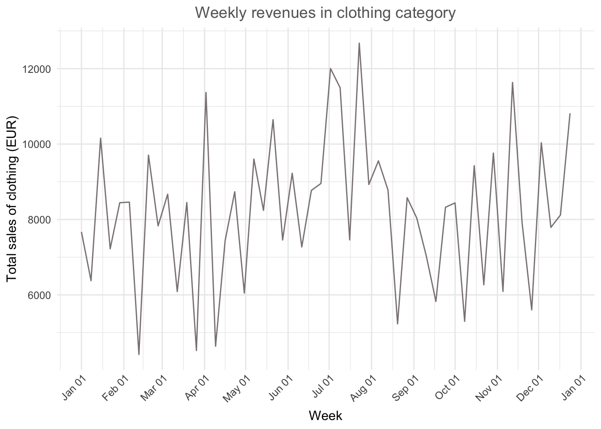
<p class="caption">(\#fig:unnamed-chunk-33)Line plot (weekly)</p>
</div>

We can now include the other specified countries in the plot by using the 'color' argument. 


``` r
sales_data_compare <- filter(sales_data, Category %in%
    c("Clothing", "Electronics", "Toys"))
sales_data_compare <- sales_data_compare %>%
    dplyr::mutate(Month = lubridate::floor_date(Date,
        "month")) %>%
    group_by(Month, Category) %>%
    dplyr::summarise(Monthly_Sales = sum(Sales_Amount))

ggplot(sales_data_compare, aes(x = Month, y = Monthly_Sales,
    color = Category)) + geom_line() + labs(x = "Month",
    y = "Sales", title = "Monthly sales by category") +
    theme_minimal() + theme(plot.title = element_text(hjust = 0.5,
    color = "#666666")) + scale_y_continuous(labels = scales::label_comma()) +
    scale_color_manual(values = c("lightblue", "red3",
        "green4")) + theme(axis.text.x = element_text(angle = 45,
    vjust = 1.1, hjust = 1), plot.title = element_text(hjust = 0.5,
    color = "#666666"))
```

<div class="figure" style="text-align: center">
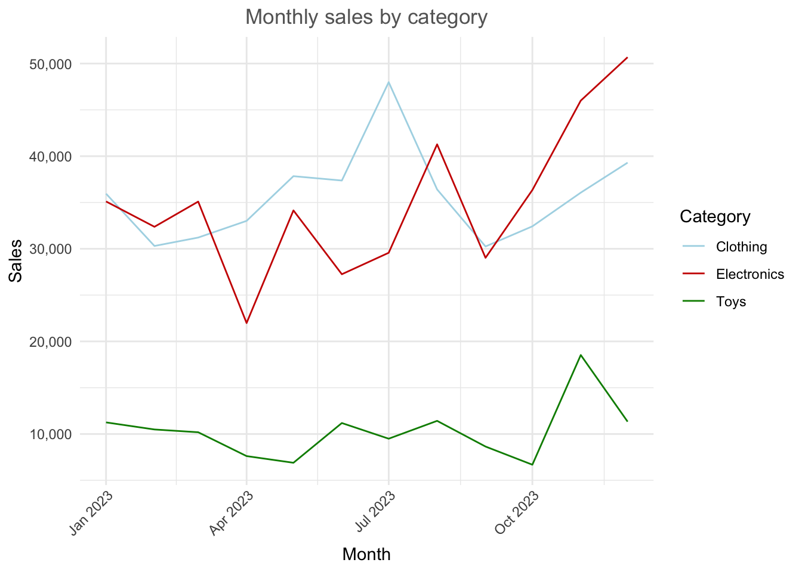
<p class="caption">(\#fig:unnamed-chunk-34)Line plot (by category)</p>
</div>
One issue in plot like this can be that the scales between categories are different (i.e., in clothing category, there are more purchases that eventually sum up to higher monthly revenues). You could also use the ```facet_wrap()``` function to create one individual plot by category and specify 'scales = "free_y"' so that each individual plot has its own scale on the y-axis. 


``` r
ggplot(sales_data_compare, aes(x = Month, y = Monthly_Sales)) +
    geom_line(color = "lavenderblush4") + labs(x = "Month",
    y = "Sales", title = "Monthly sales by category") +
    facet_wrap(~Category, scales = "free_y") + theme_minimal() +
    theme(plot.title = element_text(hjust = 0.5, color = "#666666")) +
    scale_y_continuous(labels = scales::label_comma()) +
    scale_color_manual(values = c("lightblue", "red3",
        "green4")) + theme(axis.text.x = element_text(angle = 45,
    vjust = 1.1, hjust = 1), plot.title = element_text(hjust = 0.5,
    color = "#666666"))
```

<div class="figure" style="text-align: center">
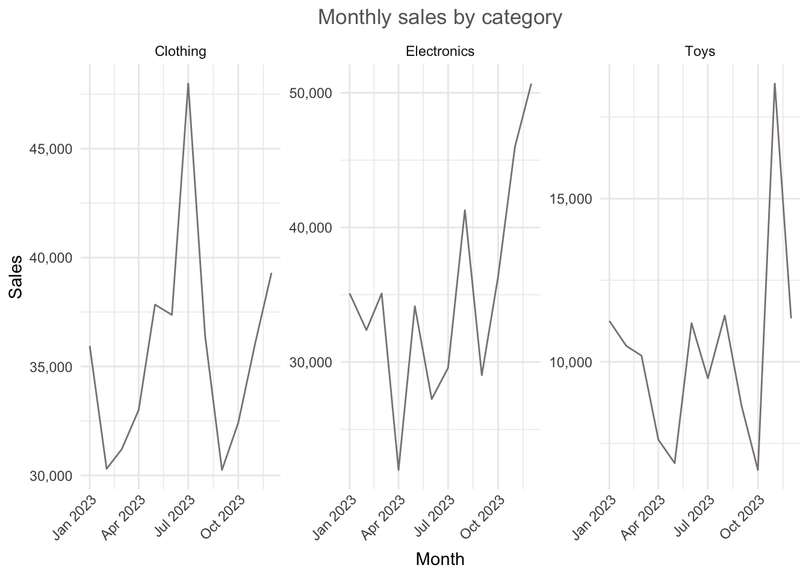
<p class="caption">(\#fig:unnamed-chunk-35)Line plot (facet wrap)</p>
</div>
Now it's easier to see that the trends are different between categories, specifically, notice the seasonality that is typical for products from the respective product groups. 


### Saving plots on your device

To save the last displayed plot, simply use the function ```ggsave()```, and it will save the plot to your working directory. Use the arguments ```height```and ```width``` to specify the size of the file. You may also choose the file format by adjusting the ending of the file name. E.g., ```file_name.jpg``` will create a file in JPG-format, whereas ```file_name.png``` saves the file in PNG-format, etc.. 


``` r
ggsave("test_plot.jpg", height = 5, width = 8.5)
```


### ggplot extensions


As the ggplot2 package became more and more popular over the past years, more and more extensions have been developed by users that can be used for specific purposes that are not yet covered by the standard functionality of ggplot2. You can find a list of the extensions <a href="https://exts.ggplot2.tidyverse.org/gallery/" target="_blank">here</a>. Below, you can find some example for the additional options.  

#### Results of statistical tests (ggstatsplot)

You may use the <a href="https://indrajeetpatil.github.io/ggstatsplot/index.html" target="_blank">ggstatplot</a> package to augment your plots with the results from statistical tests, such as an ANOVA. You can find a presentation about the capabilities of this package <a href="https://indrajeetpatil.github.io/ggstatsplot_slides/slides/ggstatsplot_presentation.html#1" target="_blank">here</a>. The boxplot below shows an example. 


``` r
library(ggstatsplot)
sales_data_anova <- filter(sales_data, Category %in% c("Clothing", "Electronics","Toys","Furniture"))
ggbetweenstats(
   data = sales_data_anova,
   title = "Sales by category", # title for the plot
   plot.type = "box",
   x = Category, # 4 groups
   y = Sales_Amount,
   type = "p", # default
   messages = FALSE,
   bf.message = FALSE,
   pairwise.comparisons = TRUE # display results from pairwise comparisons
 )
```

<div class="figure" style="text-align: center">
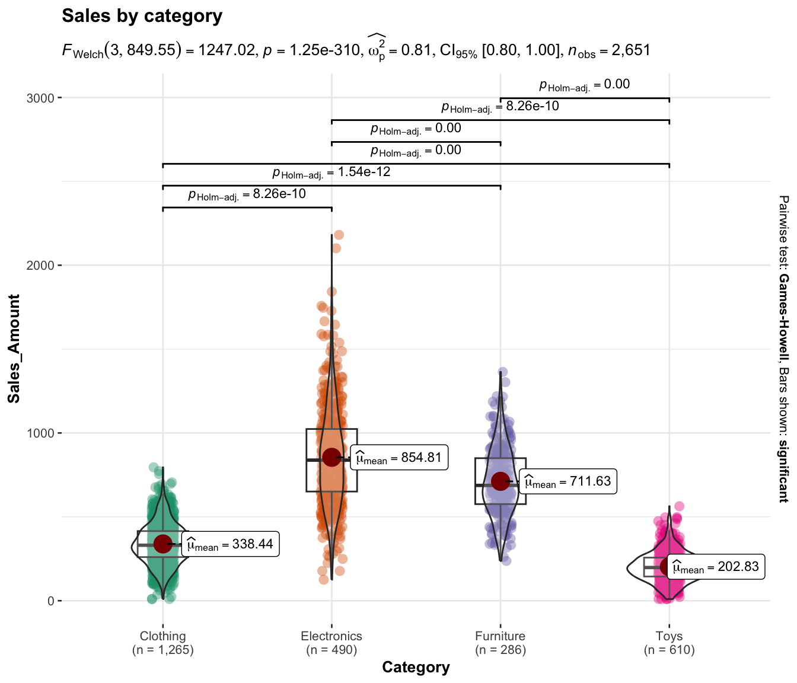
<p class="caption">(\#fig:unnamed-chunk-37)Boxplot using ggstatsplot package</p>
</div>


## Learning check {-}

**(LC2.1) For which data types is it meaningful to compute the mean?**

- [ ] Nominal
- [ ] Ordinal
- [X] Interval
- [X] Ratio

**(LC2.2) How can you compute the standardized variate of a variable X?**

- [X] $Z=\frac{X_i-\bar{X}}{s}$
- [ ] $Z=\frac{\bar{X}+X_i}{s}$
- [ ] $Z=\frac{s}{\bar{X}+X_i}$
- [ ] $Z=s*({\bar{X}+X_i)}$
- [ ] None of the above 	

**You wish to analyze the following data frame 'df' containing information about cars**

<div data-pagedtable="false">
  <script data-pagedtable-source type="application/json">
{"columns":[{"label":["mpg"],"name":[1],"type":["dbl"],"align":["right"]},{"label":["cyl"],"name":[2],"type":["dbl"],"align":["right"]},{"label":["disp"],"name":[3],"type":["dbl"],"align":["right"]},{"label":["hp"],"name":[4],"type":["dbl"],"align":["right"]},{"label":["drat"],"name":[5],"type":["dbl"],"align":["right"]},{"label":["wt"],"name":[6],"type":["dbl"],"align":["right"]},{"label":["qsec"],"name":[7],"type":["dbl"],"align":["right"]},{"label":["vs"],"name":[8],"type":["dbl"],"align":["right"]},{"label":["am"],"name":[9],"type":["dbl"],"align":["right"]},{"label":["gear"],"name":[10],"type":["dbl"],"align":["right"]},{"label":["carb"],"name":[11],"type":["dbl"],"align":["right"]}],"data":[{"1":"21.0","2":"6","3":"160","4":"110","5":"3.90","6":"2.620","7":"16.46","8":"0","9":"1","10":"4","11":"4"},{"1":"21.0","2":"6","3":"160","4":"110","5":"3.90","6":"2.875","7":"17.02","8":"0","9":"1","10":"4","11":"4"},{"1":"22.8","2":"4","3":"108","4":"93","5":"3.85","6":"2.320","7":"18.61","8":"1","9":"1","10":"4","11":"1"},{"1":"21.4","2":"6","3":"258","4":"110","5":"3.08","6":"3.215","7":"19.44","8":"1","9":"0","10":"3","11":"1"},{"1":"18.7","2":"8","3":"360","4":"175","5":"3.15","6":"3.440","7":"17.02","8":"0","9":"0","10":"3","11":"2"},{"1":"18.1","2":"6","3":"225","4":"105","5":"2.76","6":"3.460","7":"20.22","8":"1","9":"0","10":"3","11":"1"}],"options":{"columns":{"min":{},"max":[10]},"rows":{"min":[10],"max":[10]},"pages":{}}}
  </script>
</div>

**(LC2.3) How could you add a new variable containing the z-scores of the variable 'mpg' in R?**

- [ ] `df$mpg_std <- zscore(df$mpg)`
- [ ] `df$mpg_std <- stdv(df$mpg)`
- [ ] `df$mpg_std <- std.scale(df$mpg)`
- [X] `df$mpg_std <- scale(df$mpg)`
- [ ] None of the above 	

**(LC2.4) How could you produce the below output?**

<div data-pagedtable="false">
  <script data-pagedtable-source type="application/json">
{"columns":[{"label":["vars"],"name":[1],"type":["int"],"align":["right"]},{"label":["n"],"name":[2],"type":["dbl"],"align":["right"]},{"label":["mean"],"name":[3],"type":["dbl"],"align":["right"]},{"label":["sd"],"name":[4],"type":["dbl"],"align":["right"]},{"label":["median"],"name":[5],"type":["dbl"],"align":["right"]},{"label":["trimmed"],"name":[6],"type":["dbl"],"align":["right"]},{"label":["mad"],"name":[7],"type":["dbl"],"align":["right"]},{"label":["min"],"name":[8],"type":["dbl"],"align":["right"]},{"label":["max"],"name":[9],"type":["dbl"],"align":["right"]},{"label":["range"],"name":[10],"type":["dbl"],"align":["right"]},{"label":["skew"],"name":[11],"type":["dbl"],"align":["right"]},{"label":["kurtosis"],"name":[12],"type":["dbl"],"align":["right"]},{"label":["se"],"name":[13],"type":["dbl"],"align":["right"]}],"data":[{"1":"1","2":"32","3":"146.68750","4":"68.562868","5":"123.00","6":"141.19231","7":"77.095200","8":"52.0","9":"335.0","10":"283.0","11":"0.7260237","12":"-0.1355511","13":"12.1203173"},{"1":"2","2":"32","3":"20.09062","4":"6.026948","5":"19.20","6":"19.69615","7":"5.411490","8":"10.4","9":"33.9","10":"23.5","11":"0.6106550","12":"-0.3727660","13":"1.0654240"},{"1":"3","2":"32","3":"17.84875","4":"1.786943","5":"17.71","6":"17.82769","7":"1.415883","8":"14.5","9":"22.9","10":"8.4","11":"0.3690453","12":"0.3351142","13":"0.3158899"}],"options":{"columns":{"min":{},"max":[10]},"rows":{"min":[10],"max":[10]},"pages":{}}}
  </script>
</div>

- [X] `describe(select(mtcars, hp, mpg, qsec))`
- [ ] `summary(select(mtcars, hp, mpg, qsec))`
- [ ] `table(select(mtcars, hp, mpg, qsec))`
- [ ] `str(select(mtcars, hp, mpg, qsec))`
- [ ] None of the above 	

**(LC2.5) The last column "carb" indicates the number of carburetors each model has. By using a function we got to know the number of car models that have a certain number carburetors. Which function helped us to obtain this information?** 


```
## 
##  1  2  3  4  6  8 
##  7 10  3 10  1  1
```

- [ ] `describe(mtcars$carb)`
- [X] `table(mtcars$carb)`
- [ ] `str(mtcars$carb)`
- [ ] `prop.table(mtcars$carb)`
- [ ] None of the above 	

**(LC2.6) What type of data can be meaningfully depicted in a scatter plot?**

- [ ] Two categorical variables
- [ ] One categorical and one continuous variable
- [X] Two continuous variables
- [ ] One continuous variable
- [ ] None of the above 	

**(LC2.7) Which statement about the graph below is true?** 

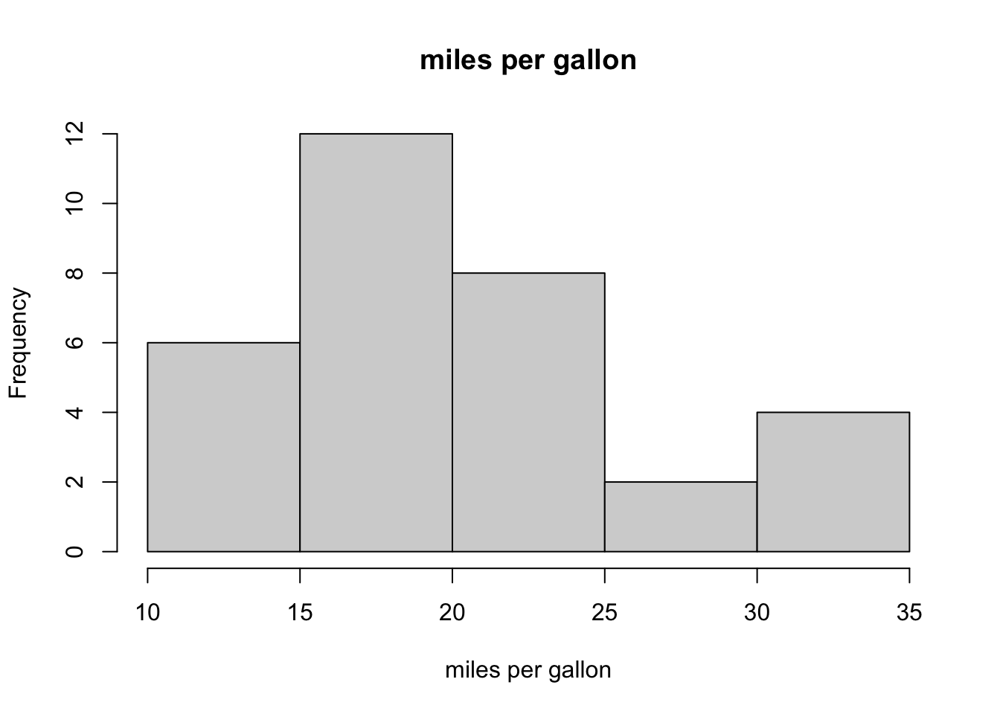

- [ ] This is a bar chart
- [X] This is a histogram
- [X] It shows the frequency distribution of a continuous variable
- [ ] It shows the frequency distribution of a categorical variable
- [ ] None of the above 	

**(LC2.8) Which statement about the graph below is true?** 

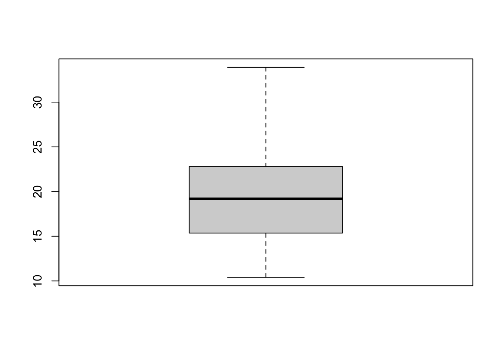

- [ ] This is a bar chart
- [X] 50% of observations are contained in the gray area
- [ ] The horizontal black line indicates the mean
- [X] This is a boxplot
- [ ] None of the above 	

**(LC2.9) Which function can help you to save a graph made with `ggplot()`?** 

- [X] `ggsave()`
- [ ] `write.plot()`
- [ ] `save.plot()`
- [ ] `export.plot()`

**(LC2.10) For a variable that follows a normal distribution, within how many standard deviations of the mean are 95% of values?**

- [ ] 1.645
- [X] 1.960
- [ ] 2.580
- [ ] 3.210
- [ ] None of the above 	
	

## References {-}

* Field, A., Miles J., & Field, Z. (2012). Discovering Statistics Using R. Sage Publications.
* Chang, W. (2020). R Graphics Cookbook, 2nd edition (https://r-graphics.org/)
* Grolemund, G. & Wickham, H. (2020). R for Data Science (https://r4ds.had.co.nz/)


