# Statistical inference


This chapter will provide you with a basic intuition on statistical inference. As marketing researchers we are usually faced with "imperfect" data in the sense that we cannot collect **all** the data we would like. Imagine you are interested in the average amount of time WU students spend listening to music every month. Ideally, we could force all WU students to fill out our survey. Realistically we will only be able to observe a small fraction of students (maybe 500 out of the $25.000+$). With the data from this small fraction at hand, we want to make an inference about the true average listening time of all WU students. We are going to start with the assumption that we know everything. That is, we first assume that we know all WU students' listening times and analyze the distribution of the listening time in the entire population. Subsequently, we are going to look at the uncertainty that is introduced by only knowing some of the students' listening times (i.e., a sample from the population) and how that influences our analysis.

## If we knew it all 


Assume there are $25,000$ students at WU and every single one has kindly provided us with the hours they listened to music in the past month. Using the code below, the ```rnorm()``` function will be used to generate 25,000 observations from a normal distribution with a mean of 50 and a standard deviation of 10. Although you might not be used to working with this type of simulated (i.e., synthetic) data, it is useful when explaining statistical concepts because the properties of the data are known. In this case, for example, we know the true mean ($49.93$ hours) and the true standard deviation (SD = $10.02$) and thus we can easily summarize the entire distribution. Since the data follows a normal distribution, roughly 95% of the values lie within 2 standard deviations from the mean, as the following plot shows:

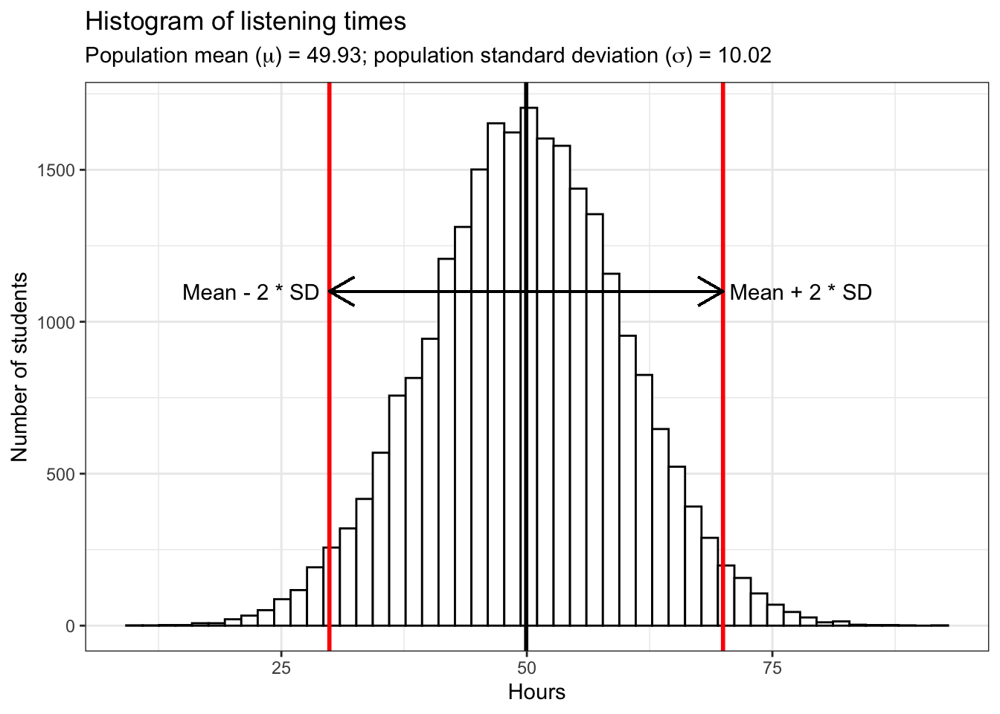


In this case, we refer to all WU students as **the population**. In general, the population is the entire group we are interested in. This group does not have to necessarily consist of people, but could also be companies, stores, animals, etc.. The parameters of the distribution of population values (in hour case: "hours") are called population parameters. As already mentioned, we do not usually know population parameters but use inferential statistics to infer them based on our sample from the population, i.e., we measure statistics from a sample (e.g., the sample mean $\bar x$) to estimate population parameters (the population mean $\mu$). Here, we will use the following notation to refer to either the population parameters or the sample statistic: 

Variable	 | Sample statistic	 | Population parameter
---------------------- | ------------------------- | -------------------------
Size  | n  | N 
Mean  |  $\bar{x} = {1 \over n}\sum_{i=1}^n x_i$ | $\mu = {1 \over N}\sum_{i=1}^N x_i$  |
Variance  | $s^2 = {1 \over n-1}\sum_{i=1}^n (x_i-\bar{x})^2$  | $\sigma^2 = {1 \over N}\sum_{i=1}^N (x_i-\mu)^2$  
Standard deviation | $s = \sqrt{s^2}$  | $\sigma = \sqrt{\sigma^2}$  
Standard error | $SE_{\bar x} = {s \over \sqrt{n}}$  | $\sigma_{\bar x} = {\sigma \over \sqrt{n}}$  

Using this notation, $N$ refers to the number of observations in the entire population (i.e., 25,000 in our example) and $n$ refers to a subset of the population (i.e., a sample). As you can see, we will use different Greek letters to denote the sample statistics and the population parameters. Another difference, you might have noticed is that in the computation of the sample variance, we divide by $n-1$, not $n$. This is also know as the *‘Bessel’s correction’* and it corrects the bias in the estimation of the population variance based on a sample. More specifically, due to the correction, the corrected variance will be larger, since the denominator gets smaller by subtracting 1. This is done because the variance will most of the time be smaller when calculated using the sum of squared deviations from the sample mean, compared to using the sum of deviations from the population mean. The intuition is that, the larger your sample is, the more likely it is to get more population-representative points. Or, to put it another way, it is less likely to get a sample mean which results in differences which are too small. Thus, the larger your sample size $n$, the less of a correction you need and, hence, the smaller the impact the correction component will be.   

### Sampling from a known population


In the first step towards a realistic research setting, let us take one sample from this population and calculate the mean listening time. We can simply sample the row numbers of students and then subset the ```hours``` vector with the sampled row numbers. The ```sample()``` function will be used to draw a sample of size 100 from the population of 25,000 students, and one student can only be drawn once (i.e., ```replace = FALSE```). The following plot shows the distribution of listening times for our sample.

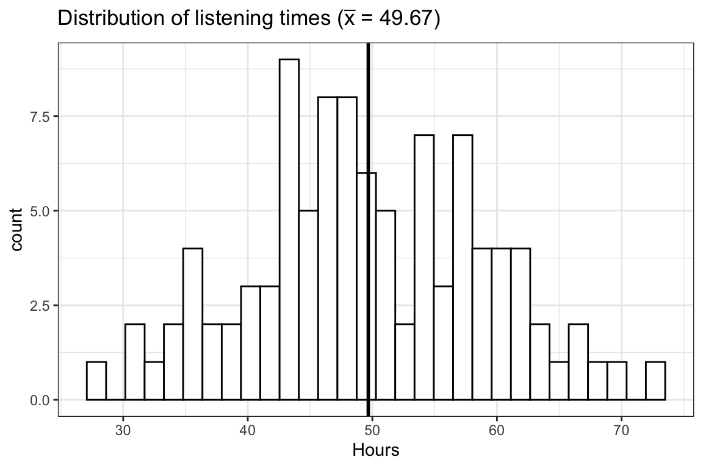

Observe that in this first draw the mean ($\bar x =$ 49.67) is quite close to the actual mean ($\mu =$ 49.93). It seems like the sample mean is a decent estimate of the population mean. However, we could just be lucky this time and the next sample could turn out to have a different mean. Let us continue by looking at four additional random samples, consisting of 100 students each. The following plot shows the distribution of listening times for the four different samples from the population.  

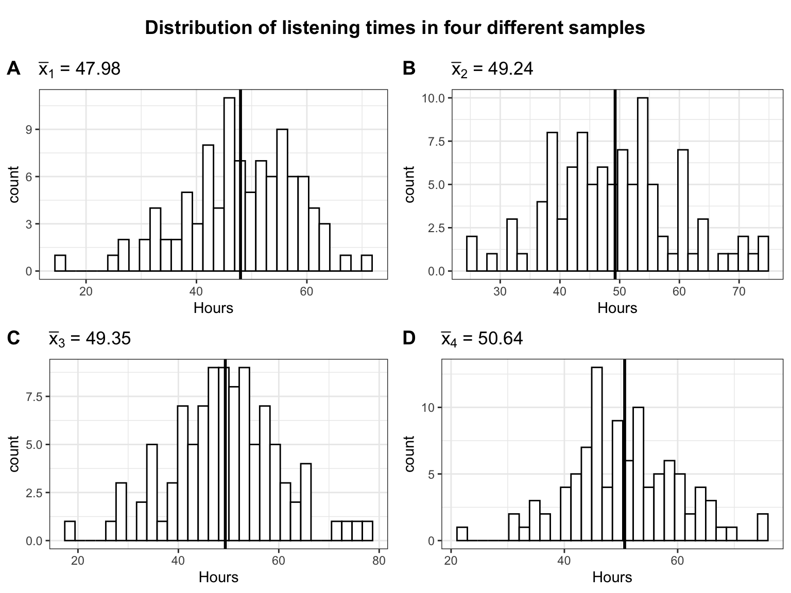

It becomes clear that the mean is slightly different for each sample. This is referred to as **sampling variation** and it is completely fine to get a slightly different mean every time we take a sample. We just need to find a way of expressing the uncertainty associated with the fact that we only have data from one sample, because in a realistic setting you are most likely only going to have access to a single sample. 

So in order to make sure that the first draw is not just pure luck and the sample mean is in fact a good estimate for the population mean, let us take **many** (e.g., $20,000$) different samples from the population. That is, we repeatedly draw 100 students randomly from the population without replacement (that is, once a student has been drawn she or he is removed from the pool and cannot be drawn again) and calculate the mean of each sample. This will show us a range within which the sample mean of any sample we take is likely going to be. We are going to store the means of all the samples in a matrix and then plot a histogram of the means to observe the likely values. 

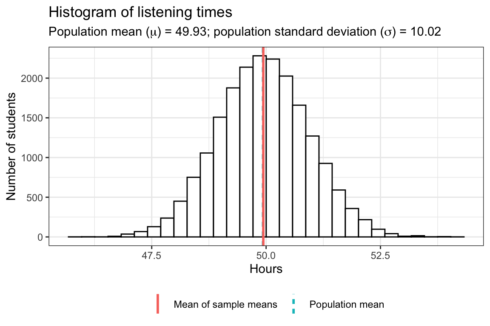

As you can see, on average the sample mean ("mean of sample means") is extremely close to the population mean, despite only sampling $100$ people at a time. This distribution of sample means is also referred to as **sampling distribution** of the sample mean. However, there is some uncertainty, and the means are slightly different for the different samples and range from 45.95 to 54.31. 

### Standard error of the mean

Due to the variation in the sample means shown in our simulation, it is never possible to say exactly what the population mean is based on a single sample. However, even with a single sample we can infer a range of values within which the population mean is likely contained. In order to do so, notice that the sample means are approximately normally distributed. Another interesting fact is that the mean of sample means (i.e., 49.94) is roughly equal to the population mean (i.e., 49.93). This tells us already that generally the sample mean is a good approximation of the population mean. However, in order to make statements about the expected range of possible values, we would need to know the standard deviation of the sampling distribution. The formal representation of the standard deviation of the sample means is

$$
\sigma_{\bar x} = {\sigma \over \sqrt{n}}
$$

where $\sigma$ is the population SD and $n$ is the sample size. $\sigma_{\bar{x}}$ is referred to as the **Standard Error** of the mean and it expresses the variation in sample means we should expect given the number of observations in our sample and the population SD. That is, it provides a measure of how precisely we can estimate the population mean from the sample mean.   

#### Sample size

The first thing to notice here is that an increase in the **number of observations per sample** $n$ decreases the range of possible sample means (i.e., the standard error). This makes intuitive sense. Think of the two extremes: sample size $1$ and sample size $25,000$. With a single person in the sample we do not gain a lot of information and our estimate is very uncertain, which is expressed through a larger standard deviation. Looking at the histogram at the beginning of this chapter showing the number of students for each of the listening times, clearly we would get values below $25$ or above $75$ for some samples. This is way farther away from the population mean than the minimum and the maximum of our $100$ person samples. On the other hand, if we sample every student we get the population mean every time and thus we do not have any uncertainty (assuming the population does not change). Even if we only sample, say $24,000$ people every time, we gain a lot of information about the population and the sample means would not be very different from each other since only up to $1,000$ people are potentially different in any given sample. Thus, with larger (smaller) samples, there is less (more) uncertainty that the sample is a good approximation of the entire population. The following plot shows the relationship between the sample size and the standard error. Samples of increasing size are randomly drawn from the population of WU students. You can see that the standard error is decreasing with the number of observations. 

<div class="figure" style="text-align: center">
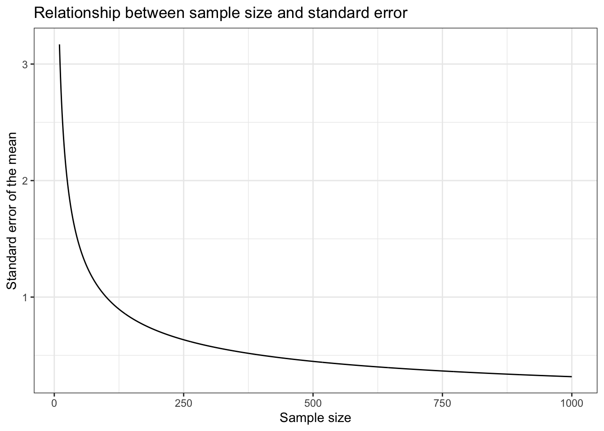
<p class="caption">(\#fig:unnamed-chunk-6)Relationship between the sample size and the standard error</p>
</div>

The following plots show the relationship between the sample size and the standard error in a slightly different way. The plots show the range of sample means resulting from the repeated sampling process for different sample sizes. Notice that the more students are contained in the individual samples, the less uncertainty there is when estimating the population mean from a sample (i.e., the possible values are more closely centered around the mean). So when the sample size is small, the sample mean can expected to be very different the next time we take a sample. When the sample size is large, we can expect the sample means to be more similar every time we take a sample.

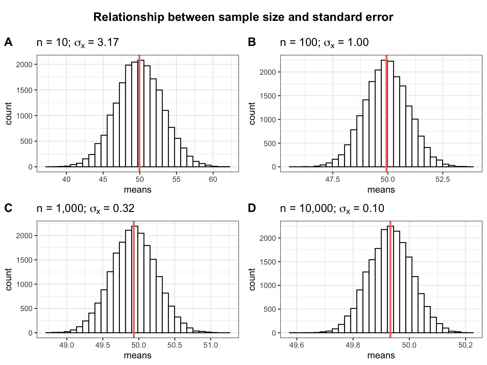

As you can see, the standard deviation of the sample means ($\sigma_{\bar x}$) decreases as the sample size increases as a consequence of the reduced uncertainty about the true sample mean when we take larger samples. 

#### Population standard deviation

A second factor determining the standard deviation of the distribution of sample means ($\sigma_{\bar x}$) is the standard deviation associated with the population parameter ($\sigma$). Again, looking at the extremes illustrates this well. If all WU students listened to music for approximately the same amount of time, the samples would not differ much from each other. In other words, if the standard deviation in the population is lower, we expect the standard deviation of the sample means to be lower as well. This is illustrated by the following plots.    

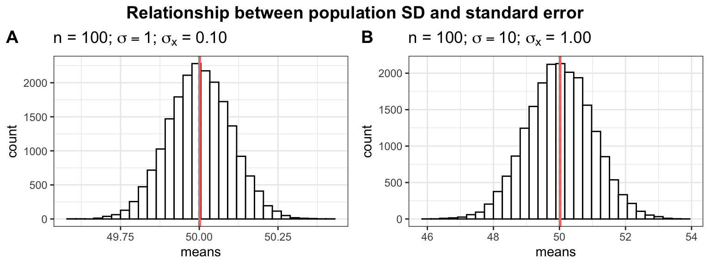

In the first plot (panel A), we assume a much smaller population standard deviation (e.g., $\sigma$ = 1 instead of $\sigma$ = 10). Notice how the smaller (larger) the population standard deviation, the less (more) uncertainty there is when estimating the population mean from a sample (i.e., the possible values are more closely centered around the mean). So when the population SD is large, the sample mean can expected to be very different the next time we take a sample. When the population SD is small, we can expect the sample means to be more similar.

## The Central Limit Theorem

The attentive reader might have noticed that the population above was generated using a normal distribution function. It would be very restrictive if we could only analyze populations whose values are normally distributed. Furthermore, we are unable in reality to check whether the population values are normally distributed since we do not know the entire population. However, it turns out that the results generalize to many other distributions. This is described by the **Central Limit Theorem**. 

The central limit theorem states that if **(1)** the population distribution has a mean (there are examples of distributions that don't have a mean , but we will ignore these here), and **(2)** we take a large enough sample, then the sampling distribution of the sample mean is approximately normally distributed. What exactly "large enough" means depends on the setting, but the interactive element at the end of this chapter illustrates how the sample size influences how accurately we can estimate the population parameters from the sample statistics.

To illustrate this, let's repeat the analysis above with a population from a gamma distribution. In the previous example, we assumed a normal distribution so it was more likely for a given student to spend around 50 hours per week listening to music. The following example depicts the case in which most students spend a similar amount of time listening to music, but there are a few students who very rarely listen to music, and some music enthusiasts with a very high level of listening time. In the following code, we will use the `rgamma()` function to generate 25,000 random observations from the gamma distribution. The gamma distribution is specified by shape and scale parameters instead of the mean and standard deviation of the normal distribution. Here is a histogram of the listening times in the population:

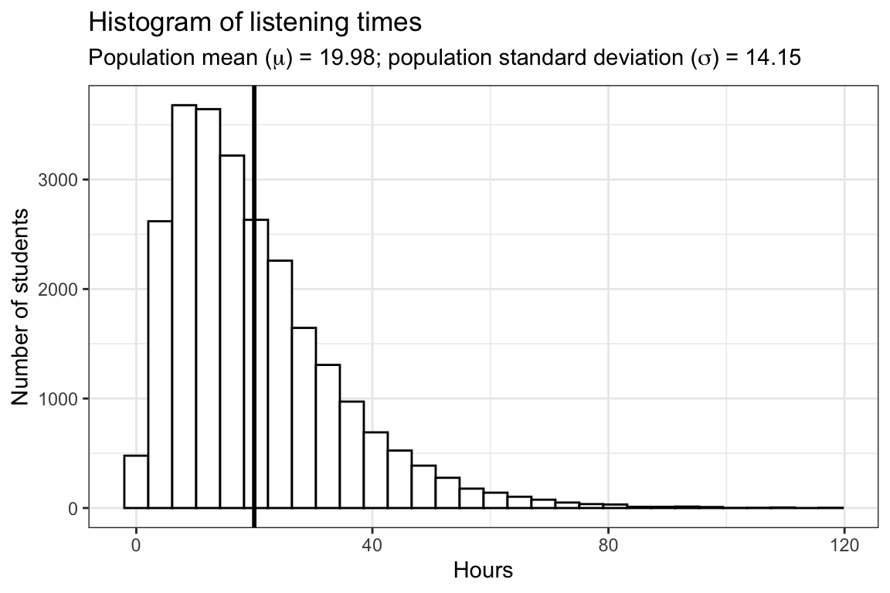

The vertical black line represents the population mean ($\mu$), which is 19.98 hours. The following plot depicts the histogram of listening times of four random samples from the population, each consisting of 100 students: 

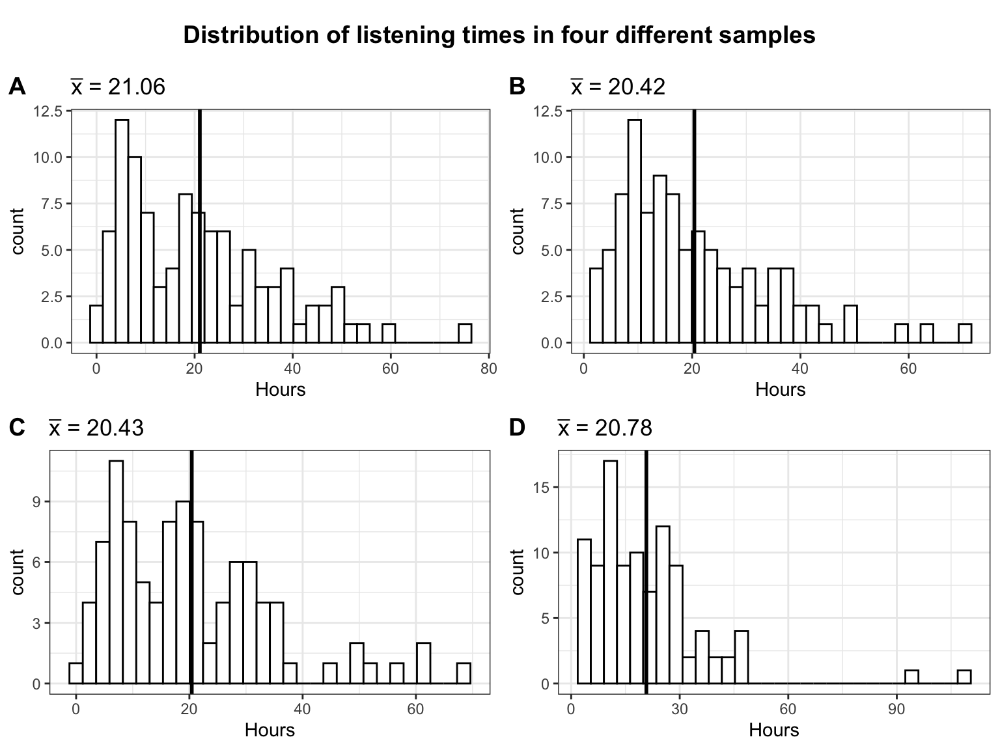

As in the previous example, the mean is slightly different every time we take a sample due to sampling variation. Also note that the distribution of listening times no longer follows a normal distribution as a result of the fact that we now assume a gamma distribution for the population with a positive skew (i.e., lower values more likely, higher values less likely). 

Let's see what happens to the distribution of sample means if we take an increasing number of samples, each drawn from the same gamma population:

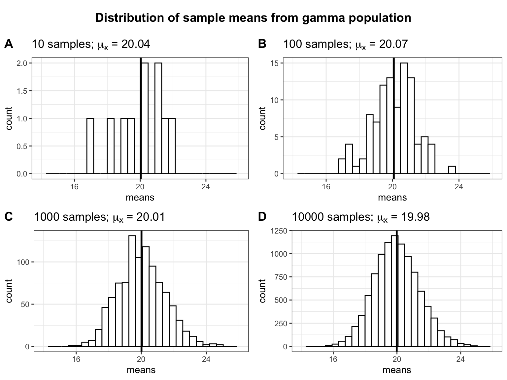

Two things are worth noting: **(1)** The more (hypothetical) samples we take, the more the sampling distribution approaches a normal distribution. **(2)** The mean of the sampling distribution of the sample mean ($\mu_{\bar x}$) is very similar to the population mean ($\mu$). From this we can see that the mean of a sample is a good estimate of the population mean. 

In summary, it is important to distinguish two types of variation: **(1)** For each individual sample that we may take in real life, the standard deviation ($s$) is used to describe the **natural variation** in the data and the data may follow a non-normal distribution. **(2)** If we would (hypothetically!) repeat the study many times, the sampling distribution of the sample mean follows a normal distribution for large samples sizes (even if data from each individual study are non-normal), and the standard error ($\sigma_{\bar x}$) is used to describe the **variation between study results**. This is an important feature, since many statistical tests assume that the sampling distribution is normally distributed. As we have seen, this does **not** mean that the data from one particular sample needs to follow a normal distribution.

## Using what we actually know

So far we have assumed to know the population standard deviation ($\sigma$). This an unrealistic assumption since we do not know the entire population. The best guess for the population standard deviation we have is the sample standard deviation, denoted $s$. Thus, the standard error of the mean is usually estimated from the sample standard deviation: 

$$
\sigma_{\bar x} \approx SE_{\bar x}={s \over \sqrt{n}}
$$

Note that $s$ itself is a sample estimate of the population parameter $\sigma$. This additional estimation introduces further uncertainty. You can see in the interactive element below that the sample SD, on average, provides a good estimate of the population SD. That is, the distribution of sample SDs that we get by drawing many samples is centered around the population value. Again, the larger the sample, the closer any given sample SD is going to be to the population parameter and we introduce less uncertainty. One conclusion is that your sample needs to be large enough to provide a reliable estimate of the population parameters. What exactly "large enough" means depends on the setting, but the interactive element illustrates how the remaining values change as a function of the sample size.

We will not go into detail about the importance of random samples but basically the correctness of your estimate depends crucially on having a sample at hand that actually represents the population. Unfortunately, we will usually not notice if the sample is non-random. Our statistics are still a good approximation of "a" population parameter, namely the one for the population that we actually sampled but not the one we are interested in. To illustrate this uncheck the "Random Sample" box below. The new sample will be only from the top $50\%$ music listeners (but this generalizes to different types of non-random samples).

<iframe src="https://learn.wu.ac.at/shiny/imsm/clt/" style="border: none; width: 800px; height: 1265px"></iframe>

## Confidence Intervals for the Sample Mean


When we try to estimate parameters of populations (e.g., the population mean $\mu$) from a sample, the average value from a sample (e.g., the sample mean $\bar x$) only provides an estimate of what the real population parameter is. The next time you collect a sample of the same size, you could get a different average. This is sampling variation and it is completely fine to get a slightly different sample mean every time we take a sample as we have seen above. However, this inherent uncertainty about the true population parameter means that coming up with an exact estimate (i.e., a **point estimate**) for a particular population parameter is really difficult. That is why it is often informative to construct a range around that statistic (i.e., an **interval estimate**) that likely contains the population parameter with a certain level of confidence. That is, we construct an interval such that for a large share (say 95%) of the sample means we could potentially get, the population mean is within that interval.

Let us consider one random sample of 100 students from our population above. 

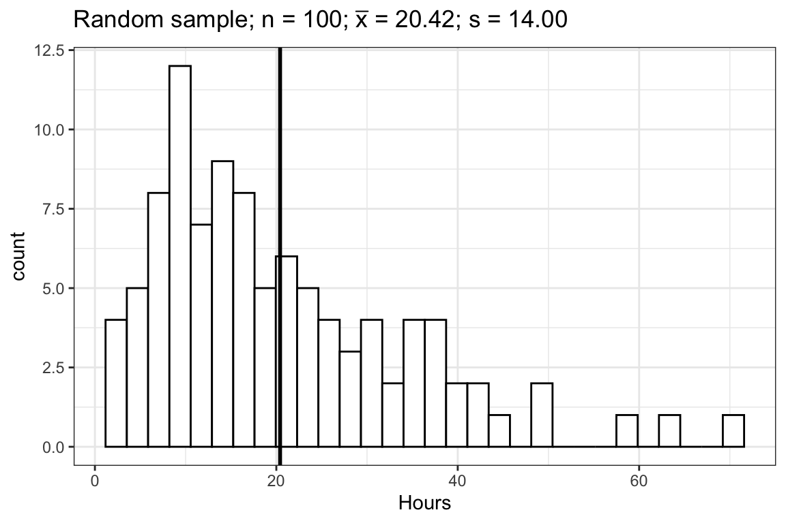

From the central limit theorem we know that the sampling distribution of the sample mean is approximately normal and we know that for the normal distribution, 95% of the values lie within about 2 standard deviations from the mean. Actually, it is not exactly 2 standard deviations from the mean. To get the exact number, we can use the quantile function for the normal distribution ```qnorm()```:  


``` r
qnorm(0.975)
```

```
## [1] 1.959964
```

We use ```0.975``` (and not ```0.95```) to account for the probability at each end of the distribution (i.e., 2.5% at the lower end and 2.5% at the upper end). We can see that 95% of the values are roughly within 1.96 standard deviations from the mean. Since we know the sample mean ($\bar x$) and we can estimate the standard deviation of the sampling distribution ($\sigma_{\bar x} \approx {s \over \sqrt{n}}$), we can now easily calculate the lower and upper boundaries of our confidence interval as:

$$
CI_{lower} = {\bar x} - z_{1-{\alpha \over 2}} * \sigma_{\bar x} \\
CI_{upper} = {\bar x} + z_{1-{\alpha \over 2}} * \sigma_{\bar x}
$$ 

Here, $\alpha$ refers to the significance level. You can find a detailed discussion of this point at the end of the next chapter. For now, we will adopt the widely accepted significance level of 5% and set $\alpha$ to 0.05. Thus, $\pm z_{1-{\alpha \over 2}}$ gives us the z-scores (i.e., number of standard deviations from the mean) within which range 95% of the probability density lies. 

Plugging in the values from our sample, we get:


``` r
sample_mean <- mean(hours_s)
se <- sd(hours_s)/sqrt(sample_size)
ci_lower <- sample_mean - qnorm(0.975)*se
ci_upper <- sample_mean + qnorm(0.975)*se
ci_lower
```

```
## [1] 17.67089
```

``` r
ci_upper
```

```
## [1] 23.1592
```

such that if we collected 100 samples and computed the mean and confidence interval for each of them, in $95\%$ of the cases, the true population mean is going to be within this interval between 17.67 and 23.16. 

::: {.infobox_orange .hint data-latex="{hint}"}
Note the correct interpretation of the confidence interval: If we collected 100 samples, calculated the mean and then calculated a confidence interval for that mean, then, for 95 of these samples, the confidence intervals we constructed would contain the true value of the mean in the population.
:::

This is illustrated in the plot below that shows the mean of the first 100 samples and their confidence intervals:

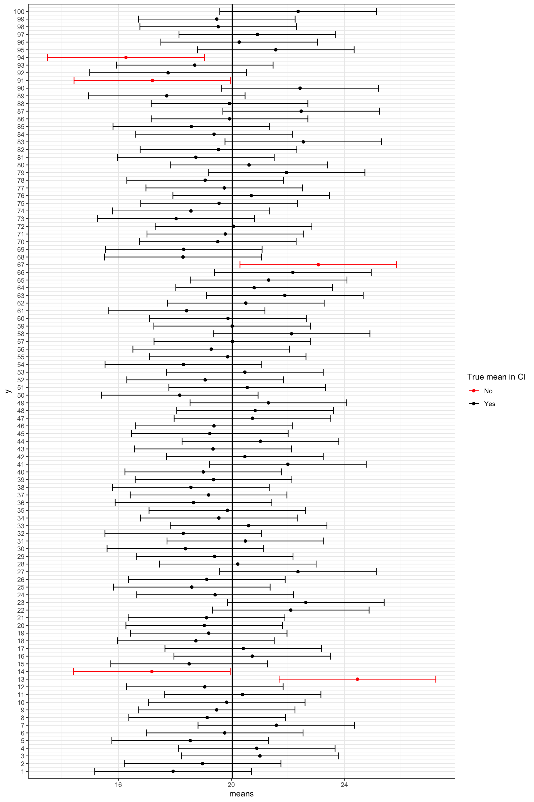


::: {.infobox_red .caution data-latex="{caution}"}
Note that this does **not** mean that for a specific sample there is a $95\%$ chance that the population mean lies within its confidence interval. The statement depends on the large number of samples we do not actually draw in a real setting. You can view the set of all possible confidence intervals similarly to the sides of a coin or a die. If we throw a coin many times, we are going to observe head roughly half of the times. This does not, however, exclude the possibility of observing tails for the first 10 throws. Similarly, any specific confidence interval might or might not include the population mean but if we take many samples on average $95\%$ of the confidence intervals are going to include the population mean.
:::


## Null Hypothesis Statistical Testing (NHST)

We test hypotheses because we are confined to taking samples – we rarely work with the entire population. In the previous chapter, we introduced the standard error (i.e., the standard deviation of a large number of hypothetical samples) as an estimate of how well a particular sample represents the population. We also saw how we can construct confidence intervals around the sample mean $\bar x$ by computing $SE_{\bar x}$ as an estimate of $\sigma_{\bar x}$ using $s$ as an estimate of $\sigma$ and calculating the 95% CI as $\bar x \pm 1.96 * SE_{\bar x}$. Although we do not know the true population mean ($\mu$), we might have an hypothesis about it and this would tell us how the corresponding sampling distribution looks like. Based on the sampling distribution of the hypothesized population mean, we could then determine the probability of a given sample **assuming that the hypothesis is true**. 

Let us again begin by assuming we know the entire population using the example of music listening times among students from the previous example. As a reminder, the following plot shows the distribution of music listening times in the population of WU students. 

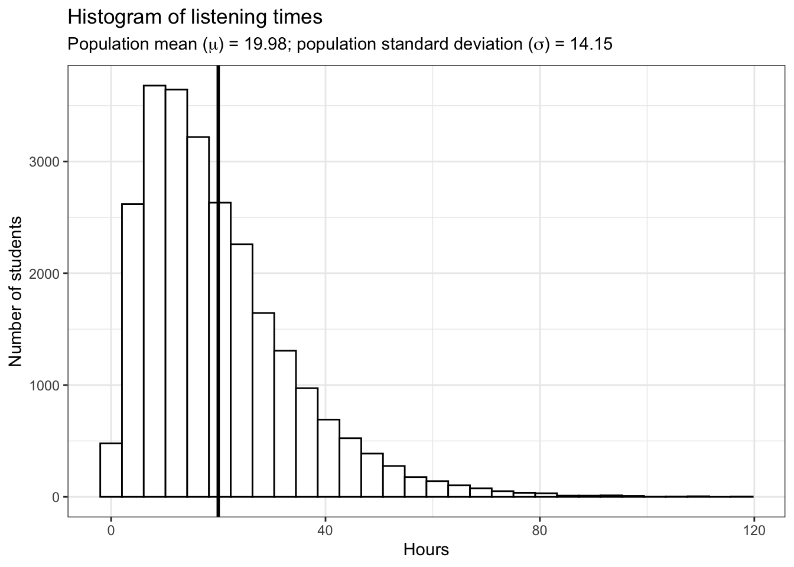

In this example, the population mean ($\mu$) is equal to 19.98, and the population standard deviation $\sigma$ is equal to 14.15. 


### The null hypothesis

Let us assume that we were planning to take a random sample of 50 students from this population and our hypothesis was that the mean listening time is equal to some specific value $\mu_0$, say $10$. This would be our **null hypothesis**. The null hypothesis refers to the statement that is being tested and is usually a statement of the status quo, one of no difference or no effect. In our example, the null hypothesis would state that there is no difference between the true population mean $\mu$ and the hypothesized value $\mu_0$ (in our example $10$), which can be expressed as follows:

$$
H_0: \mu = \mu_0
$$
When conducting research, we are usually interested in providing evidence against the null hypothesis. If we then observe sufficient evidence against it and our estimate is said to be significant. If the null hypothesis is rejected, this is taken as support for the **alternative hypothesis**. The alternative hypothesis assumes that some difference exists, which can be expressed as follows: 

$$
H_1: \mu \neq \mu_0
$$
Accepting the alternative hypothesis in turn will often lead to changes in opinions or actions. Note that while the null hypothesis may be rejected, it can never be accepted based on a single test. If we fail to reject the null hypothesis, it means that we simply haven't collected enough evidence against the null hypothesis to disprove it. In classical hypothesis testing, there is no way to determine whether the null hypothesis is true. **Hypothesis testing** provides a means to quantify to what extent the data from our sample is in line with the null hypothesis.

In order to quantify the concept of "sufficient evidence" we look at the theoretical distribution of the sample means given our null hypothesis and the sample standard error. Using the available information we can infer the sampling distribution for our null hypothesis. Recall that the standard deviation of the sampling distribution (i.e., the standard error of the mean) is given by $\sigma_{\bar x}={\sigma \over \sqrt{n}}$, and thus can be computed as follows:


``` r
mean_pop <- mean(hours)
sigma <- sd(hours) #population standard deviation
n <- 50 #sample size
standard_error <- sigma/sqrt(n) #standard error
standard_error
```

```
## [1] 2.001639
```

Since we know from the central limit theorem that the sampling distribution is normal for large enough samples, we can now visualize the expected sampling distribution **if our null hypothesis was in fact true** (i.e., if the was no difference between the true population mean and the hypothesized mean of 10). 

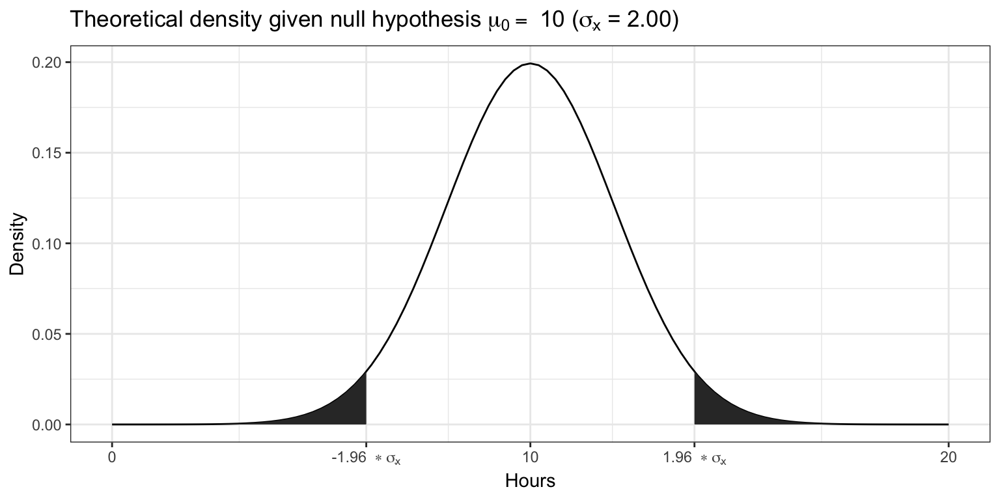

We also know that 95% of the probability is within 1.96 standard deviations from the mean. Values higher than that are rather unlikely, if our hypothesis about the population mean was indeed true. This is shown by the shaded area, also known as the "rejection region". To test our hypothesis that the population mean is equal to $10$, let us take a random sample from the population.

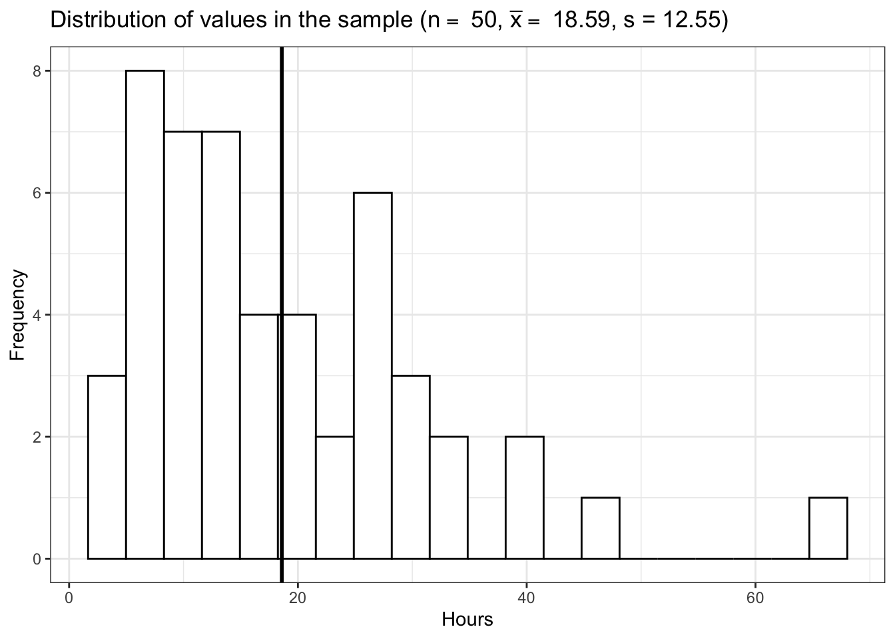

The mean listening time in the sample (black line) $\bar x$ is 18.59. We can already see from the graphic above that such a value is rather unlikely under the hypothesis that the population mean is $10$. Intuitively, such a result would therefore provide evidence against our null hypothesis. But how could we quantify specifically how unlikely it is to obtain such a value and decide whether or not to reject the null hypothesis? Significance tests can be used to provide answers to these questions. 


### Statistical inference on a sample

#### Test statistic

##### z-scores

Let's go back to the sampling distribution above. We know that 95% of all values will fall within 1.96 standard deviations from the mean. So if we could express the distance between our sample mean and the null hypothesis in terms of standard deviations, we could make statements about the probability of getting a sample mean of the observed magnitude (or more extreme values). Essentially, we would like to know how many standard deviations ($\sigma_{\bar x}$) our sample mean ($\bar x$) is away from the population mean if the null hypothesis was true ($\mu_0$). This can be formally expressed as follows:

$$
\bar x-  \mu_0 = z \sigma_{\bar x}
$$

In this equation, ```z``` will tell us how many standard deviations the sample mean $\bar x$ is away from the null hypothesis $\mu_0$. Solving for ```z``` gives us:

$$
z = {\bar x-  \mu_0 \over \sigma_{\bar x}}={\bar x-  \mu_0 \over \sigma / \sqrt{n}}
$$

This standardized value (or "z-score") is also referred to as a **test statistic**. Let's compute the test statistic for our example above:


``` r
z_score <- (mean_sample - H_0)/(sigma/sqrt(n))
z_score
```

```
## [1] 4.292454
```

To make a decision on whether the difference can be deemed statistically significant, we now need to compare this calculated test statistic to a meaningful threshold. In order to do so, we need to decide on a significance level $\alpha$, which expresses the probability of finding an effect that does not actually exist (i.e., Type I Error). You can find a detailed discussion of this point at the end of this chapter. For now, we will adopt the widely accepted significance level of 5% and set $\alpha$ to 0.05. The critical value for the normal distribution and $\alpha$ = 0.05 can be computed using the ```qnorm()``` function as follows:


``` r
z_crit <- qnorm(0.975)
z_crit
```

```
## [1] 1.959964
```

We use ```0.975``` and not ```0.95``` since we are running a two-sided test and need to account for the rejection region at the other end of the distribution. Recall that for the normal distribution, 95% of the total probability falls within 1.96 standard deviations of the mean, so that higher (absolute) values provide evidence against the null hypothesis. Generally, we speak of a statistically significant effect if the (absolute) calculated test statistic is larger than the (absolute) critical value. We can easily check if this is the case in our example:


``` r
abs(z_score) > abs(z_crit)
```

```
## [1] TRUE
```

Since the absolute value of the calculated test statistic is larger than the critical value, we would reject $H_0$ and conclude that the true population mean $\mu$ is significantly different from the hypothesized value $\mu_0 = 10$.

##### t-statistic

You may have noticed that the formula for the z-score above assumes that we know the true population standard deviation ($\sigma$) when computing the standard deviation of the sampling distribution ($\sigma_{\bar x}$) in the denominator. However, the population standard deviation is usually not known in the real world and therefore represents another unknown population parameter which we have to estimate from the sample. We saw in the previous chapter that we usually use $s$ as an estimate of $\sigma$ and $SE_{\bar x}$ as and estimate of $\sigma_{\bar x}$. Intuitively, we should be more conservative regarding the critical value that we used above to assess whether we have a significant effect to reflect this uncertainty about the true population standard deviation. That is, the threshold for a "significant" effect should be higher to safeguard against falsely claiming a significant effect when there is none. If we replace $\sigma_{\bar x}$ by it's estimate $SE_{\bar x}$ in the formula for the z-score, we get a new test statistic (i.e, the **t-statistic**) with its own distribution (the **t-distribution**): 

$$
t = {\bar x-  \mu_0 \over SE_{\bar x}}={\bar x-  \mu_0 \over s / \sqrt{n}}
$$

Here, $\bar X$ denotes the sample mean and $s$ the sample standard deviation. The t-distribution has more probability in its "tails", i.e. farther away from the mean. This reflects the higher uncertainty introduced by replacing the population standard deviation by its sample estimate. Intuitively, this is particularly relevant for small samples, since the uncertainty about the true population parameters decreases with increasing sample size. This is reflected by the fact that the exact shape of the t-distribution depends on the **degrees of freedom**, which is the sample size minus one (i.e., $n-1$). To see this, the following graph shows the t-distribution with different degrees of freedom for a two-tailed test and $\alpha = 0.05$. The grey curve shows the normal distribution. 

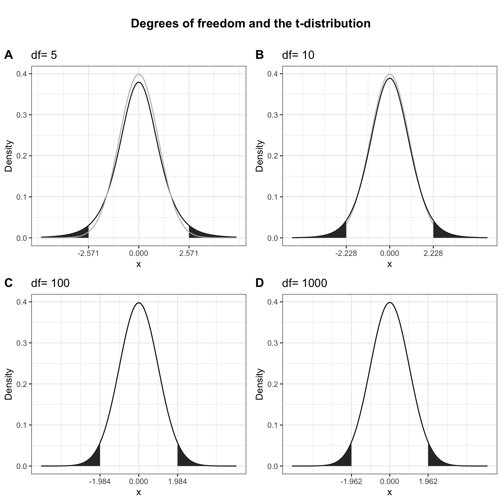

Notice that as $n$ gets larger, the t-distribution gets closer and closer to the normal distribution, reflecting the fact that the uncertainty introduced by $s$ is reduced. To summarize, we now have an estimate for the standard deviation of the distribution of the sample mean (i.e., $SE_{\bar x}$) and an appropriate distribution that takes into account the necessary uncertainty (i.e., the t-distribution). Let us now compute the t-statistic according to the formula above:


``` r
SE <- (sd(music_listening_sample$hours)/sqrt(n))
t_score <- (mean_sample - H_0)/SE
t_score
```

```
## [1] 4.84204
```

Notice that the value of the t-statistic is higher compared to the z-score (4.29). This can be attributed to the fact that by using the $s$ as and estimate of $\sigma$, we underestimate the true population standard deviation. Hence, the critical value would need to be larger to adjust for this. This is what the t-distribution does. Let us compute the critical value from the t-distribution with ```n - 1```degrees of freedom.     


``` r
df = n - 1
t_crit <- qt(0.975, df = df)
t_crit
```

```
## [1] 2.009575
```

Again, we use ```0.975``` and not ```0.95``` since we are running a two-sided test and need to account for the rejection region at the other end of the distribution. Notice that the new critical value based on the t-distributionis larger, to reflect the uncertainty when estimating $\sigma$ from $s$. Now we can see that the calculated test statistic is still larger than the critical value.  


``` r
abs(t_score) > abs(t_crit)
```

```
## [1] TRUE
```

The following graphics shows that the calculated test statistic (red line) falls into the rejection region so that in our example, we would reject the null hypothesis that the true population mean is equal to $10$. 

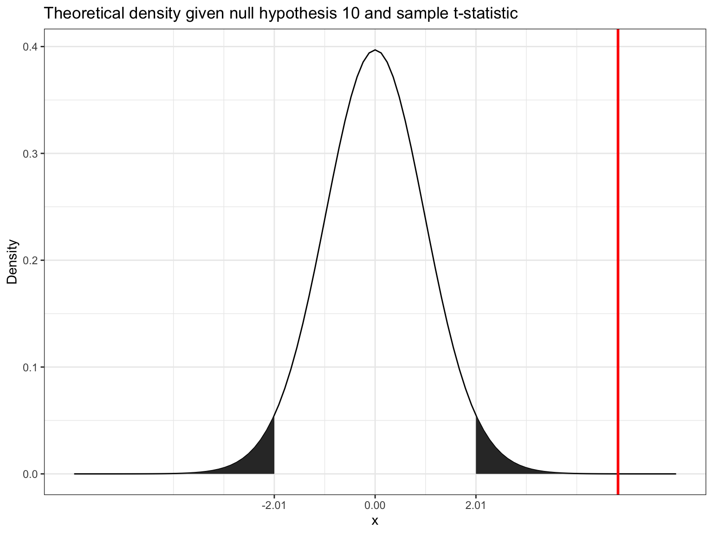

**Decision:** Reject $H_0$, given that the calculated test statistic is larger than critical value.

Something to keep in mind here is the fact the test statistic is a function of the sample size. This, as $n$ gets large, the test statistic gets larger as well and we are more likely to find a significant effect. This reflects the decrease in uncertainty about the true population mean as our sample size increases.  

#### P-values

In the previous section, we computed the test statistic, which tells us how close our sample is to the null hypothesis. The p-value corresponds to the probability that the test statistic would take a value as extreme or more extreme than the one that we actually observed, **assuming that the null hypothesis is true**. It is important to note that this is a **conditional probability**: we compute the probability of observing a sample mean (or a more extreme value) conditional on the assumption that the null hypothesis is true. The ```pnorm()```function can be used to compute this probability. It is the cumulative probability distribution function of the `normal distribution. Cumulative probability means that the function returns the probability that the test statistic will take a value **less than or equal to** the calculated test statistic given the degrees of freedom. However, we are interested in obtaining the probability of observing a test statistic **larger than or equal to** the calculated test statistic under the null hypothesis (i.e., the p-value). Thus, we need to subtract the cumulative probability from 1. In addition, since we are running a two-sided test, we need to multiply the probability by 2 to account for the rejection region at the other side of the distribution.  


``` r
p_value <- 2*(1-pt(abs(t_score), df = df))
p_value
```

```
## [1] 1.326885e-05
```

This value corresponds to the probability of observing a mean equal to or larger than the one we obtained from our sample, if the null hypothesis was true. As you can see, this probability is very low. A small p-value signals that it is unlikely to observe the calculated test statistic under the null hypothesis. To decide whether or not to reject the null hypothesis, we would now compare this value to the level of significance ($\alpha$) that we chose for our test. For this example, we adopt the widely accepted significance level of 5%, so any test results with a p-value < 0.05 would be deemed statistically significant. Note that the p-value is directly related to the value of the test statistic. The relationship is such that the higher (lower) the value of the test statistic, the lower (higher) the p-value.   

**Decision:** Reject $H_0$, given that the p-value is smaller than 0.05. 

#### Confidence interval

For a given statistic calculated for a sample of observations (e.g., listening times), a 95% confidence interval can be constructed such that in 95% of samples, the true value of the true population mean will fall within its limits. If the parameter value specified in the null hypothesis (here $10$) does not lie within the bounds, we reject $H_0$. Building on what we learned about confidence intervals in the previous chapter, the 95% confidence interval based on the t-distribution can be computed as follows:

$$
CI_{lower} = {\bar x} - t_{1-{\alpha \over 2}} * SE_{\bar x} \\
CI_{upper} = {\bar x} + t_{1-{\alpha \over 2}} * SE_{\bar x}
$$ 

It is easy to compute this interval manually:


``` r
ci_lower <- (mean_sample)-qt(0.975, df = df)*SE
ci_upper <- (mean_sample)+qt(0.975, df = df)*SE
ci_lower
```

```
## [1] 15.02606
```

``` r
ci_upper
```

```
## [1] 22.15783
```

The interpretation of this interval is as follows: if we would (hypothetically) take 100 samples and calculated the mean and confidence interval for each of them, then the true population mean would be included in 95% of these intervals. The CI is informative when reporting the result of your test, since it provides an estimate of the uncertainty associated with the test result. From the test statistic or the p-value alone, it is not easy to judge in which range the true population parameter is located.  The CI provides an estimate of this range. 

**Decision:** Reject $H_0$, given that the parameter value from the null hypothesis ($10$) is not included in the interval. 

To summarize, you can see that we arrive at the same conclusion (i.e., reject $H_0$), irrespective if we use the test statistic, the p-value, or the confidence interval. However, keep in mind that rejecting the null hypothesis does not prove the alternative hypothesis (we can merely provide support for it). Rather, think of the p-value as the chance of obtaining the data we've collected assuming that the null hypothesis is true. You should report the confidence interval to provide an estimate of the uncertainty associated with your test results.  


### NHST considerations

#### Type I and Type II Errors

When choosing the level of significance ($\alpha$). It is important to note that the choice of the significance level affects the type 1 and type 2 error:

* Type I error: When we believe there is a genuine effect in our population, when in fact there isn't. Probability of type I error ($\alpha$) = level of significance = the probability of finding an effect that does not genuinely exist.
* Type II error: When we believe that there is no effect in the population, when in fact there is. 

This following table shows the possible outcomes of a test (retain vs. reject $H_0$), depending on whether $H_0$ is true or false in reality.

&nbsp; | Retain <b>H<sub>0</sub></b>	 | Reject <b>H<sub>0</sub></b>	
--------------- | -------------------------------------- | --------------------------------------
<b>H<sub>0</sub> is true</b>  | Correct decision:<br>1-&alpha; (probability of correct retention); | Type 1 error:<br> &alpha; (level of significance)
<b>H<sub>0</sub> is false</b>  | Type 2 error:<br>&beta; (type 2 error rate) | Correct decision:<br>1-&beta; (power of the test)


#### P-values

From my experience, students tend to place a lot of weight on p-values when interpreting their research findings. It is therefore important to note some points that hopefully help to put the meaning of a "significant" vs. "insignificant" test result into perspective. So what does a significant test result actually tell us? 

* The importance of an effect? &rarr; No, significance depends on sample size.
* That the null hypothesis is false? &rarr; No, it is always false.
* That the null hypothesis is true? &rarr; No, it is never true.

It is important to understand what the p-value actually tells you. 

::: {.infobox_orange .hint data-latex="{hint}"}
A p-value of < 0.05 means that the probability of finding a difference of at least the observed magnitude is less than 5% if the null hypothesis was true. In other words, if there really wouldn't be a difference between the groups, it tells you the probability of observing the difference that you found in your data (or more extreme differences).  
:::

The following points provide some guidance on how to interpret significant and insignificant test results. 

**Significant result**

* Even if the probability of the effect being a chance result is small (e.g., less than .05) it doesn't necessarily mean that the effect is important.
* Very small and unimportant effects can turn out to be statistically significant if the sample size is large enough. 

**Insignificant result**

* If the probability of the effect occurring by chance is large (greater than .05), the alternative hypothesis is rejected. However, this does not mean that the null hypothesis is true.
* Although an effect might not be large enough to be anything other than a chance finding, it doesn't mean that the effect is zero.
* In fact, two random samples will always have slightly different means that would deemed to be statistically significant if the samples were large enough.   

Thus, you should not base your research conclusion on p-values alone! 


## Learning check {-}

**(LC3.1) What is the correct interpretation of a confidence interval for a significance level of $\alpha$=0.05?**

- [ ] If we take 100 samples and calculate mean and confidence interval for each one of them, then the true population mean would be included in 95% of these intervals.
- [ ] If we take 100 samples and calculate mean and confidence interval for each one of them, then the true population mean would be included in 5% of these intervals.
- [ ] If we take 100 samples and calculate mean and confidence interval for each one of them, then the true population mean would be included in 100% of these intervals.
- [ ] For a given sample, there is a 95% chance that the true population mean lies within the confidence interval.

**(LC3.2) Which statements regarding standard error are TRUE?**

- [ ] There is no connection between the standard deviation and the standard error.
- [ ] The standard error is a function of the sample size and the standard deviation.
- [ ] The standard error of the mean decreases as the sample size increases.
- [ ] The standard error of the mean increases as the standard deviation increases.
- [ ] None of the above 	

**(LC3.3) What is the correct definition for the standard error ($SE_{\bar x}$)?**

- [ ] ${s \over \sqrt{n}}$
- [ ] ${s * \sqrt{n}}$
- [ ] ${\sqrt{s^2} \over \sqrt{n}}$
- [ ] ${\sqrt{s} \over n}$
- [ ] None of the above 	

**(LC3.4) Which of the following do you need to compute a confidence interval around a sample mean?**

- [ ] The critical value of the test statistic given a certain level of confidence 
- [ ] A continuous variable (i.e., at least measured at the interval level) 
- [ ] The sample the mean
- [ ] The standard error
- [ ] None of the above 	

**(LC3.5) What is the correct definition for the confidence interval?**

- [ ] $CI=\bar{x} \pm \frac{z_{1-\frac{a}{n}}}{\sigma_{\bar{x}}}$
- [ ] $CI=\bar{x} * z_{1-\frac{a}{n}}*\sigma_{\bar{x}}$
- [ ] $CI= z_{1-\frac{a}{n}}*\sigma_{\bar{x}}-\bar{x}$
- [ ] $CI=\bar{x} \pm z_{1-\frac{a}{n}}*\sigma_{\bar{x}}$
- [ ] None of the above 

*As a marketing manager at Spotify you wish to find the average listening time of your users. Based on a random sample of 180 users you found that the mean listening time for the sample is 7.34 hours per week and the standard deviation is 6.87 hours.* 

**(LC3.6) What is the 95% confidence interval for the mean listening time (the corresponding z-value for the 95% CI is 1.96)?**

- [ ] [6.34;8.34]
- [ ] [7.15;7.55]
- [ ] [6.25;8.15]
- [ ] [6.54;8.54]
- [ ] None of the above 

**(LC3.7) How can you compute the standardized variate of a variable X?**

- [ ] $z = {s \over \sqrt{n}}$
- [ ] $z = {X_i - \bar{X} \over s}$
- [ ] $z = {s \over X_i-\bar{X}}$
- [ ] $z = s * (X_i-\bar{X}) $

**(LC3.8) For a variable that follows a normal distribution, within how many standard deviations of the mean are 95% of values?**

- [ ] 1.960
- [ ] 1.645
- [ ] 2.580
- [ ] 3.210

**(LC3.9) The Null Hypothesis ($H_0$) is a statement of:**

- [ ] The status-quo/no effect
- [ ] The desired status
- [ ] The expected status
- [ ] None of the above 

**(LC3.10) Which statements about the Null Hypothesis ($H_0$) are TRUE?**

- [ ] In scientific research, the goal is usually to confirm it
- [ ] In scientific research, the goal is usually to reject it
- [ ] It can be confirmed with one test
- [ ] None of the above 

**(LC3.11) In which setting would you reject the null hypothesis when conducting a statistical test?**

- [ ] When the absolute value of the calculated test-statistic (e.g., t-value) exceeds the critical value of the test statistic at your specified significance level (e.g., 0.05)
- [ ] When the p-value is smaller than your specified significance level (e.g., 0.05)
- [ ] When the confidence interval associated with the test does not contain the value suggested by the null hypothesis
- [ ] When the test-statistic (e.g., t-value) is lower than the critical value of the test statistic at your specified significance level (e.g., 0.05)
- [ ] None of the above 

**(LC3.8) What does a significant test result tell you?**

- [ ] The importance of an effect
- [ ] That the null hypothesis is false
- [ ] That the null hypothesis is true
- [ ] None of the above  

## References {-}

* Field, A., Miles J., & Field, Z. (2012). Discovering Statistics Using R. Sage Publications.
* Malhotra, N. K.(2010). Marketing Research: An Applied Orientation (6th. ed.). Prentice Hall.
* Vasishth, S. (2014). An introduction to statistical data analysis (lecture notes)

