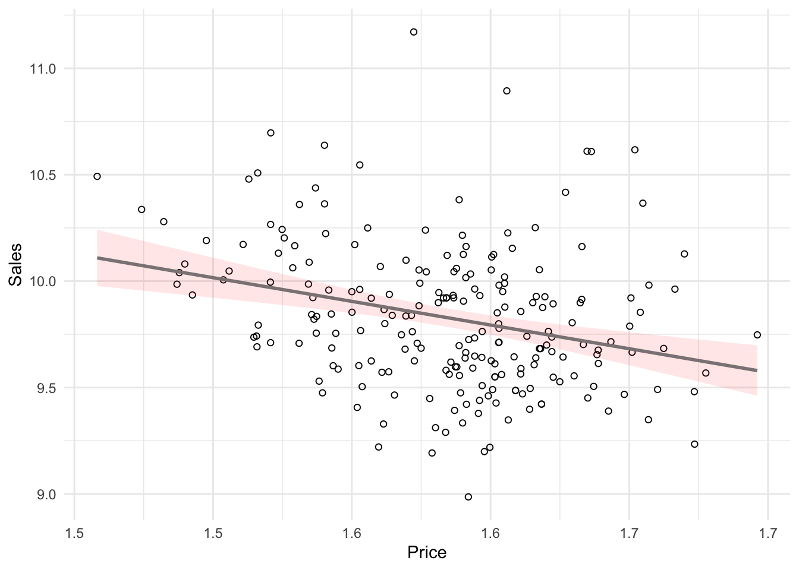
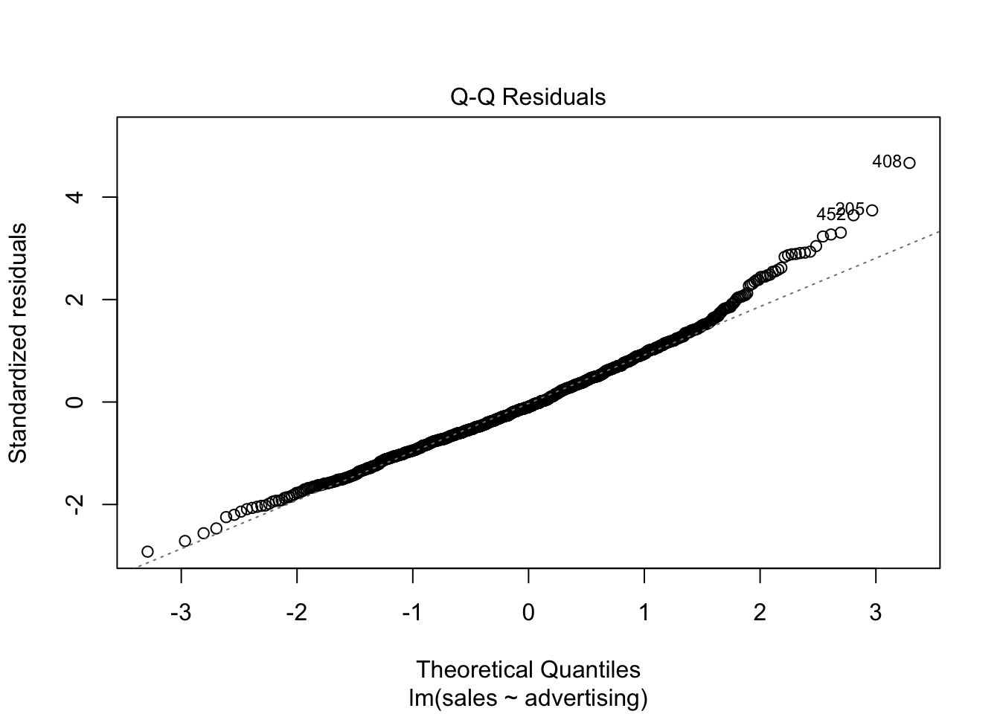
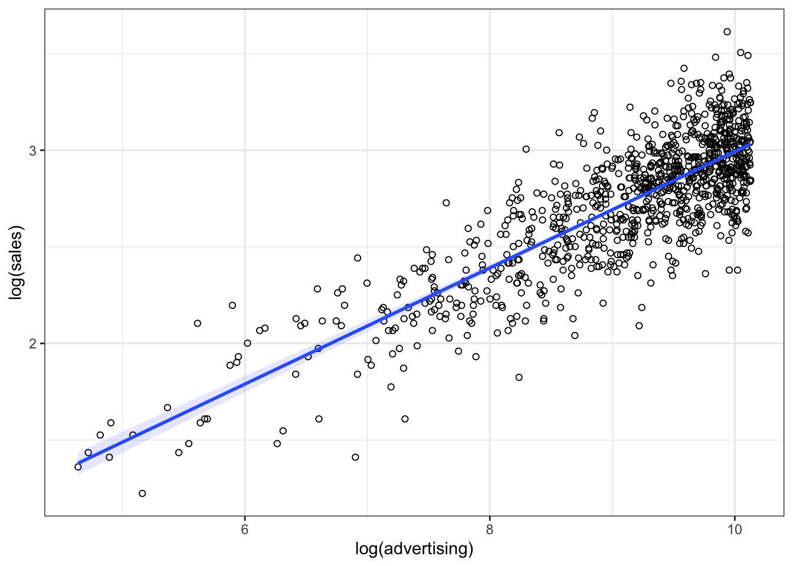
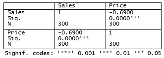

---
output:
  html_document:
    toc: yes
  pdf_document:
    toc: yes
  html_notebook: default
---


# Supervised learning


## Linear regression

### Correlation


Before we start with regression analysis, we will review the basic concept of correlation first. Correlation helps us to determine the degree to which the variation in one variable, X, is related to the variation in another variable, Y. 

#### Correlation coefficient

The correlation coefficient summarizes the strength of the linear relationship between two metric (interval or ratio scaled) variables. Let's consider a simple example. Say you conduct a survey to investigate the relationship between the attitude towards a shop and the duration of being of its customer. The "Attitude" variable can take values between 1 (very unfavorable) and 12 (very favorable), and the "Duration" is measured in months. Let's further assume for this example that the attitude measurement represents an interval scale (although it is usually not realistic to assume that the scale points on an itemized rating scale have the same distance). To keep it simple, let's further assume that you only asked 12 people. We can create a short data set like this:    


```r
library(psych)
attitude <- c(6, 9, 8, 3, 10, 4, 5, 2, 11, 9, 10, 2)
duration <- c(10, 12, 12, 4, 12, 6, 8, 2, 18, 9, 17,
    2)
att_data <- data.frame(attitude, duration)
att_data <- att_data[order(-attitude), ]
att_data$respodentID <- c(1:12)
str(att_data)
```

```
## 'data.frame':	12 obs. of  3 variables:
##  $ attitude   : num  11 10 10 9 9 8 6 5 4 3 ...
##  $ duration   : num  18 12 17 12 9 12 10 8 6 4 ...
##  $ respodentID: int  1 2 3 4 5 6 7 8 9 10 ...
```

```r
psych::describe(att_data[, c("attitude", "duration")])
```

```
##          vars  n mean   sd median trimmed  mad min max range  skew kurtosis
## attitude    1 12 6.58 3.32    7.0     6.6 4.45   2  11     9 -0.14    -1.74
## duration    2 12 9.33 5.26    9.5     9.2 4.45   2  18    16  0.10    -1.27
##            se
## attitude 0.96
## duration 1.52
```

```r
att_data
```

```
##    attitude duration respodentID
## 9        11       18           1
## 5        10       12           2
## 11       10       17           3
## 2         9       12           4
## 10        9        9           5
## 3         8       12           6
## 1         6       10           7
## 7         5        8           8
## 6         4        6           9
## 4         3        4          10
## 8         2        2          11
## 12        2        2          12
```

Let's look at the data first. The following graph shows the individual data points for the "duration" variable, where the y-axis shows the duration of residency in years and the x-axis shows the respondent ID. The blue horizontal line represents the mean of the variable (9.33) and the vertical lines show the distance of the individual data points from the mean.

<div class="figure" style="text-align: center">

<p class="caption">(\#fig:unnamed-chunk-4)Scores for duration variable</p>
</div>

You can see that there are some respondents that have been the store's customers longer than average and some - shorter than average. Let's do the same for the second variable ("Attitude"). Again, the y-axis shows the observed scores for this variable and the x-axis shows the respondent ID.  

<div class="figure" style="text-align: center">

<p class="caption">(\#fig:unnamed-chunk-5)Scores for attitude variable</p>
</div>

Again, we can see that some respondents have an above average attitude towards the store (more favorable) and some respondents have a below average attitude. Let's combine both variables in one graph now to see if there is some co-movement: 

<div class="figure" style="text-align: center">

<p class="caption">(\#fig:unnamed-chunk-6)Scores for attitude and duration variables</p>
</div>

We can see that there is indeed some co-movement here. The variables <b>covary</b> because respondents who have an above (below) average attitude towards the store also appear to have been its customers for an above (below) average amount of time and vice versa. Correlation helps us to quantify this relationship. Before you proceed to compute the correlation coefficient, you should first look at the data. We usually use a scatterplot to visualize the relationship between two metric variables:

<div class="figure" style="text-align: center">

<p class="caption">(\#fig:unnamed-chunk-7)Scatterplot for durationand attitute variables</p>
</div>

How can we compute the correlation coefficient? Remember that the variance measures the average deviation from the mean of a variable:

\begin{equation} 
\begin{split}
s_x^2&=\frac{\sum_{i=1}^{N} (X_i-\overline{X})^2}{N-1} \\
     &= \frac{\sum_{i=1}^{N} (X_i-\overline{X})*(X_i-\overline{X})}{N-1}
\end{split}
(\#eq:variance)
\end{equation} 

When we consider two variables, we multiply the deviation for one variable by the respective deviation for the second variable: 

<p style="text-align:center;">
$(X_i-\overline{X})*(Y_i-\overline{Y})$
</p>

This is called the cross-product deviation. Then we sum the cross-product deviations:

<p style="text-align:center;">
$\sum_{i=1}^{N}(X_i-\overline{X})*(Y_i-\overline{Y})$
</p>

... and compute the average of the sum of all cross-product deviations to get the <b>covariance</b>:

\begin{equation} 
Cov(x, y) =\frac{\sum_{i=1}^{N}(X_i-\overline{X})*(Y_i-\overline{Y})}{N-1}
(\#eq:covariance)
\end{equation} 

You can easily compute the covariance manually as follows


```r
x <- att_data$duration
x_bar <- mean(att_data$duration)
y <- att_data$attitude
y_bar <- mean(att_data$attitude)
N <- nrow(att_data)
cov <- (sum((x - x_bar) * (y - y_bar)))/(N - 1)
cov
```

```
## [1] 16.333333
```

Or you simply use the built-in ```cov()``` function:


```r
cov(att_data$duration, att_data$attitude)  # apply the cov function 
```

```
## [1] 16.333333
```

A positive covariance indicates that as one variable deviates from the mean, the other variable deviates in the same direction. A negative covariance indicates that as one variable deviates from the mean (e.g., increases), the other variable deviates in the opposite direction (e.g., decreases).

However, the size of the covariance depends on the scale of measurement. Larger scale units will lead to larger covariance. To overcome the problem of dependence on measurement scale, we need to convert the covariance to a standard set of units through standardization by dividing the covariance by the standard deviation (similar to how we compute z-scores).

With two variables, there are two standard deviations. We simply multiply the two standard deviations. We then divide the covariance by the product of the two standard deviations to get the standardized covariance, which is known as a correlation coefficient r:

\begin{equation} 
r=\frac{Cov_{xy}}{s_x*s_y}
(\#eq:corcoeff)
\end{equation} 

This is known as the product moment correlation (r) and it is straight-forward to compute:


```r
x_sd <- sd(att_data$duration)
y_sd <- sd(att_data$attitude)
r <- cov/(x_sd * y_sd)
r
```

```
## [1] 0.93607782
```

Or you could just use the ```cor()``` function:


```r
cor(att_data[, c("attitude", "duration")], method = "pearson",
    use = "complete")
```

```
##            attitude   duration
## attitude 1.00000000 0.93607782
## duration 0.93607782 1.00000000
```

The properties of the correlation coefficient ('r') are:

* ranges from -1 to + 1
* +1 indicates perfect linear relationship
* -1 indicates perfect negative relationship
* 0 indicates no linear relationship
* ± .1 represents small effect
* ± .3 represents medium effect
* ± .5 represents large effect

#### Significance testing

How can we determine if our two variables are significantly related? To test this, we denote the population moment correlation *&rho;*. Then we test the null of no relationship between variables:

$$H_0:\rho=0$$
$$H_1:\rho\ne0$$

The test statistic is: 

\begin{equation} 
t=\frac{r*\sqrt{N-2}}{\sqrt{1-r^2}}
(\#eq:cortest)
\end{equation} 

It has a t distribution with n - 2 degrees of freedom. You can simply use the ```cor.test()``` function, which also produces the 95% confidence interval:


```r
cor.test(att_data$attitude, att_data$duration, alternative = "two.sided",
    method = "pearson", conf.level = 0.95)
```

```
## 
## 	Pearson's product-moment correlation
## 
## data:  att_data$attitude and att_data$duration
## t = 8.4144, df = 10, p-value = 0.000007545
## alternative hypothesis: true correlation is not equal to 0
## 95 percent confidence interval:
##  0.7826041 0.9822815
## sample estimates:
##       cor 
## 0.9360778
```

To determine the linear relationship between variables, the data only needs to be measured using interval scales. If you want to test the significance of the association, the sampling distribution needs to be normally distributed (we usually assume this when our data are normally distributed or when N is large). If parametric assumptions are violated, you should use non-parametric tests:

* Spearman's correlation coefficient: requires ordinal data and ranks the data before applying Pearson's equation.
* Kendall's tau: use when N is small or the number of tied ranks is large.


```r
cor.test(att_data$attitude, att_data$duration, alternative = "two.sided",
    method = "spearman", conf.level = 0.95)
```

```
## 
## 	Spearman's rank correlation rho
## 
## data:  att_data$attitude and att_data$duration
## S = 14.197, p-value = 0.000002183
## alternative hypothesis: true rho is not equal to 0
## sample estimates:
##       rho 
## 0.9503606
```

```r
cor.test(att_data$attitude, att_data$duration, alternative = "two.sided",
    method = "kendall", conf.level = 0.95)
```

```
## 
## 	Kendall's rank correlation tau
## 
## data:  att_data$attitude and att_data$duration
## z = 3.9095, p-value = 0.0000925
## alternative hypothesis: true tau is not equal to 0
## sample estimates:
##       tau 
## 0.8960287
```

Report the results:

A Pearson product-moment correlation coefficient was computed to assess the relationship between the duration of being a customer of a store and the attitude toward this store. There was a positive correlation between the two variables, r = 0.936, n = 12, p < 0.05. A scatterplot summarizes the results (Figure XY).

**A note on the interpretation of correlation coefficients:**

As we have already seen in Chapter 1, correlation coefficients give no indication of the direction of causality. In our example, we can conclude that the attitude toward the store is more positive as the months of being a customer increase. However, we cannot say that the duration causes the attitudes to be more positive. There are two main reasons for caution when interpreting correlations:

* Third-variable problem: there may be other unobserved factors that affect both the 'attitude' and the 'duration' variables
* Direction of causality: Correlations say nothing about which variable causes the other to change (reverse causality: attitudes may just as well cause the duration variable).


### Regression analysis


Correlations measure relationships between variables (i.e., how much two variables covary). Using regression analysis we can predict the outcome of a dependent variable (Y) from one or more independent variables (X). For example, we could be interested in how many products will we will sell if we increase the advertising expenditures by 1000 Euros? In regression analysis, we fit a model to our data and use it to predict the values of the dependent variable from one predictor variable (bivariate regression) or several predictor variables (multiple regression). The following table shows a comparison of correlation and regression analysis:

<br>

&nbsp; | Correlation	 | Regression	
-------------|--------------------------  | -------------------------- 
Estimated coefficient  | Coefficient of correlation (bounded between -1 and +1) | Regression coefficient (not bounded a priori)
Interpretation  | Linear association between two variables; Association is bidirectional | (Linear) relation between one or more independent variables and dependent variable; Relation is directional
Role of theory | Theory neither required nor testable  | Theory required and testable

<br>

#### Simple linear regression

In simple linear regression, we assess the relationship between one dependent (regressand) and one independent (regressor) variable. The goal is to fit a line through a scatterplot of observations in order to find the line that best describes the data (scatterplot).

Suppose you are a marketing research analyst at a big retail group and your task is to suggest, on the basis of historical data, a marketing plan for the next year that will maximize product sales. The product in question is beer brand Budweiser. The data set that is available to you includes information on the sales of Budweiser *move_ounce* (in ounces, FYI: 1 oz = 29,57 ml), prices *price_ounce* (in dollars per ounce), and several other variables: bonus buy - a price reduction if customers buy a certain quantity of a product (*sale_B*), price reduction in % (*sale_S*), and others. Let's load and inspect the data first: 


```r
regression <- read.table("https://raw.githubusercontent.com/dariayudaeva/RMA2024/main/data/bud_store102.csv",
    sep = ",", header = TRUE)  # read in data
str(regression)
```

```
## 'data.frame':	220 obs. of  22 variables:
##  $ store           : int  102 102 102 102 102 102 102 102 102 102 ...
##  $ brand_id        : int  26 26 26 26 26 26 26 26 26 26 ...
##  $ brand           : chr  "Budweiser" "Budweiser" "Budweiser" "Budweiser" ...
##  $ week            : int  91 92 93 94 95 96 97 98 99 100 ...
##  $ move_ounce      : num  41704 44212 28748 26169 35581 ...
##  $ price_ounce     : num  4.67 4.58 4.58 4.53 4.54 ...
##  $ sale_B          : num  0.133 0.133 0.125 0 0 ...
##  $ sale_C          : int  0 0 0 0 0 0 0 0 0 0 ...
##  $ sale_S          : num  0 0 0 0 0 0 0 0 0 0 ...
##  $ summove_ounce   : num  158871900 158871900 158871900 158871900 158871900 ...
##  $ nweeks          : int  220 220 220 220 220 220 220 220 220 220 ...
##  $ mean_marketshare: num  0.0893 0.0893 0.0893 0.0893 0.0893 ...
##  $ sharerank       : int  3 3 3 3 3 3 3 3 3 3 ...
##  $ priclow         : int  0 0 0 0 0 0 0 0 0 0 ...
##  $ pricmed         : int  1 1 1 1 1 1 1 1 1 1 ...
##  $ prichigh        : int  0 0 0 0 0 0 0 0 0 0 ...
##  $ logprice_ounce  : num  1.54 1.52 1.52 1.51 1.51 ...
##  $ logmove_ounce   : num  10.6 10.7 10.3 10.2 10.5 ...
##  $ saledummy_B     : int  1 1 1 0 0 0 0 0 0 0 ...
##  $ saledummy_C     : int  0 0 0 0 0 0 0 0 0 0 ...
##  $ saledummy_S     : int  0 0 0 0 0 0 0 0 0 0 ...
##  $ promoweek       : int  91 92 93 NA NA NA NA NA NA NA ...
```

```r
regression$store <- as.factor(regression$store)  #convert grouping variable to factor
regression$brand_id <- as.factor(regression$brand_id)  #convert grouping variable to factor
regression$saledummy_B <- as.factor(regression$saledummy_B)  #convert grouping variable to factor
regression$saledummy_C <- as.factor(regression$saledummy_C)  #convert grouping variable to factor
regression$saledummy_S <- as.factor(regression$saledummy_S)  #convert grouping variable to factor
head(regression)
```

<div data-pagedtable="false">
  <script data-pagedtable-source type="application/json">
{"columns":[{"label":["store"],"name":[1],"type":["fct"],"align":["left"]},{"label":["brand_id"],"name":[2],"type":["fct"],"align":["left"]},{"label":["brand"],"name":[3],"type":["chr"],"align":["left"]},{"label":["week"],"name":[4],"type":["int"],"align":["right"]},{"label":["move_ounce"],"name":[5],"type":["dbl"],"align":["right"]},{"label":["price_ounce"],"name":[6],"type":["dbl"],"align":["right"]},{"label":["sale_B"],"name":[7],"type":["dbl"],"align":["right"]},{"label":["sale_C"],"name":[8],"type":["int"],"align":["right"]},{"label":["sale_S"],"name":[9],"type":["dbl"],"align":["right"]},{"label":["summove_ounce"],"name":[10],"type":["dbl"],"align":["right"]},{"label":["nweeks"],"name":[11],"type":["int"],"align":["right"]},{"label":["mean_marketshare"],"name":[12],"type":["dbl"],"align":["right"]},{"label":["sharerank"],"name":[13],"type":["int"],"align":["right"]},{"label":["priclow"],"name":[14],"type":["int"],"align":["right"]},{"label":["pricmed"],"name":[15],"type":["int"],"align":["right"]},{"label":["prichigh"],"name":[16],"type":["int"],"align":["right"]},{"label":["logprice_ounce"],"name":[17],"type":["dbl"],"align":["right"]},{"label":["logmove_ounce"],"name":[18],"type":["dbl"],"align":["right"]},{"label":["saledummy_B"],"name":[19],"type":["fct"],"align":["left"]},{"label":["saledummy_C"],"name":[20],"type":["fct"],"align":["left"]},{"label":["saledummy_S"],"name":[21],"type":["fct"],"align":["left"]},{"label":["promoweek"],"name":[22],"type":["int"],"align":["right"]}],"data":[{"1":"102","2":"26","3":"Budweiser","4":"91","5":"41704.00","6":"4.665278","7":"0.1333333","8":"0","9":"0","10":"158871900","11":"220","12":"0.08933073","13":"3","14":"0","15":"1","16":"0","17":"1.540147","18":"10.63835","19":"1","20":"0","21":"0","22":"91"},{"1":"102","2":"26","3":"Budweiser","4":"92","5":"44212.48","6":"4.575852","7":"0.1333333","8":"0","9":"0","10":"158871900","11":"220","12":"0.08933073","13":"3","14":"0","15":"1","16":"0","17":"1.520793","18":"10.69676","19":"1","20":"0","21":"0","22":"92"},{"1":"102","2":"26","3":"Budweiser","4":"93","5":"28748.48","6":"4.575668","7":"0.1250000","8":"0","9":"0","10":"158871900","11":"220","12":"0.08933073","13":"3","14":"0","15":"1","16":"0","17":"1.520753","18":"10.26634","19":"1","20":"0","21":"0","22":"93"},{"1":"102","2":"26","3":"Budweiser","4":"94","5":"26168.96","6":"4.530460","7":"0.0000000","8":"0","9":"0","10":"158871900","11":"220","12":"0.08933073","13":"3","14":"0","15":"1","16":"0","17":"1.510824","18":"10.17233","19":"0","20":"0","21":"0","22":"NA"},{"1":"102","2":"26","3":"Budweiser","4":"95","5":"35581.44","6":"4.539798","7":"0.0000000","8":"0","9":"0","10":"158871900","11":"220","12":"0.08933073","13":"3","14":"0","15":"1","16":"0","17":"1.512883","18":"10.47958","19":"0","20":"0","21":"0","22":"NA"},{"1":"102","2":"26","3":"Budweiser","4":"96","5":"34128.00","6":"4.650231","7":"0.0000000","8":"0","9":"0","10":"158871900","11":"220","12":"0.08933073","13":"3","14":"0","15":"1","16":"0","17":"1.536917","18":"10.43787","19":"0","20":"0","21":"0","22":"NA"}],"options":{"columns":{"min":{},"max":[10]},"rows":{"min":[10],"max":[10]},"pages":{}}}
  </script>
</div>


```r
psych::describe(regression)  #descriptive statistics using psych
```

```
##                  vars   n         mean      sd       median      trimmed
## store*              1 220         1.00    0.00         1.00         1.00
## brand_id*           2 220         1.00    0.00         1.00         1.00
## brand*              3 220         1.00    0.00         1.00         1.00
## week                4 220       202.12   65.75       200.50       201.65
## move_ounce          5 220     19713.01 7837.08     17868.00     18580.18
## price_ounce         6 220         4.88    0.21         4.90         4.88
## sale_B              7 220         0.20    0.15         0.19         0.19
## sale_C              8 220         0.00    0.00         0.00         0.00
## sale_S              9 220         0.00    0.02         0.00         0.00
## summove_ounce      10 220 158871900.16    0.00 158871900.16 158871900.16
## nweeks             11 220       220.00    0.00       220.00       220.00
## mean_marketshare   12 220         0.09    0.00         0.09         0.09
## sharerank          13 220         3.00    0.00         3.00         3.00
## priclow            14 220         0.00    0.00         0.00         0.00
## pricmed            15 220         1.00    0.00         1.00         1.00
## prichigh           16 220         0.00    0.00         0.00         0.00
## logprice_ounce     17 220         1.58    0.04         1.59         1.59
## logmove_ounce      18 220         9.83    0.34         9.79         9.81
## saledummy_B*       19 220         1.75    0.43         2.00         1.82
## saledummy_C*       20 220         1.00    0.00         1.00         1.00
## saledummy_S*       21 220         1.01    0.10         1.00         1.00
## promoweek          22 167       212.28   62.15       217.00       212.78
##                      mad          min          max    range  skew kurtosis
## store*              0.00         1.00         1.00     0.00   NaN      NaN
## brand_id*           0.00         1.00         1.00     0.00   NaN      NaN
## brand*              0.00         1.00         1.00     0.00   NaN      NaN
## week               82.28        91.00       317.00   226.00  0.06    -1.20
## move_ounce       5538.99      7992.00     71032.00 63040.00  2.32     9.32
## price_ounce         0.20         4.30         5.45     1.15 -0.15    -0.19
## sale_B              0.18         0.00         0.67     0.67  0.28    -0.59
## sale_C              0.00         0.00         0.00     0.00   NaN      NaN
## sale_S              0.00         0.00         0.21     0.21 10.68   115.22
## summove_ounce       0.00 158871900.16 158871900.16     0.00   Inf      NaN
## nweeks              0.00       220.00       220.00     0.00   NaN      NaN
## mean_marketshare    0.00         0.09         0.09     0.00  -Inf      NaN
## sharerank           0.00         3.00         3.00     0.00   NaN      NaN
## priclow             0.00         0.00         0.00     0.00   NaN      NaN
## pricmed             0.00         1.00         1.00     0.00   NaN      NaN
## prichigh            0.00         0.00         0.00     0.00   NaN      NaN
## logprice_ounce      0.04         1.46         1.70     0.24 -0.27    -0.15
## logmove_ounce       0.32         8.99        11.17     2.18  0.67     0.86
## saledummy_B*        0.00         1.00         2.00     1.00 -1.17    -0.62
## saledummy_C*        0.00         1.00         1.00     0.00   NaN      NaN
## saledummy_S*        0.00         1.00         2.00     1.00 10.27   104.03
## promoweek          78.58        91.00       316.00   225.00 -0.08    -1.14
##                      se
## store*             0.00
## brand_id*          0.00
## brand*             0.00
## week               4.43
## move_ounce       528.38
## price_ounce        0.01
## sale_B             0.01
## sale_C             0.00
## sale_S             0.00
## summove_ounce      0.00
## nweeks             0.00
## mean_marketshare   0.00
## sharerank          0.00
## priclow            0.00
## pricmed            0.00
## prichigh           0.00
## logprice_ounce     0.00
## logmove_ounce      0.02
## saledummy_B*       0.03
## saledummy_C*       0.00
## saledummy_S*       0.01
## promoweek          4.81
```

As stated above, regression analysis may be used to relate a quantitative response ("dependent variable") to one or more predictor variables ("independent variables"). In a simple linear regression, we have one dependent and one independent variable and we regress the dependent variable on the independent variable.  

Here are a few important questions that we might seek to address based on the data:

* Is there a relationship between prices and sales? 
* How strong is the relationship between prices and sales?
* Which other variables contribute to sales?
* How accurately can we estimate the effect of each variable on sales?
* How accurately can we predict future sales?
* Is the relationship linear?
* Is there synergy among the advertising activities?

We may use linear regression to answer these questions. We will see later that the interpretation of the results strongly depends on the goal of the analysis - whether you would like to simply predict an outcome variable or you would like to explain the causal effect of the independent variable on the dependent variable (see Chapter 1). Let's start with the first question and investigate the relationship between advertising and sales. 

##### Estimating the coefficients

A simple linear regression model only has one predictor and can be written as:

\begin{equation} 
Y=\beta_0+\beta_1X+\epsilon
(\#eq:regequ)
\end{equation} 

In our specific context, let's consider only the influence of prices on sales for now:

\begin{equation} 
Sales=\beta_0+\beta_1*price+\epsilon
(\#eq:regequadv)
\end{equation} 

The word "price" represents data on advertising expenditures that we have observed and &beta;<sub>1</sub> (the "slope"") represents the unknown relationship between prices and sales. It tells you by how much sales will increase or decrease for an additional dollar added to price. &beta;<sub>0</sub> (the "intercept") is the number of sales we would expect if the price is set to 0. Note that the last assumption is highly theoretical: in the majority of real world scenarios, we never have such variables as prices, advertising expenditures, kilometers to the nearest store set to 0. Hence, it is incorrect to interpret the intercept like this. Together, &beta;<sub>0</sub> and &beta;<sub>1</sub> represent the model coefficients or *parameters*. The error term (&epsilon;) captures everything that we miss by using our model, including, (1) misspecifications (the true relationship might not be linear), (2) omitted variables (other variables might drive sales), and (3) measurement error (our measurement of the variables might be imperfect).

Once we have used our training data to produce estimates for the model coefficients, we can predict future sales on the basis of a particular value of price by computing:

\begin{equation} 
\hat{Sales}=\hat{\beta_0}+\hat{\beta_1}*price
(\#eq:predreg)
\end{equation} 

We use the hat symbol, <sup>^</sup>, to denote the estimated value for an unknown parameter or coefficient, or to denote the predicted value of the response (sales). In practice, &beta;<sub>0</sub> and &beta;<sub>1</sub> are unknown and must be estimated from the data to make predictions. In the case of our pricing example, the data set consists of the prices and product sales for 220 weeks (n = 220). Our goal is to obtain coefficient estimates such that the linear model fits the available data well. In other words, we fit a line through the scatterplot of observations and try to find the line that best describes the data. The following graph shows the scatterplot for our data, where the black line shows the regression line. The grey vertical lines shows the difference between the predicted values (the regression line) and the observed values. This difference is referred to as the residuals ("e").

<div class="figure" style="text-align: center">

<p class="caption">(\#fig:unnamed-chunk-16)Ordinary least squares (OLS)</p>
</div>

The estimation of the regression function is based on the idea of the method of least squares (OLS = ordinary least squares). The first step is to calculate the residuals by subtracting the observed values from the predicted values.

<p style="text-align:center;">
$e_i = Y_i-(\hat{\beta_0}+\hat{\beta_1}X_i)$
</p>

This difference is then minimized by minimizing the sum of the squared residuals:

\begin{equation} 
\sum_{i=1}^{N} e_i^2= \sum_{i=1}^{N} [Y_i-(\hat{\beta_0}+\hat{\beta_1X_i)}]^2\rightarrow min!
(\#eq:rss)
\end{equation} 

e<sub>i</sub>: Residuals (i = 1,2,...,N)<br>
Y<sub>i</sub>: Values of the dependent variable (i = 1,2,...,N) <br>
&\hat{beta;<sub>0</sub>}: Intercept<br>
&\hat{beta;<sub>1</sub>}: Regression coefficient / slope parameters<br>
X<sub>ni</sub>: Values of the nth independent variables and the i*th* observation<br>
N: Number of observations<br>

This is also referred to as the <b>residual sum of squares (RSS)</b>. Now we need to choose the values for &beta;<sub>0</sub> and &beta;<sub>1</sub> that minimize RSS. So how can we derive these values for the regression coefficient? The equation for &beta;<sub>1</sub> is given by:

\begin{equation} 
\hat{\beta_1}=\frac{COV_{XY}}{s_x^2}
(\#eq:slope)
\end{equation} 

The exact mathematical derivation of this formula is beyond the scope of this script, but the intuition is to calculate the first derivative of the squared residuals with respect to &beta;<sub>1</sub> and set it to zero, thereby finding the &beta;<sub>1</sub> that minimizes the term. Using the above formula, you can easily compute &beta;<sub>1</sub> using the following code:


```r
cov_y_x <- cov(regression$price_ounce, regression$move_ounce)
cov_y_x
```

```
## [1] -405.2959
```

```r
var_x <- var(regression$price_ounce)
var_x
```

```
## [1] 0.04473198
```

```r
beta_1 <- cov_y_x/var_x
beta_1
```

```
## [1] -9060.539
```

The interpretation of &beta;<sub>1</sub> is as follows: 

For every extra dollar increase of the price, sales can be expected to decrease by -9060.539 oz, which is around 270 liters.

Using the estimated coefficient for &beta;<sub>1</sub>, it is easy to compute &beta;<sub>0</sub> (the intercept) as follows:

\begin{equation} 
\hat{\beta_0}=\overline{Y}-\hat{\beta_1}\overline{X}
(\#eq:intercept)
\end{equation} 

The R code for this is:


```r
beta_0 <- mean(regression$move_ounce) - beta_1 * mean(regression$price_ounce)
beta_0
```

```
## [1] 63950.63
```

You may also verify this based on a scatterplot of the data. The following plot shows the scatterplot including the regression line, which is estimated using OLS.  


```r
ggplot(regression, mapping = aes(price_ounce, move_ounce)) +
    geom_point(shape = 1) + geom_smooth(method = "lm",
    fill = "blue", alpha = 0.1) + labs(x = "Price ($ per oz)",
    y = "Sales (oz)") + theme_bw()
```

<div class="figure" style="text-align: center">

<p class="caption">(\#fig:unnamed-chunk-19)Scatterplot</p>
</div>

The slope coefficient (&beta;<sub>1</sub>) tells you by how much sales (on the y-axis) would decrease if the price (on the x-axis) is increased by one unit ($).   

##### Significance testing

In a next step, we assess if the effect of prices on sales is statistically significant. This means that we test the null hypothesis H<sub>0</sub>: "There is no relationship between prices and sales" versus the alternative hypothesis H<sub>1</sub>: "The is some relationship between prices and sales". Or, to state this formally:

$$H_0:\beta_1=0$$
$$H_1:\beta_1\ne0$$

How can we test if the effect is statistically significant? Recall the generalized equation to derive a test statistic:

\begin{equation} 
test\ statistic = \frac{effect}{error}
(\#eq:teststatgeneral)
\end{equation} 

The effect is given by the &beta;<sub>1</sub> coefficient in this case. To compute the test statistic, we need to come up with a measure of uncertainty around this estimate (the error). This is because we use information from a sample to estimate the least squares line to make inferences regarding the regression line in the entire population. Since we only have access to one sample, the regression line will be slightly different every time we take a different sample from the population. This is sampling variation and it is perfectly normal! It just means that we need to take into account the uncertainty around the estimate, which is achieved by the standard error. Thus, the test statistic for our hypothesis is given by:

\begin{equation} 
t = \frac{\hat{\beta_1}}{SE(\hat{\beta_1})}
(\#eq:teststatreg)
\end{equation} 

After calculating the test statistic, we compare its value to the values that we would expect to find if there was no effect based on the t-distribution. In a regression context, the degrees of freedom are given by ```N - p - 1``` where N is the sample size and p is the number of predictors. In our case, we have 220 observations and one predictor. Thus, the degrees of freedom is 220 - 1 - 1 = 218. In the regression output below, R provides the exact probability of observing a t value of this magnitude (or larger) if the null hypothesis was true. This probability  is the p-value. A small p-value indicates that it is unlikely to observe such a substantial association between the predictor and the outcome variable due to chance in the absence of any real association between the predictor and the outcome.

To estimate the regression model in R, you can use the ```lm()``` function. Within the function, you first specify the dependent variable ("move_ounce") and independent variable ("price_ounce") separated by a ```~``` (tilde). As mentioned previously, this is known as _formula notation_ in R. The ```data = regression``` argument specifies that the variables come from the data frame named "regression". Strictly speaking, you use the ```lm()``` function to create an object called "sales_reg," which holds the regression output. You can then view the results using the ```summary()``` function: 


```r
sales_reg <- lm(move_ounce ~ price_ounce, data = regression)  #estimate linear model
summary(sales_reg)  #summary of results
```

```
## 
## Call:
## lm(formula = move_ounce ~ price_ounce, data = regression)
## 
## Residuals:
##    Min     1Q Median     3Q    Max 
## -11439  -4798  -1539   2744  50733 
## 
## Coefficients:
##             Estimate Std. Error t value    Pr(>|t|)    
## (Intercept)    63951      11892   5.377 0.000000194 ***
## price_ounce    -9060       2434  -3.723     0.00025 ***
## ---
## Signif. codes:  0 '***' 0.001 '**' 0.01 '*' 0.05 '.' 0.1 ' ' 1
## 
## Residual standard error: 7617 on 218 degrees of freedom
## Multiple R-squared:  0.05979,	Adjusted R-squared:  0.05548 
## F-statistic: 13.86 on 1 and 218 DF,  p-value: 0.0002504
```

Note that the estimated coefficients for &beta;<sub>0</sub> (63950.625) and &beta;<sub>1</sub> (-9060.539) correspond to the results of our manual computation above. The associated t-values and p-values are given in the output. The t-values are larger than the critical t-values for the 95% confidence level, since the associated p-values are smaller than 0.05. In case of the coefficient for &beta;<sub>1</sub>, this means that the probability of an association between the prices and sales of the observed magnitude (or larger) is smaller than 0.05, if the value of &beta;<sub>1</sub> was, in fact, 0. This finding leads us to reject the null hypothesis of no association between prices and sales. 

The coefficients associated with the respective variables represent <b>point estimates</b>. To obtain a better understanding of the range of values that the coefficients could take, it is helpful to compute <b>confidence intervals</b>. A 95% confidence interval is defined as a range of values such that with a 95% probability, the range will contain the true unknown value of the parameter. For example, for &beta;<sub>1</sub>, the confidence interval can be computed as.

\begin{equation} 
CI = \hat{\beta_1}\pm(t_{1-\frac{\alpha}{2}}*SE(\beta_1))
(\#eq:regCI)
\end{equation} 

It is easy to compute confidence intervals in R using the ```confint()``` function. You just have to provide the name of you estimated model as an argument:


```r
confint(sales_reg)
```

```
##                 2.5 %   97.5 %
## (Intercept)  40511.67 87389.58
## price_ounce -13856.72 -4264.36
```

For our model, the 95% confidence interval for &beta;<sub>0</sub> is [40511.67,87389.58], and the 95% confidence interval for &beta;<sub>1</sub> is [-13856.72,-4264.36]. Thus, we can conclude that when we do not spend any money on advertising, sales will be somewhere between 40512 and 87390 units on average. In addition, for each increase in advertising expenditures by one Euro, there will be an average increase in sales of between -13856.72 and -4264.36. If you revisit the graphic depiction of the regression model above, the uncertainty regarding the intercept and slope parameters can be seen in the confidence bounds (blue area) around the regression line. 

##### Assessing model fit

Once we have rejected the null hypothesis in favor of the alternative hypothesis, the next step is to investigate how well the model represents ("fits") the data. How can we assess the model fit?

* First, we calculate the fit of the most basic model (i.e., the mean)
* Then, we calculate the fit of the best model (i.e., the regression model)
* A good model should fit the data significantly better than the basic model
* R<sup>2</sup>: Represents the percentage of the variation in the outcome that can be explained by the model
* The F-ratio measures how much the model has improved the prediction of the outcome compared to the level of inaccuracy in the model

Similar to ANOVA, the calculation of model fit statistics relies on estimating the different sum of squares values. SS<sub>T</sub> is the difference between the observed data and the mean value of Y (aka. total variation). In the absence of any other information, the mean value of Y ($\overline{Y}$) represents the best guess on where a particular observation $Y_{i}$ at a given level of advertising will fall:

\begin{equation} 
SS_T= \sum_{i=1}^{N} (Y_i-\overline{Y})^2
(\#eq:regSST)
\end{equation} 

The following graph shows the total sum of squares:

<div class="figure" style="text-align: center">

<p class="caption">(\#fig:unnamed-chunk-22)Total sum of squares</p>
</div>

Based on our linear model, the best guess about the sales level at a given level of prices is the predicted value $\hat{Y}_i$. The model sum of squares (SS<sub>M</sub>) therefore has the mathematical representation:

\begin{equation} 
SS_M= \sum_{i=1}^{N}  (\hat{Y}_i-\overline{Y})^2
(\#eq:regSSM)
\end{equation} 

The model sum of squares represents the improvement in prediction resulting from using the regression model rather than the mean of the data. The following graph shows the model sum of squares for our example:

<div class="figure" style="text-align: center">

<p class="caption">(\#fig:unnamed-chunk-23)Ordinary least squares (OLS)</p>
</div>

The residual sum of squares (SS<sub>R</sub>) is the difference between the observed data points ($Y_{i}$) and the predicted values along the regression line ($\hat{Y}_{i}$), i.e., the variation *not* explained by the model.

\begin{equation} 
SS_R= \sum_{i=1}^{N} ({Y}_{i}-\hat{Y}_{i})^2
(\#eq:regSSR)
\end{equation} 

The following graph shows the residual sum of squares for our example:

<div class="figure" style="text-align: center">

<p class="caption">(\#fig:unnamed-chunk-24)Ordinary least squares (OLS)</p>
</div>

Based on these statistics, we can determine how well the model fits the data as we will see next. 

###### R-squared {-}

The R<sup>2</sup> statistic represents the proportion of variance that is explained by the model and is computed as:

\begin{equation} 
R^2= \frac{SS_M}{SS_T}
(\#eq:regSSR)
\end{equation} 

It takes values between 0 (very bad fit) and 1 (very good fit). Note that when the goal of your model is to *predict* future outcomes, a "too good" model fit can pose severe challenges. The reason is that the model might fit your specific sample so well, that it will only predict well within the sample but not generalize to other samples. This is called **overfitting** and it shows that there is a trade-off between model fit and out-of-sample predictive ability of the model, if the goal is to predict beyond the sample. We will come back to this point later in this chapter. 

You can get a first impression of the fit of the model by inspecting the scatter plot as can be seen in the plot below. If the observations are highly dispersed around the regression line (left plot), the fit will be lower compared to a data set where the values are less dispersed (right plot).

<div class="figure" style="text-align: center">

<p class="caption">(\#fig:unnamed-chunk-25)Good vs. bad model fit</p>
</div>

The R<sup>2</sup> statistic is reported in the regression output, so you don't need to compute it manually.


###### Adjusted R-squared {-}

Due to the way the R<sup>2</sup> statistic is calculated, it will never decrease if a new explanatory variable is introduced into the model. This means that every new independent variable either doesn't change the R<sup>2</sup> or increases it, even if there is no real relationship between the new variable and the dependent variable. Hence, one could be tempted to just add as many variables as possible to increase the R<sup>2</sup> and thus obtain a "better" model. However, this actually only leads to more noise and therefore a worse model. 

To account for this, there exists a test statistic closely related to the R<sup>2</sup>, the **adjusted R<sup>2</sup>**. It can be calculated as follows:

\begin{equation} 
\overline{R^2} = 1 - (1 - R^2)\frac{n-1}{n - k - 1}
(\#eq:adjustedR2)
\end{equation} 

where ```n``` is the total number of observations and ```k``` is the total number of explanatory variables. The adjusted R<sup>2</sup> is equal to or less than the regular R<sup>2</sup> and can be negative. It will only increase if the added variable adds more explanatory power than one would expect by pure chance. Essentially, it contains a "penalty" for including unnecessary variables and therefore favors more parsimonious models. As such, it is a measure of suitability, good for comparing different models and is very useful in the model selection stage of a project. In R, the standard ```lm()``` function automatically also reports the adjusted R<sup>2</sup> as you can see above.

###### F-test {-}

Similar to the ANOVA, another significance test is the F-test, which tests the null hypothesis:

$$H_0:R^2=0$$

<br>

Or, to state it slightly differently: 

$$H_0:\beta_1=\beta_2=\beta_3=\beta_k=0$$
<br>
This means that we test whether any of the included independent variables has a significant effect on the dependent variable. So far, we have only included one independent variable, but we will extend the set of predictor variables below.   

The F-test statistic is calculated as follows:

\begin{equation} 
F=\frac{\frac{SS_M}{k}}{\frac{SS_R}{(n-k-1)}}=\frac{MS_M}{MS_R}
(\#eq:regSSR)
\end{equation} 

which has a F distribution with k number of predictors and n degrees of freedom. In other words, you divide the systematic ("explained") variation due to the predictor variables by the unsystematic ("unexplained") variation. 

The result of the F-test is provided in the regression output as well. However, you might manually compute the F-test using the ANOVA results from the model:  


```r
f_calc <- anova(sales_reg)$"Mean Sq"[1]/anova(sales_reg)$"Mean Sq"[2]  #compute F
f_calc
```

```
## [1] 14
```

```r
f_crit <- qf(0.95, df1 = 1, df2 = 100)  #critical value
f_crit
```

```
## [1] 3.9
```

```r
f_calc > f_crit  #test if calculated test statistic is larger than critical value
```

```
## [1] TRUE
```

##### Using the model

After fitting the model, we can use the estimated coefficients to predict sales of Budweiser for different values of prices. Suppose the store plans to set the price per ounce to 2 dollars. How much will it sell? You can easily compute this either by hand:

$$\hat{sales}=63950.6 + (-9060.5)*2=45,829.6$$

<br>

... or by extracting the estimated coefficients from the model summary:


```r
prediction <- summary(sales_reg)$coefficients[1, 1] +
    summary(sales_reg)$coefficients[2, 1] * 2  # the slope * 2 EUR
prediction
```

```
## [1] 45830
```

The predicted value of the dependent variable is 45,829.6 oz, i.e., the store will sell around 45,829.6 oz (~1,355 liters) of Budweiser.


#### Log-Log transformation

Have a look at the plots above again. You might notice some data specific pattern, making the data points look odd: they are pulled to lower edge of the scatterplot. In this particular case, we're dealing with different measurement scales of our independent and dependent variables. Moreover, you could also notice how odd the interpretation of the regression coefficients sounds. 

It is very rare that in the retailing context, the predictions are made as we did before. The concept that is used instead is familiar to you from the microeconomics course - elasticity is a measure that is used by retail managers and researchers much more often than mere unit changes.

Let's have a look at the plot again:  


```r
ggplot(regression, mapping = aes(price_ounce, move_ounce)) +
    geom_point(shape = 1) + geom_smooth(method = "lm",
    color = "lavenderblush4", fill = "red", alpha = 0.1) +
    labs(x = "Price (ounce)", y = "Sales (ounce)") +
    theme_minimal()
```


The way of obtaining a more reasonable view and interpretation in this case is called "multiplicative modeling", or log-log transformation (you can find additional details about log-log transformations below with a slightly different motivation and example). 

The multiplicative model has the following formal representation: 

\begin{equation} 
Y =\beta_0 *X_1^{\beta_1}*X_2^{\beta_2}*...*X_J^{\beta_J}*\epsilon
(\#eq:multiplicative)
\end{equation} 

This functional form can be linearized by taking the logarithm of both sides of the equation:

\begin{equation} 
log(Y) =log(\beta_0) + \beta_1*log(X_1) + \beta_2*log(X_2) + ...+ \beta_J*log(X_J) + log(\epsilon)
(\#eq:multiplicativetransformed)
\end{equation}

This means that taking logarithms of both sides of the equation makes linear estimation possible. The above transformation follows from two logarithm rules that we apply here: 

1. the product rule states that $log(xy)=log(x)+log(y)$; thus, when taking the logarithm of the right hand side of the multiplicative model, we can write $log(X_1) + log(X_2)... log(X_J)$ instead of $log(X_1*X_2*...X_J)$, and
2. the power rule states that $log(x^y) = ylog(x)$; thus, we can write $\beta*log(X)$ instead of $X^{\beta}$

Let's test how the scatterplot would look like if we use the logarithm of our variables using the ```log()``` function instead of the original values.  


```r
ggplot(regression, mapping = aes(log(price_ounce),
    log(move_ounce))) + geom_point(shape = 1) + geom_smooth(method = "lm",
    color = "lavenderblush4", fill = "red", alpha = 0.1) +
    labs(x = "Price", y = "Sales") + theme_minimal()
```



You can see how the scales changed, and how the observations got more normally distributed. Hence, we can log-transform our variables and estimate the following equation: 

\begin{equation} 
log(sales) = log(\beta_0) + \beta_1*log(price) + log(\epsilon)
(\#eq:multiplicativetransformed1)
\end{equation}

Now, let's estimate a new regression by applying ```log()``` function to both sales and prices:


```r
sales_reg2 <- lm(log(move_ounce) ~ log(price_ounce),
    data = regression)
summary(sales_reg2)  #remember that now the interpretation changed
```

```
## 
## Call:
## lm(formula = log(move_ounce) ~ log(price_ounce), data = regression)
## 
## Residuals:
##     Min      1Q  Median      3Q     Max 
## -0.8252 -0.2239 -0.0285  0.1818  1.3156 
## 
## Coefficients:
##                  Estimate Std. Error t value             Pr(>|t|)    
## (Intercept)        13.354      0.796   16.77 < 0.0000000000000002 ***
## log(price_ounce)   -2.225      0.502   -4.43             0.000015 ***
## ---
## Signif. codes:  0 '***' 0.001 '**' 0.01 '*' 0.05 '.' 0.1 ' ' 1
## 
## Residual standard error: 0.32 on 218 degrees of freedom
## Multiple R-squared:  0.0826,	Adjusted R-squared:  0.0784 
## F-statistic: 19.6 on 1 and 218 DF,  p-value: 0.0000148
```

In this example, you would interpret the coefficient as follows: **A 1% increase in price leads to a 2.23% decrease in sales**. Hence, the interpretation is in proportional terms and no longer in units. This means that the coefficients in a log-log model can be directly interpreted as elasticities, which also makes communication easier. We can generally also inspect the R<sup>2</sup> statistic to see that the model fit has increased compared to the linear specification (i.e., R<sup>2</sup> has increased to 0.08 from 0.06). However, please note that the variables are now measured on a different scale, which means that the model fit in theory is not directly comparable.


#### Multiple linear regression


Multiple linear regression is a statistical technique that simultaneously tests the relationships between two or more independent variables and an interval-scaled dependent variable. The general form of the equation is given by:

\begin{equation} 
Y=(\beta_0+\beta_1*X_1+\beta_2*X_2+\beta_n*X_n)+\epsilon
(\#eq:regequ)
\end{equation} 

Again, we aim to find the combination of predictors that correlate maximally with the outcome variable. Note that if you change the composition of predictors, the partial regression coefficient of an independent variable will be different from that of the bivariate regression coefficient. This is because the regressors are usually correlated, and any variation in Y that was shared by X1 and X2 was attributed to X1. The interpretation of the partial regression coefficients is the expected change in Y when X is changed by one unit and all other predictors are held constant. 

Let's extend the previous example. Say, in addition to the influence of price itself, you are interested in estimating the influence of two sales promotion techniques on the amount of Budweiser. The corresponding equation, including bonus buy and price reduction, would then be given by:

$$ Sales=\beta_0+\beta_1*price+\beta_2*bonus\_buy+\beta_3*price\_reduction+\epsilon$$


&beta;<sub>1</sub>, &beta;<sub>2</sub>, and &beta;<sub>3</sub> represent the unknown relationship between sales and independent variables (price, bonus buy, and price reduction, respectively). The corresponding coefficients tell you by how much sales will change for an additional dollar increase of price (when the other IVs are held constant) and by how much sales will change for an additional unit of price reduction (when price itself and bonus buy are held constant), etc. Thus, we can make predictions about sales using all these variables.

With several predictors, the partitioning of sum of squares is the same as in the bivariate model, except that the model is no longer a 2-D straight line. With two predictors, the regression line becomes a 3-D regression plane. While multiple regression models that have more than two predictors are not as easy to visualize, you may apply the same principles when interpreting the model outcome:

* Total sum of squares (SS<sub>T</sub>) is still the difference between the observed data and the mean value of Y (total variation)
* Residual sum of squares (SS<sub>R</sub>) is still the difference between the observed data and the values predicted by the model (unexplained variation)
* Model sum of squares (SS<sub>M</sub>) is still the difference between the values predicted by the model and the mean value of Y (explained variation)
* R measures the multiple correlation between the predictors and the outcome
* R<sup>2</sup> is the amount of variation in the outcome variable explained by the model

Estimating multiple regression models is straightforward using the ```lm()``` function. You just need to separate the individual predictors on the right hand side of the equation using the ```+``` symbol. In addition, as discussed before, we would need to use log-log transformation for our use case, which can be done in multiple regression context as well. Hence, we would specify the model as follows (note that bonus buy and price reduction are already percentages in our data set, i.e., 0.2 value of price reduction is translated as 20% price decrease - hence, we don't need to take an additional logarithm of it):

$$ log(Sales) =log(\beta_0) + \beta_1*log(Price) + \beta_2*bonus\_buy+\beta_3*price\_reduction+ log(\epsilon) $$


This regression could be estimated as follows: 


```r
multiple_sales_reg <- lm(log(move_ounce) ~ log(price_ounce) +
    sale_B + sale_S, data = regression)  # estimate the model
summary(multiple_sales_reg)  #summary of results
```

```
## 
## Call:
## lm(formula = log(move_ounce) ~ log(price_ounce) + sale_B + sale_S, 
##     data = regression)
## 
## Residuals:
##     Min      1Q  Median      3Q     Max 
## -0.7960 -0.2149 -0.0269  0.1871  1.2959 
## 
## Coefficients:
##                  Estimate Std. Error t value             Pr(>|t|)    
## (Intercept)        13.318      0.811   16.42 < 0.0000000000000002 ***
## log(price_ounce)   -2.221      0.508   -4.37             0.000019 ***
## sale_B              0.123      0.149    0.82                0.411    
## sale_S              3.033      1.223    2.48                0.014 *  
## ---
## Signif. codes:  0 '***' 0.001 '**' 0.01 '*' 0.05 '.' 0.1 ' ' 1
## 
## Residual standard error: 0.32 on 216 degrees of freedom
## Multiple R-squared:  0.11,	Adjusted R-squared:  0.0979 
## F-statistic: 8.92 on 3 and 216 DF,  p-value: 0.0000134
```

The interpretation of the coefficients is as follows: 

* price (&beta;<sub>1</sub>): when price increases by 1%, sales will change by -2.221%
* bonus buy (&beta;<sub>2</sub>): when bonus buy increases by 1%, sales will change by 0.123%
* price reduction (&beta;<sub>3</sub>): when the price reduction increases by 1%, sales will change by 3.033%

The associated t-values and p-values are also given in the output. You can see that the p-values are smaller than 0.05 for price and price reduction coefficients, while bonus sale is insignificant. Moreover, the p-value for F-test is smaller than 0.05. This means that if the null hypothesis was true (i.e., there was no effect between the variables and sales), the probability of observing associations of the estimated magnitudes (or larger) is very small (e.g., smaller than 0.05).     

Again, to get a better feeling for the range of values that the coefficients could take, it is helpful to compute <b>confidence intervals</b>. 


```r
confint(multiple_sales_reg)
```

```
##                  2.5 % 97.5 %
## (Intercept)      11.72  14.92
## log(price_ounce) -3.22  -1.22
## sale_B           -0.17   0.42
## sale_S            0.62   5.44
```

What does this tell you? Recall that a 95% confidence interval is defined as a range of values such that with a 95% probability, the range will contain the true unknown value of the parameter. For example, for &beta;<sub>3</sub>, the confidence interval is [0.6229993,5.4421432]. Thus, although we have computed a point estimate of 3.033 for the effect of price reduction on sales based on our sample, the effect might actually just as well take any other value within this range, considering the sample size and the variability in our data. You could also visualize the output from your regression model including the confidence intervals using the `ggstatsplot` package as follows: 


```r
library(ggstatsplot)
ggcoefstats(x = multiple_sales_reg, title = "Sales predicted by price, bonus buy, and price reduction")
```

<div class="figure" style="text-align: center">

<p class="caption">(\#fig:unnamed-chunk-33)Confidence intervals for regression model</p>
</div>

The output also tells us that 11.0258688% of the variation can be explained by our model. You may also visually inspect the fit of the model by plotting the predicted values against the observed values. We can extract the predicted values using the ```predict()``` function. So let's create a new variable ```yhat```, which contains those predicted values.  


```r
regression$logmove_ounce_hat <- fitted(multiple_sales_reg)
```

We can now use this variable to plot the predicted values against the observed values. In the following plot, the model fit would be perfect if all points would fall on the diagonal line. The larger the distance between the points and the line, the worse the model fit. In other words, if all points would fall exactly on the diagonal line, the model would perfectly predict the observed values. 


```r
ggplot(data = regression, aes(week, log(move_ounce))) +
    geom_vline(xintercept = regression$promoweek, colour = "lightgrey") +
    geom_line(aes(y = log(move_ounce), colour = "logsales"),
        size = 1) + geom_line(aes(y = (logmove_ounce_hat),
    colour = "logsales (predicted)"), size = 1) + scale_color_manual(values = c("black",
    "gold")) + theme_minimal()
```

<div class="figure" style="text-align: center">

<p class="caption">(\#fig:unnamed-chunk-35)Model fit</p>
</div>

**Partial plots**

In the context of a simple linear regression (i.e., with a single independent variable), a scatter plot of the dependent variable against the independent variable provides a good indication of the nature of the relationship. If there is more than one independent variable, however, things become more complicated. The reason is that although the scatter plot still show the relationship between the two variables, it does not take into account the effect of the other independent variables in the model. Partial regression plot show the effect of adding another variable to a model that already controls for the remaining variables in the model. In other words, it is a scatterplot of the residuals of the outcome variable and each predictor when both variables are regressed separately on the remaining predictors. In our example, the partial plot would show the effect of adding price as an explanatory variables while controlling for the variation that is explained by sales promotions in both variables (sales and price). Think of it as the purified relationship between price and sales that remains after controlling for other factors. The partial plots can easily be created using the ```avPlots()``` function from the ```car``` package:


```r
library(car)
avPlots(multiple_sales_reg)
```

<div class="figure" style="text-align: center">

<p class="caption">(\#fig:unnamed-chunk-36)Partial plots</p>
</div>


### Categorical predictors

#### Two categories


```r
categories <- read.table("https://raw.githubusercontent.com/WU-RDS/RMA2024/main/data/beer_categorical",
    sep = ",", header = TRUE)
categories$store <- as.factor(categories$store)
categories$brand <- as.factor(categories$brand)
str(categories)
```

```
## 'data.frame':	3194 obs. of  19 variables:
##  $ store           : Factor w/ 2 levels "98","100": 1 1 1 1 1 1 1 1 1 1 ...
##  $ brand_id        : int  2 2 2 2 2 2 2 2 2 2 ...
##  $ brand           : Factor w/ 6 levels "Amstel","Budweiser",..: 1 1 1 1 1 1 1 1 1 1 ...
##  $ week            : int  234 235 237 238 239 240 241 242 243 245 ...
##  $ move_ounce      : num  763.2 741.6 259.2 165.6 21.6 ...
##  $ price_ounce     : num  0.0773 0.0773 0.0887 0.0918 0.0921 ...
##  $ sale_B          : num  0.5 0.5 0 0 0 ...
##  $ sale_C          : int  0 0 0 0 0 0 0 0 0 0 ...
##  $ sale_S          : num  0 0 0 0 0 0 0 0 0 0 ...
##  $ summove_ounce   : num  6071191 6071191 6071191 6071191 6071191 ...
##  $ mean_marketshare: num  0.00341 0.00341 0.00341 0.00341 0.00341 ...
##  $ sharerank       : int  24 24 24 24 24 24 24 24 24 24 ...
##  $ priclow         : int  0 0 0 0 0 0 0 0 0 0 ...
##  $ pricmed         : int  1 1 1 1 1 1 1 1 1 1 ...
##  $ prichigh        : int  0 0 0 0 0 0 0 0 0 0 ...
##  $ saledummy_B     : int  1 1 0 0 0 0 0 0 0 1 ...
##  $ saledummy_C     : int  0 0 0 0 0 0 0 0 0 0 ...
##  $ saledummy_S     : int  0 0 0 0 0 0 0 0 0 0 ...
##  $ promoweek       : int  234 235 NA NA NA NA NA NA NA 245 ...
```


We will use a slightly different data set to explore additional opportunities for regression analysis. Suppose, you wish to investigate the effect of the variable "store" on sales, which is a categorical variable that can only take two levels (i.e., 98 = store with ID 98, and 100 = store with ID 100). Categorical variables with two levels are also called binary predictors; in our example, however, they are not decoded into typical binary view (i.e., they are not 0 and 1). It is straightforward to include these variables in your model as "dummy" variables. Dummy variables are factor variables that can only take two values. For our "store" variable, we can create a new predictor variable that takes the form:

\begin{equation} 
x_4 =
  \begin{cases}
    0       & \quad \text{if } i \text{th observation comes from store 98}\\
    1  & \quad \text{if } i \text{th observation comes from store 100}
  \end{cases}
(\#eq:dummycoding)
\end{equation} 

This new variable is then added to our regression equation from before, so that the equation becomes 

\begin{align}
Sales =\beta_0 &+\beta_1*price\\
      &+\beta_2*bonus\_buy\\
      &+\beta_3*price\_reduction\\ 
      &+\beta_4*store+\epsilon
\end{align}

where "store" represents the new dummy variable and is the coefficient associated with this variable. Estimating the model is straightforward - you just need to include the variable as an additional predictor variable. Note that the variable needs to be specified as a factor variable before including it in your model. If you haven't converted it to a factor variable before, you could also use the wrapper function ```as.factor()``` within the equation. 

First, let's reestimate the regression we had before (note that the result slightly changes because we are using a different data set - you can recall that with different samples, the estimation of true value changes). For the sake of easier interpretation, we use regular regression specification (i.e., not log-log transformed).


```r
multiple_regression_new <- lm(move_ounce ~ price_ounce +
    sale_B + sale_S, data = categories)
summary(multiple_regression_new)
```

```
## 
## Call:
## lm(formula = move_ounce ~ price_ounce + sale_B + sale_S, data = categories)
## 
## Residuals:
##    Min     1Q Median     3Q    Max 
## -10570  -2915  -1414    407  56446 
## 
## Coefficients:
##             Estimate Std. Error t value            Pr(>|t|)    
## (Intercept)    14706        458   32.08 <0.0000000000000002 ***
## price_ounce  -146658       5991  -24.48 <0.0000000000000002 ***
## sale_B           601        457    1.32                0.19    
## sale_S         -2340       3015   -0.78                0.44    
## ---
## Signif. codes:  0 '***' 0.001 '**' 0.01 '*' 0.05 '.' 0.1 ' ' 1
## 
## Residual standard error: 7430 on 3190 degrees of freedom
## Multiple R-squared:  0.16,	Adjusted R-squared:  0.159 
## F-statistic:  202 on 3 and 3190 DF,  p-value: <0.0000000000000002
```

Now, let's add the store variable:


```r
multiple_regression_store <- lm(move_ounce ~ price_ounce +
    sale_B + sale_S + store, data = categories)
summary(multiple_regression_store)
```

```
## 
## Call:
## lm(formula = move_ounce ~ price_ounce + sale_B + sale_S + store, 
##     data = categories)
## 
## Residuals:
##    Min     1Q Median     3Q    Max 
## -10710  -3135  -1317    678  55579 
## 
## Coefficients:
##             Estimate Std. Error t value             Pr(>|t|)    
## (Intercept)    13844        474   29.22 < 0.0000000000000002 ***
## price_ounce  -147160       5952  -24.73 < 0.0000000000000002 ***
## sale_B           666        454    1.47                 0.14    
## sale_S         -2428       2995   -0.81                 0.42    
## store100        1725        261    6.60       0.000000000047 ***
## ---
## Signif. codes:  0 '***' 0.001 '**' 0.01 '*' 0.05 '.' 0.1 ' ' 1
## 
## Residual standard error: 7380 on 3189 degrees of freedom
## Multiple R-squared:  0.171,	Adjusted R-squared:  0.17 
## F-statistic:  165 on 4 and 3189 DF,  p-value: <0.0000000000000002
```


You can see that we now have an additional coefficient in the regression output, which tells us the effect of the dummy predictor. The dummy variable can generally be interpreted as the average difference in the dependent variable between the two groups, conditional on the other variables you have included in your model. In this case, the coefficient tells you the difference in sales between store 98 and 100 artists, and whether this difference is significant. Specifically, it means that sales in store 100 are on average 1,724.92 oz higher than in store 98, and this difference is significant (i.e., p < 0.05).  


#### More than two categories

Predictors with more than two categories, like our "brand"" variable, can also be included in your model. However, in this case one dummy variable cannot represent all possible values, since there are many brands (i.e., 1 = Amstel, 2 = Budweiser, 3 = Corona, 4 = Fosters, 5 = Heineken, 6 = Old Milwaukee). Thus, we need to create additional dummy variables. For example, for our "brand" variable, we create five dummy variables as follows:

\begin{equation} 
x_5 =
  \begin{cases}
    1       & \quad \text{if } i \text{th  product is Budweiser}\\
    0  & \quad \text{if } i \text{th product is Amstel}
  \end{cases}
(\#eq:dummycoding1)
\end{equation} 

\begin{equation} 
x_6 =
  \begin{cases}
    1       & \quad \text{if } i \text{th  product is Corona}\\
    0  & \quad \text{if } i \text{th product is Amstel}
  \end{cases}
(\#eq:dummycoding2)
\end{equation} 

and so on. 


We would then add these variables as additional predictors in the regression equation and obtain the following model

\begin{align}
Sales =\beta_0 &+\beta_1*price\\
      &+\beta_2*bonus\_buy\\
      &+\beta_3*price\_reduction\\ 
      &+\beta_4*store\\
      &+\beta_5*Budweiser\\
      &+\beta_6*Corona\\
      &+\beta_7*Fosters\\
      &+\beta_8*Heineken\\
      &+\beta_9*Old\_Milwaukee+\epsilon
\end{align}

where "Budweiser", "Corona", "Fosters", "Heineken", and "Old Milwaukee" represent our new dummy variables, and refer to the associated regression coefficients. You don't have to create the dummy variables manually as R will do this automatically when you add the variable to your equation.

The interpretation of the coefficients is as follows: $\beta_5$ is the difference in average sales between the brands "Amstel" and "Budweiser", $\beta_6$ is the difference in average sales between the brands "Amstel" and "Corona", and so on. Note that the level for which no dummy variable is created is also referred to as the *baseline*. In our case, "Amstel" would be the baseline brand. This means that there will always be one fewer dummy variable than the number of levels.


```r
multiple_regression_ext <- lm(move_ounce ~ price_ounce +
    sale_B + sale_S + store + brand, data = categories)
summary(multiple_regression_ext)
```

```
## 
## Call:
## lm(formula = move_ounce ~ price_ounce + sale_B + sale_S + store + 
##     brand, data = categories)
## 
## Residuals:
##    Min     1Q Median     3Q    Max 
## -13305  -1179   -381   1091  40849 
## 
## Coefficients:
##                   Estimate Std. Error t value             Pr(>|t|)    
## (Intercept)          -1614       1372   -1.18               0.2395    
## price_ounce           7220      15159    0.48               0.6339    
## sale_B                1235        307    4.03  0.00005819767165529 ***
## sale_S                1661       1496    1.11               0.2669    
## store100              1858        129   14.44 < 0.0000000000000002 ***
## brandBudweiser       22299        619   36.05 < 0.0000000000000002 ***
## brandCorona           2289        237    9.66 < 0.0000000000000002 ***
## brandFosters          -110        240   -0.46               0.6472    
## brandHeinekenBeer     1815        220    8.25  0.00000000000000022 ***
## brandOldMilwaukee     2584        838    3.08               0.0021 ** 
## ---
## Signif. codes:  0 '***' 0.001 '**' 0.01 '*' 0.05 '.' 0.1 ' ' 1
## 
## Residual standard error: 3620 on 3184 degrees of freedom
## Multiple R-squared:  0.801,	Adjusted R-squared:   0.8 
## F-statistic: 1.42e+03 on 9 and 3184 DF,  p-value: <0.0000000000000002
```

How can we interpret the coefficients? It is estimated based on our model that products from the "Budweiser" brand will on average sell 22,298.63 oz more than products from the "Amstel" brand, and that products from the "Corona" brand will sell on average 2,288.88 oz more than the products from the "Amstel" brand, etc. The p-value of both these and some other brand-variables is smaller than 0.05, suggesting that there is statistical evidence for a real difference in sales between the brands

The level of the baseline category is arbitrary. As you have seen, R simply selects the first level as the baseline. If you would like to use a different baseline category, you can use the ```relevel()``` function and set the reference category using the ```ref``` argument. The following would estimate the same model using the second category as the baseline:


```r
multiple_regression_ext <- lm(move_ounce ~ price_ounce +
    sale_B + sale_S + store + relevel(brand, ref = 2),
    data = categories)
summary(multiple_regression_ext)
```

```
## 
## Call:
## lm(formula = move_ounce ~ price_ounce + sale_B + sale_S + store + 
##     relevel(brand, ref = 2), data = categories)
## 
## Residuals:
##    Min     1Q Median     3Q    Max 
## -13305  -1179   -381   1091  40849 
## 
## Coefficients:
##                                     Estimate Std. Error t value
## (Intercept)                            20684        811   25.51
## price_ounce                             7220      15159    0.48
## sale_B                                  1235        307    4.03
## sale_S                                  1661       1496    1.11
## store100                                1858        129   14.44
## relevel(brand, ref = 2)Amstel         -22299        619  -36.05
## relevel(brand, ref = 2)Corona         -20010        534  -37.50
## relevel(brand, ref = 2)Fosters        -22409        616  -36.36
## relevel(brand, ref = 2)HeinekenBeer   -20484        625  -32.77
## relevel(brand, ref = 2)OldMilwaukee   -19714        329  -59.88
##                                                 Pr(>|t|)    
## (Intercept)                         < 0.0000000000000002 ***
## price_ounce                                         0.63    
## sale_B                                          0.000058 ***
## sale_S                                              0.27    
## store100                            < 0.0000000000000002 ***
## relevel(brand, ref = 2)Amstel       < 0.0000000000000002 ***
## relevel(brand, ref = 2)Corona       < 0.0000000000000002 ***
## relevel(brand, ref = 2)Fosters      < 0.0000000000000002 ***
## relevel(brand, ref = 2)HeinekenBeer < 0.0000000000000002 ***
## relevel(brand, ref = 2)OldMilwaukee < 0.0000000000000002 ***
## ---
## Signif. codes:  0 '***' 0.001 '**' 0.01 '*' 0.05 '.' 0.1 ' ' 1
## 
## Residual standard error: 3620 on 3184 degrees of freedom
## Multiple R-squared:  0.801,	Adjusted R-squared:   0.8 
## F-statistic: 1.42e+03 on 9 and 3184 DF,  p-value: <0.0000000000000002
```
  
Note that while your choice of the baseline category impacts the coefficients and the significance level, the prediction for each group will be the same regardless of this choice.


#### Non-linear relationships

##### Multiplicative model 

In many practical applications, linear relationship might not be the case. Let's review the implications of a linear specification again:

* Constant marginal returns (e.g., an increase in ad-spend from 10€ to 11€ yields the same increase in sales as an increase from 100,000€ to 100,001€)
* Elasticities increase with X (e.g., advertising becomes relatively more effective; i.e., a relatively smaller change in advertising expenditure will yield the same return)

In many marketing contexts, these might not be reasonable assumptions. Consider the case of advertising. It is unlikely that the return on advertising will not depend on the level of advertising expenditures. It is rather likely that saturation occurs at some level, meaning that the return from an additional Euro spend on advertising is decreasing with the level of advertising expenditures (i.e., decreasing marginal returns). In other words, at some point the advertising campaign has achieved a certain level of penetration and an additional Euro spend on advertising won't yield the same return as in the beginning.

Let's use an example data set, containing the advertising expenditures of a company and the sales (in thousand units).


```r
non_linear_reg <- read.table("https://raw.githubusercontent.com/IMSMWU/Teaching/master/MRDA2017/non_linear.dat",
    sep = "\t", header = TRUE)  #read in data
head(non_linear_reg)
```

<div data-pagedtable="false">
  <script data-pagedtable-source type="application/json">
{"columns":[{"label":["sales"],"name":[1],"type":["dbl"],"align":["right"]},{"label":["advertising"],"name":[2],"type":["dbl"],"align":["right"]}],"data":[{"1":"16","2":"13817"},{"1":"17","2":"5075"},{"1":"15","2":"3501"},{"1":"27","2":"23662"},{"1":"14","2":"9977"},{"1":"19","2":"11972"}],"options":{"columns":{"min":{},"max":[10]},"rows":{"min":[10],"max":[10]},"pages":{}}}
  </script>
</div>

Now we inspect if a linear specification is appropriate by looking at the scatterplot:


```r
ggplot(data = non_linear_reg, aes(x = advertising,
    y = sales)) + geom_point(shape = 1) + geom_smooth(method = "lm",
    fill = "blue", alpha = 0.1) + theme_bw()
```

<div class="figure" style="text-align: center">

<p class="caption">(\#fig:unnamed-chunk-43)Non-linear relationship</p>
</div>

It appears that a linear model might **not** represent the data well. It rather appears that the effect of an additional Euro spend on advertising is decreasing with increasing levels of advertising expenditures. Thus, we have decreasing marginal returns. We could put this to a test and estimate a linear model:


```r
linear_reg <- lm(sales ~ advertising, data = non_linear_reg)
summary(linear_reg)
```

```
## 
## Call:
## lm(formula = sales ~ advertising, data = non_linear_reg)
## 
## Residuals:
##     Min      1Q  Median      3Q     Max 
## -10.477  -2.389  -0.356   2.188  16.745 
## 
## Coefficients:
##              Estimate Std. Error t value            Pr(>|t|)    
## (Intercept) 9.9575216  0.2251151    44.2 <0.0000000000000002 ***
## advertising 0.0005024  0.0000156    32.2 <0.0000000000000002 ***
## ---
## Signif. codes:  0 '***' 0.001 '**' 0.01 '*' 0.05 '.' 0.1 ' ' 1
## 
## Residual standard error: 3.6 on 998 degrees of freedom
## Multiple R-squared:  0.509,	Adjusted R-squared:  0.509 
## F-statistic: 1.04e+03 on 1 and 998 DF,  p-value: <0.0000000000000002
```

Advertising appears to be positively related to sales with an additional Euro that is spent on advertising resulting in 0.0005 additional sales. The R<sup>2</sup> statistic suggests that approximately 51% of the total variation can be explained by the model

To test if the linear specification is appropriate, let's inspect some of the plots that are generated by R. We start by inspecting the residuals plot. 


```r
plot(linear_reg, 1)
```

<div class="figure" style="text-align: center">

<p class="caption">(\#fig:unnamed-chunk-45)Residuals vs. Fitted</p>
</div>

The plot suggests that the assumption of homoscedasticity is violated (i.e., the spread of values on the y-axis is different for different levels of the fitted values). In addition, the red line deviates from the dashed grey line, suggesting that the relationship might not be linear. Finally, the Q-Q plot of the residuals suggests that the residuals are not normally distributed. 


```r
plot(linear_reg, 2)
```

<div class="figure" style="text-align: center">

<p class="caption">(\#fig:unnamed-chunk-46)Q-Q plot</p>
</div>

To sum up, a linear specification might not be the best model for this data set. 

In this case, a multiplicative model might be a better representation of the data. The multiplicative model has the following formal representation: 

\begin{equation} 
Y =\beta_0 *X_1^{\beta_1}*X_2^{\beta_2}*...*X_J^{\beta_J}*\epsilon
(\#eq:multiplicative)
\end{equation} 

This functional form can be linearized by taking the logarithm of both sides of the equation:

\begin{equation} 
log(Y) =log(\beta_0) + \beta_1*log(X_1) + \beta_2*log(X_2) + ...+ \beta_J*log(X_J) + log(\epsilon)
(\#eq:multiplicativetransformed)
\end{equation}

This means that taking logarithms of both sides of the equation makes linear estimation possible. The above transformation follows from two logarithm rules that we apply here: 

1. the product rule states that $log(xy)=log(x)+log(y)$; thus, when taking the logarithm of the right hand side of the multiplicative model, we can write $log(X_1) + log(X_2)... log(X_J)$ instead of $log(X_1*X_2*...X_J)$, and
2. the power rule states that $log(x^y) = ylog(x)$; thus, we can write $\beta*log(X)$ instead of $X^{\beta}$

Let's test how the scatterplot would look like if we use the logarithm of our variables using the ```log()``` function instead of the original values.  


```r
ggplot(data = non_linear_reg, aes(x = log(advertising),
    y = log(sales))) + geom_point(shape = 1) + geom_smooth(method = "lm",
    fill = "blue", alpha = 0.1) + theme_bw()
```

<div class="figure" style="text-align: center">

<p class="caption">(\#fig:unnamed-chunk-47)Linearized effect</p>
</div>

It appears that now, with the log-transformed variables, a linear specification is a much better representation of the data. Hence, we can log-transform our variables and estimate the following equation: 

\begin{equation} 
log(sales) = log(\beta_0) + \beta_1*log(advertising) + log(\epsilon)
(\#eq:multiplicativetransformed1)
\end{equation}

This can be easily implemented in R by transforming the variables using the ```log()``` function:


```r
log_reg <- lm(log(sales) ~ log(advertising), data = non_linear_reg)
summary(log_reg)
```

```
## 
## Call:
## lm(formula = log(sales) ~ log(advertising), data = non_linear_reg)
## 
## Residuals:
##    Min     1Q Median     3Q    Max 
## -0.666 -0.127  0.003  0.134  0.640 
## 
## Coefficients:
##                  Estimate Std. Error t value            Pr(>|t|)    
## (Intercept)      -0.01493    0.05971   -0.25                 0.8    
## log(advertising)  0.30077    0.00651   46.20 <0.0000000000000002 ***
## ---
## Signif. codes:  0 '***' 0.001 '**' 0.01 '*' 0.05 '.' 0.1 ' ' 1
## 
## Residual standard error: 0.2 on 998 degrees of freedom
## Multiple R-squared:  0.681,	Adjusted R-squared:  0.681 
## F-statistic: 2.13e+03 on 1 and 998 DF,  p-value: <0.0000000000000002
```

Note that this specification implies decreasing marginal returns (i.e., the returns of advertising are decreasing with the level of advertising), which appear to be more consistent with the data. The specification is also consistent with proportional changes in advertising being associated with proportional changes in sales (i.e., advertising does not become more effective with increasing levels). This has important implications on the interpretation of the coefficients. In our example, you would interpret the coefficient as follows: **A 1% increase in advertising leads to a 0.3% increase in sales**. Hence, the interpretation is in proportional terms and no longer in units. This means that the coefficients in a log-log model can be directly interpreted as elasticities, which also makes communication easier. We can generally also inspect the R<sup>2</sup> statistic to see that the model fit has increased compared to the linear specification (i.e., R<sup>2</sup> has increased to 0.681 from 0.509). However, please note that the variables are now measured on a different scale, which means that the model fit in theory is not directly comparable. Also, we could use the residuals plot to confirm that the revised specification is more appropriate:


```r
plot(log_reg, 1)
```

<div class="figure" style="text-align: center">

<p class="caption">(\#fig:unnamed-chunk-49-1)Residuals plot</p>
</div>

```r
plot(log_reg, 2)
```

<div class="figure" style="text-align: center">

<p class="caption">(\#fig:unnamed-chunk-49-2)Q-Q plot</p>
</div>

Finally, we can plot the predicted values against the observed values to see that the results from the log-log model (red) provide a better prediction than the results from the linear model (blue). 


```r
non_linear_reg$pred_lin_reg <- predict(linear_reg)
non_linear_reg$pred_log_reg <- predict(log_reg)
ggplot(data = non_linear_reg) + geom_point(aes(x = advertising,
    y = sales), shape = 1) + geom_line(data = non_linear_reg,
    aes(x = advertising, y = pred_lin_reg), color = "blue",
    size = 1.05) + geom_line(data = non_linear_reg,
    aes(x = advertising, y = exp(pred_log_reg)), color = "red",
    size = 1.05) + theme_bw()
```

<div class="figure" style="text-align: center">

<p class="caption">(\#fig:unnamed-chunk-50)Comparison if model fit</p>
</div>


## Logistic regression


### Motivation and intuition

In the last section we saw how to predict continuous outcomes (e.g., sales) via linear regression models. Another interesting case is that of binary outcomes, i.e. when the variable we want to model can only take two values (yes or no, group 1 or group 2, dead or alive, etc.). To this end we would like to estimate how our predictor variables change the *probability* of a value being 0 or 1. In this case we can technically still use a linear model (e.g. OLS). However, its predictions will most likely not be particularly useful. A more useful method is the logistic regression. In particular we are going to have a look at the logit model. In the following dataset we are trying to predict whether a customer will churn (i.e., stop being our customer) any time soon. In the first step we are going to use only the "cash-back amount" index as a predictor. Later we are going to add more independent variables. 


```r
library(ggplot2)
library(gridExtra)

churn_data <- read.csv("https://raw.githubusercontent.com/WU-RDS/RMA2024/main/data/e_com_data.csv",
    sep = ",", header = T)
head(churn_data)
```

<div data-pagedtable="false">
  <script data-pagedtable-source type="application/json">
{"columns":[{"label":["CustomerID"],"name":[1],"type":["int"],"align":["right"]},{"label":["Churn"],"name":[2],"type":["int"],"align":["right"]},{"label":["Tenure"],"name":[3],"type":["int"],"align":["right"]},{"label":["PreferredLoginDevice"],"name":[4],"type":["chr"],"align":["left"]},{"label":["CityTier"],"name":[5],"type":["int"],"align":["right"]},{"label":["WarehouseToHome"],"name":[6],"type":["int"],"align":["right"]},{"label":["PreferredPaymentMode"],"name":[7],"type":["chr"],"align":["left"]},{"label":["Gender"],"name":[8],"type":["chr"],"align":["left"]},{"label":["HourSpendOnApp"],"name":[9],"type":["int"],"align":["right"]},{"label":["NumberOfDeviceRegistered"],"name":[10],"type":["int"],"align":["right"]},{"label":["PreferedOrderCat"],"name":[11],"type":["chr"],"align":["left"]},{"label":["SatisfactionScore"],"name":[12],"type":["int"],"align":["right"]},{"label":["MaritalStatus"],"name":[13],"type":["chr"],"align":["left"]},{"label":["NumberOfAddress"],"name":[14],"type":["int"],"align":["right"]},{"label":["Complain"],"name":[15],"type":["int"],"align":["right"]},{"label":["OrderAmountHikeFromlastYear"],"name":[16],"type":["int"],"align":["right"]},{"label":["CouponUsed"],"name":[17],"type":["int"],"align":["right"]},{"label":["OrderCount"],"name":[18],"type":["int"],"align":["right"]},{"label":["DaySinceLastOrder"],"name":[19],"type":["int"],"align":["right"]},{"label":["CashbackAmount"],"name":[20],"type":["int"],"align":["right"]}],"data":[{"1":"50001","2":"1","3":"4","4":"Mobile Phone","5":"3","6":"6","7":"Debit Card","8":"Female","9":"3","10":"3","11":"Laptop & Accessory","12":"2","13":"Single","14":"9","15":"1","16":"11","17":"1","18":"1","19":"5","20":"160"},{"1":"50002","2":"1","3":"NA","4":"Phone","5":"1","6":"8","7":"UPI","8":"Male","9":"3","10":"4","11":"Mobile","12":"3","13":"Single","14":"7","15":"1","16":"15","17":"0","18":"1","19":"0","20":"121"},{"1":"50003","2":"1","3":"NA","4":"Phone","5":"1","6":"30","7":"Debit Card","8":"Male","9":"2","10":"4","11":"Mobile","12":"3","13":"Single","14":"6","15":"1","16":"14","17":"0","18":"1","19":"3","20":"120"},{"1":"50004","2":"1","3":"0","4":"Phone","5":"3","6":"15","7":"Debit Card","8":"Male","9":"2","10":"4","11":"Laptop & Accessory","12":"5","13":"Single","14":"8","15":"0","16":"23","17":"0","18":"1","19":"3","20":"134"},{"1":"50005","2":"1","3":"0","4":"Phone","5":"1","6":"12","7":"CC","8":"Male","9":"NA","10":"3","11":"Mobile","12":"5","13":"Single","14":"3","15":"0","16":"11","17":"1","18":"1","19":"3","20":"130"},{"1":"50006","2":"1","3":"0","4":"Computer","5":"1","6":"22","7":"Debit Card","8":"Female","9":"3","10":"5","11":"Mobile Phone","12":"5","13":"Single","14":"2","15":"1","16":"22","17":"4","18":"6","19":"7","20":"139"}],"options":{"columns":{"min":{},"max":[10]},"rows":{"min":[10],"max":[10]},"pages":{}}}
  </script>
</div>

```r
str(churn_data)
```

```
## 'data.frame':	5630 obs. of  20 variables:
##  $ CustomerID                 : int  50001 50002 50003 50004 50005 50006 50007 50008 50009 50010 ...
##  $ Churn                      : int  1 1 1 1 1 1 1 1 1 1 ...
##  $ Tenure                     : int  4 NA NA 0 0 0 NA NA 13 NA ...
##  $ PreferredLoginDevice       : chr  "Mobile Phone" "Phone" "Phone" "Phone" ...
##  $ CityTier                   : int  3 1 1 3 1 1 3 1 3 1 ...
##  $ WarehouseToHome            : int  6 8 30 15 12 22 11 6 9 31 ...
##  $ PreferredPaymentMode       : chr  "Debit Card" "UPI" "Debit Card" "Debit Card" ...
##  $ Gender                     : chr  "Female" "Male" "Male" "Male" ...
##  $ HourSpendOnApp             : int  3 3 2 2 NA 3 2 3 NA 2 ...
##  $ NumberOfDeviceRegistered   : int  3 4 4 4 3 5 3 3 4 5 ...
##  $ PreferedOrderCat           : chr  "Laptop & Accessory" "Mobile" "Mobile" "Laptop & Accessory" ...
##  $ SatisfactionScore          : int  2 3 3 5 5 5 2 2 3 3 ...
##  $ MaritalStatus              : chr  "Single" "Single" "Single" "Single" ...
##  $ NumberOfAddress            : int  9 7 6 8 3 2 4 3 2 2 ...
##  $ Complain                   : int  1 1 1 0 0 1 0 1 1 0 ...
##  $ OrderAmountHikeFromlastYear: int  11 15 14 23 11 22 14 16 14 12 ...
##  $ CouponUsed                 : int  1 0 0 0 1 4 0 2 0 1 ...
##  $ OrderCount                 : int  1 1 1 1 1 6 1 2 1 1 ...
##  $ DaySinceLastOrder          : int  5 0 3 3 3 7 0 0 2 1 ...
##  $ CashbackAmount             : int  160 121 120 134 130 139 121 123 127 123 ...
```

```r
# Variable 'Churn' is 1 if a customer left and 0
# else

# correct the variables types
churn_data$CustomerID <- as.factor(churn_data$CustomerID)
churn_data$Gender <- as.factor(churn_data$Gender)
churn_data$Tenure <- as.factor(churn_data$Tenure)
churn_data$PreferredLoginDevice <- as.factor(churn_data$PreferredLoginDevice)
churn_data$CityTier <- as.factor(churn_data$CityTier)
```

Below are two attempts to model the data. The left assumes a linear probability model (calculated with the same methods that we used in the last chapter), while the right model is a __logistic regression model__. As you can see, the linear probability model is able of producing probabilities that are above 1 and below 0 (see the lower right corner), which are not valid probabilities, while the logistic model stays between 0 and 1. Notice that songs with a higher cash-back value (on the right of the x-axis) seem to cluster more at $0$ and those with a lower more at $1$ so we expect a negative influence of cash-back value on the probability of churn. 

<div class="figure" style="text-align: center">

<p class="caption">(\#fig:unnamed-chunk-52)The same binary data explained by two models; A linear probability model (on the left) and a logistic regression model (on the right)</p>
</div>

A key insight at this point is that the connection between $\mathbf{X}$ and $Y$ is __non-linear__ in the logistic regression model. 

### Technical details of the model

As the name suggests, the logistic function is an important component of the logistic regression model. It has the following form:

$$
f(\mathbf{X}) = \frac{1}{1 + e^{-\mathbf{X}}}
$$
This function transforms all real numbers into the range between 0 and 1. We need this to model probabilities, as probabilities can only be between 0 and 1. 


The logistic function on its own is not very useful yet, as we want to be able to determine how predictors influence the probability of a value to be equal to 1. To this end we replace the $\mathbf{X}$ in the function above with our familiar linear specification, i.e.

$$
\mathbf{X} = \beta_0 + \beta_1 * x_{1,i} + \beta_2 * x_{2,i} + ... +\beta_m * x_{m,i}\\
f(\mathbf{X}) = P(y_i = 1) = \frac{1}{1 + e^{-(\beta_0 + \beta_1 * x_{1,i} + \beta_2 * x_{2,i} + ... +\beta_m * x_{m,i})}}
$$

In our case we only have $\beta_0$ and $\beta_1$, the coefficient associated with cash-back. 

In general we now have a mathematical relationship between our predictor variables $(x_1, ..., x_m)$ and the probability of $y_i$ being equal to one. The last step is to estimate the parameters of this model $(\beta_0, \beta_1, ..., \beta_m)$ to determine the magnitude of the effects.  

### Estimation in R

We are now going to show how to perform logistic regression in R. Instead of ```lm()``` we now use ```glm(Y~X, family=binomial(link = 'logit'))``` to use the logit model. We can still use the ```summary()``` command to inspect the output of the model. 


```r
# Run the glm
logit_model <- glm(Churn ~ CashbackAmount, family = binomial(link = "logit"),
    data = churn_data)
# Inspect model summary
summary(logit_model)
```

```
## 
## Call:
## glm(formula = Churn ~ CashbackAmount, family = binomial(link = "logit"), 
##     data = churn_data)
## 
## Coefficients:
##                 Estimate Std. Error z value            Pr(>|z|)    
## (Intercept)     0.189865   0.156571    1.21                0.23    
## CashbackAmount -0.010542   0.000936  -11.26 <0.0000000000000002 ***
## ---
## Signif. codes:  0 '***' 0.001 '**' 0.01 '*' 0.05 '.' 0.1 ' ' 1
## 
## (Dispersion parameter for binomial family taken to be 1)
## 
##     Null deviance: 5104.3  on 5629  degrees of freedom
## Residual deviance: 4950.3  on 5628  degrees of freedom
## AIC: 4954
## 
## Number of Fisher Scoring iterations: 5
```

Noticeably this output does not include an $R^2$ value to asses model fit. Multiple "Pseudo $R^2$s", similar to the one used in OLS, have been developed. There are packages that return the $R^2$ given a logit model:


```r
library(DescTools)
PseudoR2(logit_model, which = "CoxSnell")  # you can also use 'McFadden', 'McFaddenAdj', 'Nagelkerke', 'AldrichNelson', 'VeallZimmermann', 'Efron', 'McKelveyZavoina', 'Tjur', 'all'
```

```
## CoxSnell 
##    0.027
```

The coefficients of the model give the change in the [log odds](https://en.wikipedia.org/wiki/Odds#Statistical_usage) of the dependent variable due to a unit change in the regressor. This makes the exact interpretation of the coefficients difficult, but we can still interpret the signs and the p-values which will tell us if a variable has a significant positive or negative impact on the probability of the dependent variable being $1$. In order to get the odds ratios we can simply take the exponent of the coefficients. 


```r
exp(coef(logit_model))
```

```
##    (Intercept) CashbackAmount 
##           1.21           0.99
```

This now gives the effect on the dependent variable: an additional dollar paid back as cash-back, on average, makes it $0.99$ time more likely (= by a constant factor of 0.99 = 1% less) for a customer to churn. 

Note: In some cases, depending on the scales, the coefficient can be extremely large (e.g., due to the fact that the variable is constrained to values between $0$ and $1$ and the coefficients are for a unit change). We can make the "unit-change" interpretation more meaningful by multiplying the variable by $100$, thus changing its scale. This linear transformation does not affect the model fit or the p-values.

We observe that cash-back negatively affects the likelihood of churning. To get the confidence intervals for the coefficients we can use the same function as with OLS.


```r
confint(logit_model)
```

```
##                 2.5 %  97.5 %
## (Intercept)    -0.114  0.5000
## CashbackAmount -0.012 -0.0087
```


To get the effect of an additional point at a specific value, we can calculate the odds ratio by predicting the probability at a value and at the value $+1$. For example, if we are interested in how much more (or, in our case, less) likely a customer with cash-back value of 201 compared to 200 is to churn, we can simply calculate the following:


```r
# Probability of churn with a cashback amount of
# 200
prob_200 <- exp(-(-summary(logit_model)$coefficients[1,
    1] - summary(logit_model)$coefficients[2, 1] *
    200))
prob_200
```

```
## [1] 0.15
```

```r
# Probability of churn with a cashback amount of
# 201
prob_201 <- exp(-(-summary(logit_model)$coefficients[1,
    1] - summary(logit_model)$coefficients[2, 1] *
    201))
prob_201
```

```
## [1] 0.15
```

```r
# Odds ratio
prob_201/prob_200
```

```
## [1] 0.99
```

This is essentially what we got in the regression output earlier. So the odds are 1% lower at 201 than at 200 cash-back. 

#### Logistic model with multiple predictors

Of course we can also use multiple predictors in logistic regression as shown in the formula above. We might want to add order amount from last year, days since last order, warehouse-to-home distance, and order count.

Again, the familiar formula interface can be used with the ```glm()``` function. All the model summaries shown above still work with multiple predictors.


```r
multiple_logit_model <- glm(Churn ~ OrderAmountHikeFromlastYear +
    DaySinceLastOrder + WarehouseToHome + OrderCount +
    CashbackAmount, family = binomial(link = "logit"),
    data = churn_data)
summary(multiple_logit_model)
```

```
## 
## Call:
## glm(formula = Churn ~ OrderAmountHikeFromlastYear + DaySinceLastOrder + 
##     WarehouseToHome + OrderCount + CashbackAmount, family = binomial(link = "logit"), 
##     data = churn_data)
## 
## Coefficients:
##                             Estimate Std. Error z value             Pr(>|z|)
## (Intercept)                 -0.16916    0.28264   -0.60                 0.55
## OrderAmountHikeFromlastYear  0.00679    0.01104    0.62                 0.54
## DaySinceLastOrder           -0.16095    0.01667   -9.66 < 0.0000000000000002
## WarehouseToHome              0.02481    0.00459    5.41      0.0000000630563
## OrderCount                   0.10421    0.01959    5.32      0.0000001046673
## CashbackAmount              -0.00978    0.00140   -6.96      0.0000000000033
##                                
## (Intercept)                    
## OrderAmountHikeFromlastYear    
## DaySinceLastOrder           ***
## WarehouseToHome             ***
## OrderCount                  ***
## CashbackAmount              ***
## ---
## Signif. codes:  0 '***' 0.001 '**' 0.01 '*' 0.05 '.' 0.1 ' ' 1
## 
## (Dispersion parameter for binomial family taken to be 1)
## 
##     Null deviance: 4162.4  on 4548  degrees of freedom
## Residual deviance: 3942.0  on 4543  degrees of freedom
##   (1081 observations deleted due to missingness)
## AIC: 3954
## 
## Number of Fisher Scoring iterations: 5
```

```r
PseudoR2(multiple_logit_model, which = "CoxSnell")
```

```
## CoxSnell 
##    0.047
```

Again, to properly interpret the coefficient, we extract odds ratio:

```r
exp(coef(multiple_logit_model))
```

```
##                 (Intercept) OrderAmountHikeFromlastYear 
##                        0.84                        1.01 
##           DaySinceLastOrder             WarehouseToHome 
##                        0.85                        1.03 
##                  OrderCount              CashbackAmount 
##                        1.11                        0.99
```

```r
confint(multiple_logit_model)
```

```
## Waiting for profiling to be done...
```

```
##                              2.5 %  97.5 %
## (Intercept)                 -0.720  0.3878
## OrderAmountHikeFromlastYear -0.015  0.0283
## DaySinceLastOrder           -0.194 -0.1287
## WarehouseToHome              0.016  0.0338
## OrderCount                   0.065  0.1423
## CashbackAmount              -0.013 -0.0071
```

We can see that such variables as warehouse-to-home distance and order count increase the probability of churn, while days since last order and cash-back value decrease it.


#### Model selection

The question remains, whether a variable *should* be added to the model. We will present two methods for model selection for logistic regression. The first is based on the _Akaike Information Criterium_ (AIC). It is reported with the summary output for logit models. The value of the AIC is __relative__, meaning that it has no interpretation by itself. However, it can be used to compare and select models. The model with the lowest AIC value is the one that should be chosen. Note that the AIC does not indicate how well the model fits the data, but is merely used to compare models. 

For example, consider the following model, where we exclude the ```order count``` predictor. Seeing as it was able to contribute significantly to the explanatory power of the model, the AIC increases, indicating that the model including ```order count``` is better suited to explain the data. We always want the *lowest* possible AIC. 


```r
multiple_logit_model2 <- glm(Churn ~ OrderAmountHikeFromlastYear +
    DaySinceLastOrder + WarehouseToHome + CashbackAmount,
    family = binomial(link = "logit"), data = churn_data)
summary(multiple_logit_model2)
```

```
## 
## Call:
## glm(formula = Churn ~ OrderAmountHikeFromlastYear + DaySinceLastOrder + 
##     WarehouseToHome + CashbackAmount, family = binomial(link = "logit"), 
##     data = churn_data)
## 
## Coefficients:
##                             Estimate Std. Error z value           Pr(>|z|)    
## (Intercept)                 -0.12798    0.26542   -0.48               0.63    
## OrderAmountHikeFromlastYear  0.00281    0.01092    0.26               0.80    
## DaySinceLastOrder           -0.11361    0.01390   -8.17 0.0000000000000003 ***
## WarehouseToHome              0.02556    0.00448    5.70 0.0000000119246808 ***
## CashbackAmount              -0.00912    0.00126   -7.25 0.0000000000004033 ***
## ---
## Signif. codes:  0 '***' 0.001 '**' 0.01 '*' 0.05 '.' 0.1 ' ' 1
## 
## (Dispersion parameter for binomial family taken to be 1)
## 
##     Null deviance: 4315.0  on 4806  degrees of freedom
## Residual deviance: 4100.4  on 4802  degrees of freedom
##   (823 observations deleted due to missingness)
## AIC: 4110
## 
## Number of Fisher Scoring iterations: 5
```

As a second measure for variable selection, you can use the pseudo $R^2$s as shown above. The fit is worse according to all three values presented here, when excluding the order count. 


```r
PseudoR2(multiple_logit_model2, which = "CoxSnell")
```

```
## CoxSnell 
##    0.044
```


#### Predictions

We can predict the probability given an observation using the ```predict(my_logit, newdata = ..., type = "response")``` function. Replace ```...``` with the observed values for which you would like to predict the outcome variable.


```r
# Prediction for one observation
predict(multiple_logit_model, newdata = data.frame(OrderAmountHikeFromlastYear = 5,
    DaySinceLastOrder = 30, WarehouseToHome = 10, OrderCount = 10,
    CashbackAmount = 300), type = "response")
```

```
##      1 
## 0.0013
```

The prediction indicates that a customer who made $5$ orders last year, $10$ orders in total, last order happened $30$ days ago, warehouse-to-home distance is 10 km, and cash-back amount is 300 dollars, has a tiny ($0.2\%$ chance of churning. 


## Learning check {-}

**(LC6.1) What is a correlation coefficient?**

- [ ] It describes the difference in means of two variables
- [ ] It describes the causal relation between two variables
- [x] It is the standardized covariance
- [x] It describes the degree to which the variation in one variable is related to the variation in another variable
- [ ] None of the above 

**(LC6.2) Which line through a scatterplot produces the best fit in a linear regression model?**

- [ ] The line associated with the steepest slope parameter
- [x] The line that minimizes the sum of the squared deviations of the predicted values (regression line) from the observed values
- [x] The line that minimizes the sum of the squared residuals
- [ ] The line that maximizes the sum of the squared residuals
- [ ] None of the above 

**(LC6.3) Which of the following statements about the adjusted R-squared is TRUE?**

- [ ] It is always larger than the regular $R^{2}$
- [ ] It increases with every additional variable
- [x] It increases only with additional variables that add more explanatory power than pure chance
- [x] It contains a “penalty” for including unnecessary variables
- [ ] None of the above 

**(LC6.4) When do you use a logistic regression model?**

- [ ] When the dependent variable is continuous
- [ ] When the independent and dependent variables are binary
- [x] When the dependent variable is binary
- [ ] None of the above 

**(LC6.5) What is the correct way to implement a linear regression model in R? (x = independent variable, y = dependent variable)?**

- [x] `lm(y~x, data=data)`
- [ ] `lm(x~y + error, data=data)`
- [ ] `lm(x~y, data=data)`
- [ ] `lm(y~x + error, data=data)`
- [ ] None of the above 

**(LC6.6) Consider the output from a bivariate correlation below**

- [ ] …lower prices cause higher sales.
- [x] …lower prices are associated with higher sales and vice versa.
- [ ] None of the above



**(LC6.7) When interpreting the statistical significance of a regression coefficient, the p-value…**

- [ ] …of 0.05 means that, if the null hypothesis is true (i.e., if the independent variable would NOT affect the outcome), the odds are 19 in 20 of getting a regression coefficient as large or larger than the estimated coefficient
- [x] …of 0.05 means that, if the null hypothesis is true (i.e., if the independent variable would NOT affect the outcome), the odds are 1 in 20 of getting a regression coefficient as large or larger than the estimated coefficient
- [x] ...of 0.05 means that the effect is statistically significant at the 5% level. 
- [x] ...does not tell you anything about the importance of the effect
- [x] …will get smaller, the larger the calculated value of the test statistic (t-value).

**(LC6.8) In which setting(s) would a regression coefficient be interpreted as "statistically significant"?**

- [x] When the absolute value of the calculated test-statistic (e.g., t-value) exceeds the critical value of the test statistic at your specified significance level (e.g., 0.05)
- [ ] When the test-statistic (e.g., t-value) is lower than the critical value of the test statistic at your specified significance level (e.g., 0.05)
- [x] When the confidence interval associated with the test does not contain zero
- [x] When the p-value is smaller than your specified significance level (e.g., 0.05)

**(LC6.9) When interpreting the significance of the coefficients in a regression model, what is the relationship between the test statistic (e.g., t-value) and the p-value?**

- [ ] The lower the absolute value of the test statistic, the lower the p-value
- [ ] The higher the absolute value of the test statistic, the higher the p-value
- [ ] There is no connection between the test statistic and the p-value
- [x] The higher the absolute value of the test statistic, the lower the p-value

**(LC6.10) What does the term overfitting refer to?**

- [ ] A regression model that fits to a specific data set so poorly, that it will not generalize to other samples
- [ ] A regression model that fits to a specific data set so well, that it will generalize to other samples particularly well
- [ ] A regression model that has too many predictor variables
- [x] A regression model that fits to a specific data set so well, that it will only predict well within the sample but not generalize to other samples

## References {-}

* Field, A., Miles J., & Field, Z. (2012): Discovering Statistics Using R. Sage Publications (**chapters 6, 7, 8**).
* James, G., Witten, D., Hastie, T., & Tibshirani, R. (2013): An Introduction to Statistical Learning with Applications in R, Springer (**chapter 3**)
