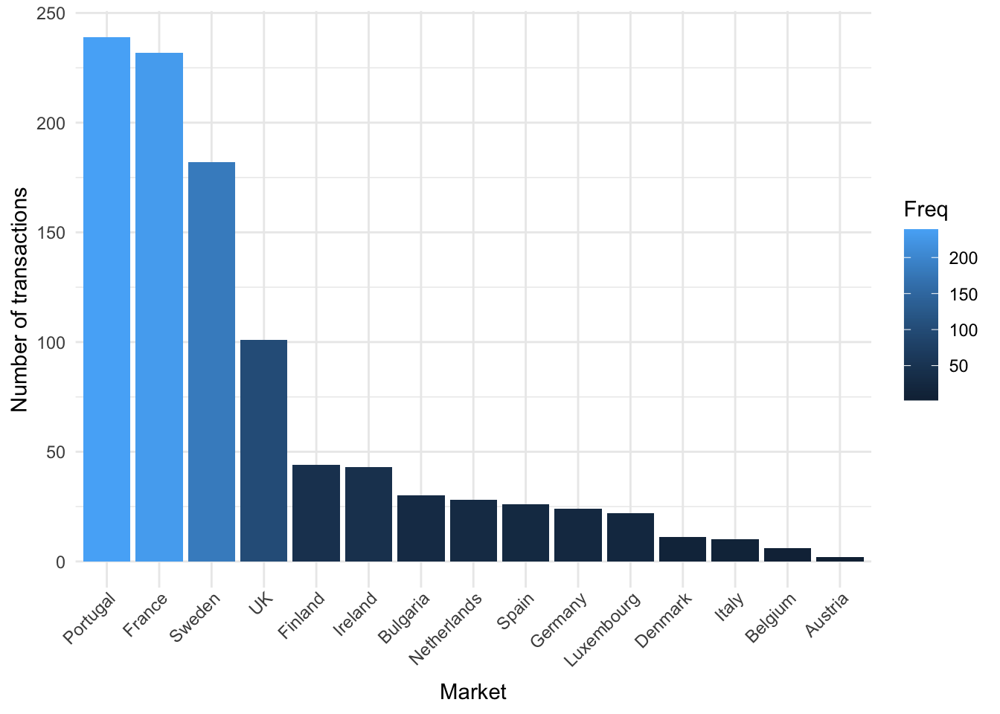
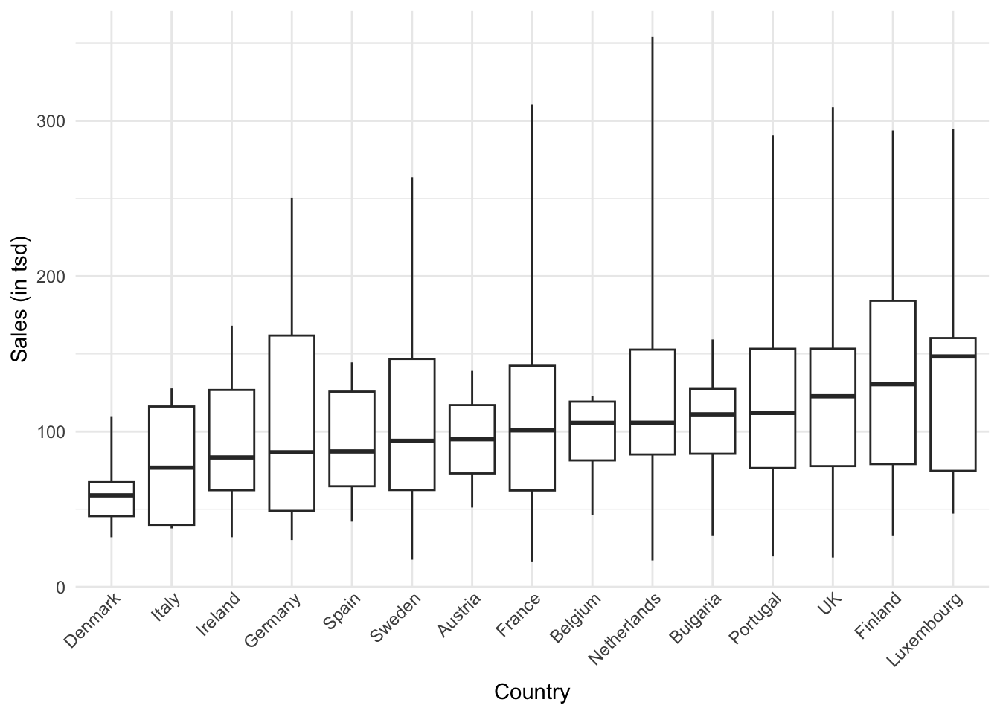

# (PART) Assignments {-}

# R Markdown 


## Introduction to R Markdown

::: {.infobox .download data-latex="{download}"}
[You can download the example markdown file here](./Code/rmarkdown_example.Rmd)
:::

This page will guide you through creating and editing R Markdown documents. This is a useful tool for reporting your analysis (e.g. for homework assignments). Of course, there is also [a cheat sheet for R-Markdown](https://www.rstudio.org/links/r_markdown_cheat_sheet) and [this book](https://bookdown.org/yihui/rmarkdown/) contains a comprehensive discussion of the format. 

The following video contains a short introduction to the R Markdown format.

<br>
<div align="center">
<iframe width="560" height="315" src="https://www.youtube.com/embed/o8FdyMAR-g4" frameborder="0" allowfullscreen></iframe>
</div>
<br>

### Creating a new R Markdown document {-}

In addition to the video, the following text contains a short description of the most important formatting options.  

Let's start to go through the steps of creating and .Rmd file and outputting the content to an HTML file. 

0. If an R-Markdown file was provided to you, open it with R-Studio and skip to [step 4](#step4) after adding your answers.

1. Open R-Studio

2. Create a new R-Markdown document


3. Save with appropriate name


    3.1. Add your answers

    3.2. Save again

 <a name="step4"></a>
 
4. "Knit" to HTML 


5. Hand in appropriate file (ending in `.html`) on learn\@WU


### Text and Equations {-}

R-Markdown documents are plain text files that include both text and R-code. Using RStudio they can be converted ('knitted') to HTML or PDF files that include both the text and the results of the R-code. In fact this website is written using R-Markdown and RStudio. In order for RStudio to be able to interpret the document you have to use certain characters or combinations of characters when formatting text and including R-code to be evaluated. By default the document starts with the options for the text part. You can change the title, date, author and a few more advanced options. 


The default is text mode, meaning that lines in an Rmd document will be interpreted as text, unless specified otherwise.

#### Headings {-}

Usually you want to include some kind of heading to structure your text. A heading is created using `#` signs. A single `#` creates a first level heading, two `##` a second level and so on. 


It is important to note here that the ```#``` symbol means something different within the code chunks as opposed to outside of them. If you continue to put a ```#``` in front of all your regular text, it will all be interpreted as a first level heading, making your text very large.

#### Lists {-}

Bullet point lists are created using `*`, `+` or `-`. Sub-items are created by indenting the item using 4 spaces or 2 tabs. 

````
* First Item
* Second Item
    + first sub-item
        - first sub-sub-item
    + second sub-item
````
* First Item
* Second Item
    + first sub-item
        - first sub-sub-item
    + second sub-item


Ordered lists can be created using numbers and letters. If you need sub-sub-items use `A)` instead of `A.` on the third level. 

````
1. First item
    a. first sub-item
        A) first sub-sub-item 
     b. second sub-item
2. Second item
````

1. First item
    a. first sub-item
        A) first sub-sub-item
    b. second sub-item
2. Second item


#### Text formatting {-}

Text can be formatted in *italics* (`*italics*`) or **bold** (`**bold**`). In addition, you can ad block quotes with `>`

````
> Lorem ipsum dolor amet chillwave lomo ramps, four loko green juice messenger bag raclette forage offal shoreditch chartreuse austin. Slow-carb poutine meggings swag blog, pop-up salvia taxidermy bushwick freegan ugh poke.
````
> Lorem ipsum dolor amet chillwave lomo ramps, four loko green juice messenger bag raclette forage offal shoreditch chartreuse austin. Slow-carb poutine meggings swag blog, pop-up salvia taxidermy bushwick freegan ugh poke.

### R-Code {-}

R-code is contained in so called "chunks". These chunks always start with three backticks and ```r``` in curly braces (``` ```{r} ```) and end with three backticks (``` ``` ```). Optionally, parameters can be added after the ```r``` to influence how a chunk behaves. Additionally, you can also give each chunk a name. Note that these have to be **unique**, otherwise R will refuse to knit your document.

#### Global and chunk options {-}

The first chunk always looks as follows


    ```{r setup, include = FALSE}
    knitr::opts_chunk$set(echo = TRUE)
    ```

It is added to the document automatically and sets options for all the following chunks. These options can be overwritten on a per-chunk basis. 

Keep `knitr::opts_chunk$set(echo = TRUE)` to print your code to the document you will hand in. Changing it to `knitr::opts_chunk$set(echo = FALSE)` will not print your code by default. This can be changed on a per-chunk basis.


    ```{r cars, echo = FALSE}
    summary(cars)

    plot(dist~speed, cars)
    ```


```
##      speed           dist       
##  Min.   : 4.0   Min.   :  2.00  
##  1st Qu.:12.0   1st Qu.: 26.00  
##  Median :15.0   Median : 36.00  
##  Mean   :15.4   Mean   : 42.98  
##  3rd Qu.:19.0   3rd Qu.: 56.00  
##  Max.   :25.0   Max.   :120.00
```


 
    ```{r cars2, echo = TRUE}
    summary(cars)

    plot(dist~speed, cars)
    ```


```r
summary(cars)
```

```
##      speed           dist       
##  Min.   : 4.0   Min.   :  2.00  
##  1st Qu.:12.0   1st Qu.: 26.00  
##  Median :15.0   Median : 36.00  
##  Mean   :15.4   Mean   : 42.98  
##  3rd Qu.:19.0   3rd Qu.: 56.00  
##  Max.   :25.0   Max.   :120.00
```

```r
plot(dist ~ speed, cars)
```


A good overview of all available global/chunk options can be found [here](https://yihui.name/knitr/options/#chunk_options).

### LaTeX Math {-}

Writing well formatted mathematical formulas is done the same way as in [LaTeX](https://en.wikipedia.org/wiki/LaTeX). Math mode is started and ended using `$$`. 
````
$$
 f_1(\omega) = \frac{\sigma^2}{2 \pi},\ \omega \in[-\pi, \pi]
$$
````

$$
 f_1(\omega) = \frac{\sigma^2}{2 \pi},\ \omega \in[-\pi, \pi]
$$

(for those interested this is the spectral density of [white noise](https://en.wikipedia.org/wiki/White_noise))

Including inline mathematical notation is done with a single ```$``` symbol. 

````
${2\over3}$ of my code is inline.

````
${2\over3}$ of my code is inline.

<br>

Take a look at [this wikibook on Mathematics in LaTeX](https://en.wikibooks.org/wiki/LaTeX/Mathematics#Symbols) and [this list of Greek letters and mathematical symbols](https://www.sharelatex.com/learn/List_of_Greek_letters_and_math_symbols) if you are not familiar with LaTeX.

In order to write multi-line equations in the same math environment, use `\\` after every line. In order to insert a space use a single `\`. To render text inside a math environment use `\text{here is the text}`. In order to align equations start with `\begin{align}` and place an `&` in each line at the point around which it should be aligned. Finally end with `\end{align}`

````
$$
\begin{align}
\text{First equation: }\ Y &= X \beta + \epsilon_y,\ \forall X \\
\text{Second equation: }\ X &= Z \gamma + \epsilon_x
\end{align}
$$
````

$$
\begin{align}
\text{First equation: }\ Y &= X \beta + \epsilon_y,\ \forall X \\
\text{Second equation: }\ X &= Z \gamma + \epsilon_x
\end{align}
$$

#### Important symbols {-}

<table class="table table-striped" style="width: auto !important; margin-left: auto; margin-right: auto;">
 <thead>
  <tr>
   <th style="text-align:left;"> Symbol </th>
   <th style="text-align:left;"> Code </th>
  </tr>
 </thead>
<tbody>
  <tr>
   <td style="text-align:left;"> $a^{2} + b$ </td>
   <td style="text-align:left;"> ```a^{2} + b``` </td>
  </tr>
  <tr>
   <td style="text-align:left;"> $a^{2+b}$ </td>
   <td style="text-align:left;"> ```a^{2+b}``` </td>
  </tr>
  <tr>
   <td style="text-align:left;"> $a_{1}$ </td>
   <td style="text-align:left;"> ```a_{1}``` </td>
  </tr>
  <tr>
   <td style="text-align:left;"> $a \leq b$ </td>
   <td style="text-align:left;"> ```a \leq b``` </td>
  </tr>
  <tr>
   <td style="text-align:left;"> $a \geq b$ </td>
   <td style="text-align:left;"> ```a \geq b``` </td>
  </tr>
  <tr>
   <td style="text-align:left;"> $a \neq b$ </td>
   <td style="text-align:left;"> ```a \neq b``` </td>
  </tr>
  <tr>
   <td style="text-align:left;"> $a \approx b$ </td>
   <td style="text-align:left;"> ```a \approx b``` </td>
  </tr>
  <tr>
   <td style="text-align:left;"> $a \in (0,1)$ </td>
   <td style="text-align:left;"> ```a \in (0,1)``` </td>
  </tr>
  <tr>
   <td style="text-align:left;"> $a \rightarrow \infty$ </td>
   <td style="text-align:left;"> ```a \rightarrow \infty``` </td>
  </tr>
  <tr>
   <td style="text-align:left;"> $\frac{a}{b}$ </td>
   <td style="text-align:left;"> ```\frac{a}{b}``` </td>
  </tr>
  <tr>
   <td style="text-align:left;"> $\frac{\partial a}{\partial b}$ </td>
   <td style="text-align:left;"> ```\frac{\partial a}{\partial b}``` </td>
  </tr>
  <tr>
   <td style="text-align:left;"> $\sqrt{a}$ </td>
   <td style="text-align:left;"> ```\sqrt{a}``` </td>
  </tr>
  <tr>
   <td style="text-align:left;"> $\sum_{i = 1}^{b} a_i$ </td>
   <td style="text-align:left;"> ```\sum_{i = 1}^{b} a_i``` </td>
  </tr>
  <tr>
   <td style="text-align:left;"> $\int_{a}^b f(c) dc$ </td>
   <td style="text-align:left;"> ```\int_{a}^b f(c) dc``` </td>
  </tr>
  <tr>
   <td style="text-align:left;"> $\prod_{i = 0}^b a_i$ </td>
   <td style="text-align:left;"> ```\prod_{i = 0}^b a_i``` </td>
  </tr>
  <tr>
   <td style="text-align:left;"> $c \left( \sum_{i=1}^b a_i \right)$ </td>
   <td style="text-align:left;"> ```c \left( \sum_{i=1}^b a_i \right)``` </td>
  </tr>
</tbody>
</table>

The `{}` after `_` and `^` are not strictly necessary if there is only one character in the sub-/superscript. However, in order to place multiple characters in the sub-/superscript they are necessary. 
e.g.


<table class="table table-striped" style="width: auto !important; margin-left: auto; margin-right: auto;">
 <thead>
  <tr>
   <th style="text-align:left;"> Symbol </th>
   <th style="text-align:left;"> Code </th>
  </tr>
 </thead>
<tbody>
  <tr>
   <td style="text-align:left;"> $a^b = a^{b}$ </td>
   <td style="text-align:left;"> ```a^b = a^{b}``` </td>
  </tr>
  <tr>
   <td style="text-align:left;"> $a^b+c \neq a^{b+c}$ </td>
   <td style="text-align:left;"> ```a^b+c \neq a^{b+c}``` </td>
  </tr>
  <tr>
   <td style="text-align:left;"> $\sum_i a_i = \sum_{i} a_{i}$ </td>
   <td style="text-align:left;"> ```\sum_i a_i = \sum_{i} a_{i}``` </td>
  </tr>
  <tr>
   <td style="text-align:left;"> $\sum_{i=1}^{b+c} a_i \neq \sum_i=1^b+c a_i$ </td>
   <td style="text-align:left;"> ```\sum_{i=1}^{b+c} a_i \neq \sum_i=1^b+c a_i``` </td>
  </tr>
</tbody>
</table>

#### Greek letters {-}

[Greek letters](https://en.wikipedia.org/wiki/Greek_alphabet#Letters) are preceded by a `\` followed by their name (`$\beta$` = $\beta$). In order to capitalize them simply capitalize the first letter of the name (`$\Gamma$` = $\Gamma$).


# Assignments: Solutions

## Assignment 1

This is the *technical* solution for the first assignment (i.e., it does not include any interpretations while your solutions should have some for *each task*). Also, plase note that there are multiple possible ways of solving the assignment.

### Load data


```r
library(tidyverse)
library(magrittr)

sales_data <- read.csv2("https://raw.githubusercontent.com/WU-RDS/RMA2024/main/data/Sales-2019-2020_A1.csv",
    sep = ",", header = TRUE)
sales_data %<>%
    mutate(date = as.Date(date, format = "%m/%d/%Y"))
sales_data$year <- format(sales_data$date, "%Y")
sales_data$order_value_EUR <- str_remove(sales_data$order_value_EUR,
    ",")
str(sales_data)
```

```
## 'data.frame':	1000 obs. of  11 variables:
##  $ country        : chr  "Sweden" "Finland" "Portugal" "Portugal" ...
##  $ order_value_EUR: chr  "17524.02" "116563.40" "296465.56" "74532.02" ...
##  $ cost           : chr  "14122.61" "92807.78" "257480.34" "59752.32" ...
##  $ date           : Date, format: "2020-02-12" "2019-09-26" ...
##  $ category       : chr  "Books" "Games" "Clothing" "Beauty" ...
##  $ customer_name  : chr  "Goldner-Dibbert" "Hilll-Vandervort" "Larkin-Collier" "Hessel-Stiedemann" ...
##  $ sales_manager  : chr  "Maxie Marrow" "Hube Corey" "Celine Tumasian" "Celine Tumasian" ...
##  $ sales_rep      : chr  "Madelon Bront" "Wat Bowkley" "Smitty Culverhouse" "Aurelie Wren" ...
##  $ device_type    : chr  "Mobile" "Mobile" "PC" "PC" ...
##  $ order_id       : chr  "70-0511466" "28-6585323" "58-7703341" "14-6700183" ...
##  $ year           : chr  "2020" "2019" "2019" "2020" ...
```

```r
# head(sales_data)
```

First, you should check the data and make sure all variables are recorded correctly (correct variable types). From the output above you can see that ```order_value_EUR``` and ```cost```, which are measured in ratio scales, are not numeric. Hence, you need to fix this: 


```r
sales_data$order_value_EUR = as.numeric(sales_data$order_value_EUR)
sales_data$cost = as.numeric(sales_data$cost)
head(sales_data, 2)
```

<div data-pagedtable="false">
  <script data-pagedtable-source type="application/json">
{"columns":[{"label":["country"],"name":[1],"type":["chr"],"align":["left"]},{"label":["order_value_EUR"],"name":[2],"type":["dbl"],"align":["right"]},{"label":["cost"],"name":[3],"type":["dbl"],"align":["right"]},{"label":["date"],"name":[4],"type":["date"],"align":["right"]},{"label":["category"],"name":[5],"type":["chr"],"align":["left"]},{"label":["customer_name"],"name":[6],"type":["chr"],"align":["left"]},{"label":["sales_manager"],"name":[7],"type":["chr"],"align":["left"]},{"label":["sales_rep"],"name":[8],"type":["chr"],"align":["left"]},{"label":["device_type"],"name":[9],"type":["chr"],"align":["left"]},{"label":["order_id"],"name":[10],"type":["chr"],"align":["left"]},{"label":["year"],"name":[11],"type":["chr"],"align":["left"]}],"data":[{"1":"Sweden","2":"17524.02","3":"14122.61","4":"2020-02-12","5":"Books","6":"Goldner-Dibbert","7":"Maxie Marrow","8":"Madelon Bront","9":"Mobile","10":"70-0511466","11":"2020"},{"1":"Finland","2":"116563.40","3":"92807.78","4":"2019-09-26","5":"Games","6":"Hilll-Vandervort","7":"Hube Corey","8":"Wat Bowkley","9":"Mobile","10":"28-6585323","11":"2019"}],"options":{"columns":{"min":{},"max":[10]},"rows":{"min":[10],"max":[10]},"pages":{}}}
  </script>
</div>


### Q1 

To solve the first task of Question 1, ypu could simply use the ```table()``` and ```arrange()``` functions. By storing the table as data frame, you allow for using it in the bar plot as well:


```r
prop <- as.data.frame(table(sales_data$country))
prop <- prop %>%
    arrange(desc(Freq))
prop
```

<div data-pagedtable="false">
  <script data-pagedtable-source type="application/json">
{"columns":[{"label":["Var1"],"name":[1],"type":["fct"],"align":["left"]},{"label":["Freq"],"name":[2],"type":["int"],"align":["right"]}],"data":[{"1":"Portugal","2":"239"},{"1":"France","2":"232"},{"1":"Sweden","2":"182"},{"1":"UK","2":"101"},{"1":"Finland","2":"44"},{"1":"Ireland","2":"43"},{"1":"Bulgaria","2":"30"},{"1":"Netherlands","2":"28"},{"1":"Spain","2":"26"},{"1":"Germany","2":"24"},{"1":"Luxembourg","2":"22"},{"1":"Denmark","2":"11"},{"1":"Italy","2":"10"},{"1":"Belgium","2":"6"},{"1":"Austria","2":"2"}],"options":{"columns":{"min":{},"max":[10]},"rows":{"min":[10],"max":[10]},"pages":{}}}
  </script>
</div>

```r
ggplot(prop, aes(x = Var1, y = Freq)) + geom_col(aes(x = fct_reorder(Var1,
    -Freq), fill = Freq)) + ylab("Number of transactions") +
    xlab("Market") + theme_minimal() + theme(axis.text.x = element_text(angle = 45,
    vjust = 1.1, hjust = 1))
```



For the next task, it was enough to use conditional frequencies *by year* (because this way, the audience sees the dynamics of transactions shares between markets in Y1 and Y2), or you could show the percentage changes for each market from Y1 to Y2.

```r
round(prop.table(table(select(sales_data, country,
    year)), 2), 3) * 100
```

```
##              year
## country       2019 2020
##   Austria      0.0  0.4
##   Belgium      0.4  0.8
##   Bulgaria     3.1  2.9
##   Denmark      0.8  1.4
##   Finland      4.5  4.3
##   France      26.1 20.4
##   Germany      2.2  2.5
##   Ireland      3.1  5.5
##   Italy        0.8  1.2
##   Luxembourg   2.7  1.8
##   Netherlands  2.2  3.3
##   Portugal    21.0 26.7
##   Spain        3.1  2.2
##   Sweden      19.2 17.3
##   UK          10.8  9.4
```


### Q2 

In this task, you should simply perform grouping and summarizing. The only difference is, in task 1, you only needed one grouping variable (year), while in task 2, you had to use country as well.


```r
s1 <- sales_data %>% group_by(year) %>% summarize(annual_revenue = sum(order_value_EUR), avg_revenue = mean(order_value_EUR))
s1
```

<div data-pagedtable="false">
  <script data-pagedtable-source type="application/json">
{"columns":[{"label":["year"],"name":[1],"type":["chr"],"align":["left"]},{"label":["annual_revenue"],"name":[2],"type":["dbl"],"align":["right"]},{"label":["avg_revenue"],"name":[3],"type":["dbl"],"align":["right"]}],"data":[{"1":"2019","2":"56617524","3":"115546.0"},{"1":"2020","2":"56744214","3":"111263.2"}],"options":{"columns":{"min":{},"max":[10]},"rows":{"min":[10],"max":[10]},"pages":{}}}
  </script>
</div>

```r
s2 <- sales_data %>% group_by(country, year) %>% summarize(annual_revenue = sum(order_value_EUR), avg_revenue = mean(order_value_EUR)) 
s2 <- as.data.frame(s2)
s2
```

<div data-pagedtable="false">
  <script data-pagedtable-source type="application/json">
{"columns":[{"label":["country"],"name":[1],"type":["chr"],"align":["left"]},{"label":["year"],"name":[2],"type":["chr"],"align":["left"]},{"label":["annual_revenue"],"name":[3],"type":["dbl"],"align":["right"]},{"label":["avg_revenue"],"name":[4],"type":["dbl"],"align":["right"]}],"data":[{"1":"Austria","2":"2020","3":"190166.4","4":"95083.18"},{"1":"Belgium","2":"2019","3":"228554.3","4":"114277.15"},{"1":"Belgium","2":"2020","3":"380415.6","4":"95103.91"},{"1":"Bulgaria","2":"2019","3":"1909415.2","4":"127294.35"},{"1":"Bulgaria","2":"2020","3":"1572729.4","4":"104848.63"},{"1":"Denmark","2":"2019","3":"336460.0","4":"84115.01"},{"1":"Denmark","2":"2020","3":"426743.5","4":"60963.35"},{"1":"Finland","2":"2019","3":"2538029.1","4":"115364.96"},{"1":"Finland","2":"2020","3":"3010005.9","4":"136818.45"},{"1":"France","2":"2019","3":"14723094.3","4":"115024.17"},{"1":"France","2":"2020","3":"11177584.1","4":"107476.77"},{"1":"Germany","2":"2019","3":"1409637.3","4":"128148.85"},{"1":"Germany","2":"2020","3":"1384411.2","4":"106493.17"},{"1":"Ireland","2":"2019","3":"2308991.1","4":"153932.74"},{"1":"Ireland","2":"2020","3":"2643293.6","4":"94403.34"},{"1":"Italy","2":"2019","3":"459532.1","4":"114883.02"},{"1":"Italy","2":"2020","3":"476037.2","4":"79339.54"},{"1":"Luxembourg","2":"2019","3":"1672315.1","4":"128639.62"},{"1":"Luxembourg","2":"2020","3":"1241235.3","4":"137915.04"},{"1":"Netherlands","2":"2019","3":"1015879.3","4":"92352.66"},{"1":"Netherlands","2":"2020","3":"2208785.5","4":"129928.56"},{"1":"Portugal","2":"2019","3":"11722952.8","4":"113815.08"},{"1":"Portugal","2":"2020","3":"16073409.1","4":"118186.83"},{"1":"Spain","2":"2019","3":"1489665.7","4":"99311.04"},{"1":"Spain","2":"2020","3":"1009573.9","4":"91779.44"},{"1":"Sweden","2":"2019","3":"10403214.5","4":"110672.49"},{"1":"Sweden","2":"2020","3":"9233989.9","4":"104931.70"},{"1":"UK","2":"2019","3":"6399783.6","4":"120750.63"},{"1":"UK","2":"2020","3":"5715833.7","4":"119079.87"}],"options":{"columns":{"min":{},"max":[10]},"rows":{"min":[10],"max":[10]},"pages":{}}}
  </script>
</div>

```r
sales_data %>% filter(year == 2020) %>% group_by(country) %>% 
ggplot(aes(x = fct_reorder(country, order_value_EUR),
    y = order_value_EUR/1000)) + # to have nicely readable axis points
  geom_boxplot(coef = 3) + labs(x = "Country",
    y = "Sales (in tsd)") + theme_minimal() +
    theme(axis.text.x = element_text(angle = 45, vjust = 1.1,
        hjust = 1), plot.title = element_text(hjust = 0.5,
        color = "#666666"), legend.position = "none")
```




### Q3 

Here are the two ways to solve Question 3: one with ```mutate()``` and another with ```summarize()```. You can see that the second way is slightly more parsimonious. 
Reminder: ROI is calculated as (( total revenue - total cost) / total cost ) * 100. 


```r
roi_mut <- sales_data %>%
    group_by(country) %>%
    mutate(roi_index = (sum(order_value_EUR) - sum(cost))/sum(cost) *
        100) %>%
    arrange(desc(roi_index)) %>%
    select(country, roi_index) %>%
    unique()
roi_mut
```

<div data-pagedtable="false">
  <script data-pagedtable-source type="application/json">
{"columns":[{"label":["country"],"name":[1],"type":["chr"],"align":["left"]},{"label":["roi_index"],"name":[2],"type":["dbl"],"align":["right"]}],"data":[{"1":"Austria","2":"23.12648"},{"1":"Denmark","2":"21.17211"},{"1":"Bulgaria","2":"21.04475"},{"1":"UK","2":"20.39093"},{"1":"Portugal","2":"20.19396"},{"1":"Sweden","2":"20.15162"},{"1":"Ireland","2":"20.11442"},{"1":"France","2":"20.10141"},{"1":"Germany","2":"20.01462"},{"1":"Italy","2":"19.92777"},{"1":"Spain","2":"19.89351"},{"1":"Luxembourg","2":"19.85066"},{"1":"Netherlands","2":"19.47191"},{"1":"Finland","2":"19.34466"},{"1":"Belgium","2":"18.35307"}],"options":{"columns":{"min":{},"max":[10]},"rows":{"min":[10],"max":[10]},"pages":{}}}
  </script>
</div>

```r
roi_sum <- sales_data %>%
    group_by(country) %>%
    summarize(roi_index = (sum(order_value_EUR) - sum(cost))/sum(cost) *
        100) %>%
    arrange(desc(roi_index))
roi_sum
```

<div data-pagedtable="false">
  <script data-pagedtable-source type="application/json">
{"columns":[{"label":["country"],"name":[1],"type":["chr"],"align":["left"]},{"label":["roi_index"],"name":[2],"type":["dbl"],"align":["right"]}],"data":[{"1":"Austria","2":"23.12648"},{"1":"Denmark","2":"21.17211"},{"1":"Bulgaria","2":"21.04475"},{"1":"UK","2":"20.39093"},{"1":"Portugal","2":"20.19396"},{"1":"Sweden","2":"20.15162"},{"1":"Ireland","2":"20.11442"},{"1":"France","2":"20.10141"},{"1":"Germany","2":"20.01462"},{"1":"Italy","2":"19.92777"},{"1":"Spain","2":"19.89351"},{"1":"Luxembourg","2":"19.85066"},{"1":"Netherlands","2":"19.47191"},{"1":"Finland","2":"19.34466"},{"1":"Belgium","2":"18.35307"}],"options":{"columns":{"min":{},"max":[10]},"rows":{"min":[10],"max":[10]},"pages":{}}}
  </script>
</div>

```r
head(roi_mut, 3)
```

<div data-pagedtable="false">
  <script data-pagedtable-source type="application/json">
{"columns":[{"label":["country"],"name":[1],"type":["chr"],"align":["left"]},{"label":["roi_index"],"name":[2],"type":["dbl"],"align":["right"]}],"data":[{"1":"Austria","2":"23.12648"},{"1":"Denmark","2":"21.17211"},{"1":"Bulgaria","2":"21.04475"}],"options":{"columns":{"min":{},"max":[10]},"rows":{"min":[10],"max":[10]},"pages":{}}}
  </script>
</div>

```r
tail(roi_mut, 3)
```

<div data-pagedtable="false">
  <script data-pagedtable-source type="application/json">
{"columns":[{"label":["country"],"name":[1],"type":["chr"],"align":["left"]},{"label":["roi_index"],"name":[2],"type":["dbl"],"align":["right"]}],"data":[{"1":"Netherlands","2":"19.47191"},{"1":"Finland","2":"19.34466"},{"1":"Belgium","2":"18.35307"}],"options":{"columns":{"min":{},"max":[10]},"rows":{"min":[10],"max":[10]},"pages":{}}}
  </script>
</div>


### Q4

This task is quite similar to the prevoius one and could be solved the same way:


```r
categories <- sales_data %>%
    group_by(category) %>%
    mutate(profit = (sum(order_value_EUR) - sum(cost))) %>%
    arrange(desc(profit)) %>%
    select(category, profit) %>%
    unique() %>%
    head(5)  # could also be done with summarize() like in the previous task
categories
```

<div data-pagedtable="false">
  <script data-pagedtable-source type="application/json">
{"columns":[{"label":["category"],"name":[1],"type":["chr"],"align":["left"]},{"label":["profit"],"name":[2],"type":["dbl"],"align":["right"]}],"data":[{"1":"Clothing","2":"2941938"},{"1":"Games","2":"2559796"},{"1":"Appliances","2":"2534879"},{"1":"Electronics","2":"2401133"},{"1":"Books","2":"2225914"}],"options":{"columns":{"min":{},"max":[10]},"rows":{"min":[10],"max":[10]},"pages":{}}}
  </script>
</div>


### Q5

The tricky part in this task could be with "share of sales" - remember that share of sales is a share of revenue, gained by the device type, against the total revenue. This is **not counting** (i.e., ```prop.table()``` would not be the right way to solve this). Instead, you should use the sums of revenues per device type to obtain the shares:


```r
device_sales <- sales_data %>%
    group_by(device_type) %>%
    summarise(sales = sum(order_value_EUR))
device_sales %>%
    mutate(share_of_sales_percentage = round(sales/sum(sales),
        4) * 100)
```

<div data-pagedtable="false">
  <script data-pagedtable-source type="application/json">
{"columns":[{"label":["device_type"],"name":[1],"type":["chr"],"align":["left"]},{"label":["sales"],"name":[2],"type":["dbl"],"align":["right"]},{"label":["share_of_sales_percentage"],"name":[3],"type":["dbl"],"align":["right"]}],"data":[{"1":"Mobile","2":"15447394","3":"13.63"},{"1":"PC","2":"89647284","3":"79.08"},{"1":"Tablet","2":"8267061","3":"7.29"}],"options":{"columns":{"min":{},"max":[10]},"rows":{"min":[10],"max":[10]},"pages":{}}}
  </script>
</div>


