# (PART) Assignments {-}

# R Markdown 


## Introduction to R Markdown

::: {.infobox .download data-latex="{download}"}
[You can download the example markdown file here](./Code/rmarkdown_example.Rmd)
:::

This page will guide you through creating and editing R Markdown documents. This is a useful tool for reporting your analysis (e.g. for homework assignments). Of course, there is also [a cheat sheet for R-Markdown](https://www.rstudio.org/links/r_markdown_cheat_sheet) and [this book](https://bookdown.org/yihui/rmarkdown/) contains a comprehensive discussion of the format. 

The following video contains a short introduction to the R Markdown format.

<br>
<div align="center">
<iframe width="560" height="315" src="https://www.youtube.com/embed/o8FdyMAR-g4" frameborder="0" allowfullscreen></iframe>
</div>
<br>

### Creating a new R Markdown document {-}

In addition to the video, the following text contains a short description of the most important formatting options.  

Let's start to go through the steps of creating and .Rmd file and outputting the content to an HTML file. 

0. If an R-Markdown file was provided to you, open it with R-Studio and skip to [step 4](#step4) after adding your answers.

1. Open R-Studio

2. Create a new R-Markdown document


3. Save with appropriate name


    3.1. Add your answers

    3.2. Save again

 <a name="step4"></a>
 
4. "Knit" to HTML 


5. Hand in appropriate file (ending in `.html`) on learn\@WU


### Text and Equations {-}

R-Markdown documents are plain text files that include both text and R-code. Using RStudio they can be converted ('knitted') to HTML or PDF files that include both the text and the results of the R-code. In fact this website is written using R-Markdown and RStudio. In order for RStudio to be able to interpret the document you have to use certain characters or combinations of characters when formatting text and including R-code to be evaluated. By default the document starts with the options for the text part. You can change the title, date, author and a few more advanced options. 


The default is text mode, meaning that lines in an Rmd document will be interpreted as text, unless specified otherwise.

#### Headings {-}

Usually you want to include some kind of heading to structure your text. A heading is created using `#` signs. A single `#` creates a first level heading, two `##` a second level and so on. 


It is important to note here that the ```#``` symbol means something different within the code chunks as opposed to outside of them. If you continue to put a ```#``` in front of all your regular text, it will all be interpreted as a first level heading, making your text very large.

#### Lists {-}

Bullet point lists are created using `*`, `+` or `-`. Sub-items are created by indenting the item using 4 spaces or 2 tabs. 

````
* First Item
* Second Item
    + first sub-item
        - first sub-sub-item
    + second sub-item
````
* First Item
* Second Item
    + first sub-item
        - first sub-sub-item
    + second sub-item


Ordered lists can be created using numbers and letters. If you need sub-sub-items use `A)` instead of `A.` on the third level. 

````
1. First item
    a. first sub-item
        A) first sub-sub-item 
     b. second sub-item
2. Second item
````

1. First item
    a. first sub-item
        A) first sub-sub-item
    b. second sub-item
2. Second item


#### Text formatting {-}

Text can be formatted in *italics* (`*italics*`) or **bold** (`**bold**`). In addition, you can ad block quotes with `>`

````
> Lorem ipsum dolor amet chillwave lomo ramps, four loko green juice messenger bag raclette forage offal shoreditch chartreuse austin. Slow-carb poutine meggings swag blog, pop-up salvia taxidermy bushwick freegan ugh poke.
````
> Lorem ipsum dolor amet chillwave lomo ramps, four loko green juice messenger bag raclette forage offal shoreditch chartreuse austin. Slow-carb poutine meggings swag blog, pop-up salvia taxidermy bushwick freegan ugh poke.

### R-Code {-}

R-code is contained in so called "chunks". These chunks always start with three backticks and ```r``` in curly braces (``` ```{r} ```) and end with three backticks (``` ``` ```). Optionally, parameters can be added after the ```r``` to influence how a chunk behaves. Additionally, you can also give each chunk a name. Note that these have to be **unique**, otherwise R will refuse to knit your document.

#### Global and chunk options {-}

The first chunk always looks as follows


    ```{r setup, include = FALSE}
    knitr::opts_chunk$set(echo = TRUE)
    ```

It is added to the document automatically and sets options for all the following chunks. These options can be overwritten on a per-chunk basis. 

Keep `knitr::opts_chunk$set(echo = TRUE)` to print your code to the document you will hand in. Changing it to `knitr::opts_chunk$set(echo = FALSE)` will not print your code by default. This can be changed on a per-chunk basis.


    ```{r cars, echo = FALSE}
    summary(cars)

    plot(dist~speed, cars)
    ```


```
##      speed           dist       
##  Min.   : 4.0   Min.   :  2.00  
##  1st Qu.:12.0   1st Qu.: 26.00  
##  Median :15.0   Median : 36.00  
##  Mean   :15.4   Mean   : 42.98  
##  3rd Qu.:19.0   3rd Qu.: 56.00  
##  Max.   :25.0   Max.   :120.00
```


 
    ```{r cars2, echo = TRUE}
    summary(cars)

    plot(dist~speed, cars)
    ```


```r
summary(cars)
```

```
##      speed           dist       
##  Min.   : 4.0   Min.   :  2.00  
##  1st Qu.:12.0   1st Qu.: 26.00  
##  Median :15.0   Median : 36.00  
##  Mean   :15.4   Mean   : 42.98  
##  3rd Qu.:19.0   3rd Qu.: 56.00  
##  Max.   :25.0   Max.   :120.00
```

```r
plot(dist ~ speed, cars)
```


A good overview of all available global/chunk options can be found [here](https://yihui.name/knitr/options/#chunk_options).

### LaTeX Math {-}

Writing well formatted mathematical formulas is done the same way as in [LaTeX](https://en.wikipedia.org/wiki/LaTeX). Math mode is started and ended using `$$`. 
````
$$
 f_1(\omega) = \frac{\sigma^2}{2 \pi},\ \omega \in[-\pi, \pi]
$$
````

$$
 f_1(\omega) = \frac{\sigma^2}{2 \pi},\ \omega \in[-\pi, \pi]
$$

(for those interested this is the spectral density of [white noise](https://en.wikipedia.org/wiki/White_noise))

Including inline mathematical notation is done with a single ```$``` symbol. 

````
${2\over3}$ of my code is inline.

````
${2\over3}$ of my code is inline.

<br>

Take a look at [this wikibook on Mathematics in LaTeX](https://en.wikibooks.org/wiki/LaTeX/Mathematics#Symbols) and [this list of Greek letters and mathematical symbols](https://www.sharelatex.com/learn/List_of_Greek_letters_and_math_symbols) if you are not familiar with LaTeX.

In order to write multi-line equations in the same math environment, use `\\` after every line. In order to insert a space use a single `\`. To render text inside a math environment use `\text{here is the text}`. In order to align equations start with `\begin{align}` and place an `&` in each line at the point around which it should be aligned. Finally end with `\end{align}`

````
$$
\begin{align}
\text{First equation: }\ Y &= X \beta + \epsilon_y,\ \forall X \\
\text{Second equation: }\ X &= Z \gamma + \epsilon_x
\end{align}
$$
````

$$
\begin{align}
\text{First equation: }\ Y &= X \beta + \epsilon_y,\ \forall X \\
\text{Second equation: }\ X &= Z \gamma + \epsilon_x
\end{align}
$$

#### Important symbols {-}

<table class="table table-striped" style="width: auto !important; margin-left: auto; margin-right: auto;">
 <thead>
  <tr>
   <th style="text-align:left;"> Symbol </th>
   <th style="text-align:left;"> Code </th>
  </tr>
 </thead>
<tbody>
  <tr>
   <td style="text-align:left;"> $a^{2} + b$ </td>
   <td style="text-align:left;"> ```a^{2} + b``` </td>
  </tr>
  <tr>
   <td style="text-align:left;"> $a^{2+b}$ </td>
   <td style="text-align:left;"> ```a^{2+b}``` </td>
  </tr>
  <tr>
   <td style="text-align:left;"> $a_{1}$ </td>
   <td style="text-align:left;"> ```a_{1}``` </td>
  </tr>
  <tr>
   <td style="text-align:left;"> $a \leq b$ </td>
   <td style="text-align:left;"> ```a \leq b``` </td>
  </tr>
  <tr>
   <td style="text-align:left;"> $a \geq b$ </td>
   <td style="text-align:left;"> ```a \geq b``` </td>
  </tr>
  <tr>
   <td style="text-align:left;"> $a \neq b$ </td>
   <td style="text-align:left;"> ```a \neq b``` </td>
  </tr>
  <tr>
   <td style="text-align:left;"> $a \approx b$ </td>
   <td style="text-align:left;"> ```a \approx b``` </td>
  </tr>
  <tr>
   <td style="text-align:left;"> $a \in (0,1)$ </td>
   <td style="text-align:left;"> ```a \in (0,1)``` </td>
  </tr>
  <tr>
   <td style="text-align:left;"> $a \rightarrow \infty$ </td>
   <td style="text-align:left;"> ```a \rightarrow \infty``` </td>
  </tr>
  <tr>
   <td style="text-align:left;"> $\frac{a}{b}$ </td>
   <td style="text-align:left;"> ```\frac{a}{b}``` </td>
  </tr>
  <tr>
   <td style="text-align:left;"> $\frac{\partial a}{\partial b}$ </td>
   <td style="text-align:left;"> ```\frac{\partial a}{\partial b}``` </td>
  </tr>
  <tr>
   <td style="text-align:left;"> $\sqrt{a}$ </td>
   <td style="text-align:left;"> ```\sqrt{a}``` </td>
  </tr>
  <tr>
   <td style="text-align:left;"> $\sum_{i = 1}^{b} a_i$ </td>
   <td style="text-align:left;"> ```\sum_{i = 1}^{b} a_i``` </td>
  </tr>
  <tr>
   <td style="text-align:left;"> $\int_{a}^b f(c) dc$ </td>
   <td style="text-align:left;"> ```\int_{a}^b f(c) dc``` </td>
  </tr>
  <tr>
   <td style="text-align:left;"> $\prod_{i = 0}^b a_i$ </td>
   <td style="text-align:left;"> ```\prod_{i = 0}^b a_i``` </td>
  </tr>
  <tr>
   <td style="text-align:left;"> $c \left( \sum_{i=1}^b a_i \right)$ </td>
   <td style="text-align:left;"> ```c \left( \sum_{i=1}^b a_i \right)``` </td>
  </tr>
</tbody>
</table>

The `{}` after `_` and `^` are not strictly necessary if there is only one character in the sub-/superscript. However, in order to place multiple characters in the sub-/superscript they are necessary. 
e.g.


<table class="table table-striped" style="width: auto !important; margin-left: auto; margin-right: auto;">
 <thead>
  <tr>
   <th style="text-align:left;"> Symbol </th>
   <th style="text-align:left;"> Code </th>
  </tr>
 </thead>
<tbody>
  <tr>
   <td style="text-align:left;"> $a^b = a^{b}$ </td>
   <td style="text-align:left;"> ```a^b = a^{b}``` </td>
  </tr>
  <tr>
   <td style="text-align:left;"> $a^b+c \neq a^{b+c}$ </td>
   <td style="text-align:left;"> ```a^b+c \neq a^{b+c}``` </td>
  </tr>
  <tr>
   <td style="text-align:left;"> $\sum_i a_i = \sum_{i} a_{i}$ </td>
   <td style="text-align:left;"> ```\sum_i a_i = \sum_{i} a_{i}``` </td>
  </tr>
  <tr>
   <td style="text-align:left;"> $\sum_{i=1}^{b+c} a_i \neq \sum_i=1^b+c a_i$ </td>
   <td style="text-align:left;"> ```\sum_{i=1}^{b+c} a_i \neq \sum_i=1^b+c a_i``` </td>
  </tr>
</tbody>
</table>

#### Greek letters {-}

[Greek letters](https://en.wikipedia.org/wiki/Greek_alphabet#Letters) are preceded by a `\` followed by their name (`$\beta$` = $\beta$). In order to capitalize them simply capitalize the first letter of the name (`$\Gamma$` = $\Gamma$).


# Assignments: Solutions

## Assignment 1

This is the *technical* solution for the first assignment (i.e., it does not include any interpretations while your solutions should have some for *each task*). Also, plase note that there are multiple possible ways of solving the assignment.

### Load data


```r
library(tidyverse)
library(magrittr)

sales_data <- read.csv2("https://raw.githubusercontent.com/WU-RDS/RMA2024/main/data/Sales-2019-2020_A1.csv",
    sep = ",", header = TRUE)
sales_data %<>%
    mutate(date = as.Date(date, format = "%m/%d/%Y"))
sales_data$year <- format(sales_data$date, "%Y")
sales_data$order_value_EUR <- str_remove(sales_data$order_value_EUR,
    ",")
str(sales_data)
```

```
## 'data.frame':	1000 obs. of  11 variables:
##  $ country        : chr  "Sweden" "Finland" "Portugal" "Portugal" ...
##  $ order_value_EUR: chr  "17524.02" "116563.40" "296465.56" "74532.02" ...
##  $ cost           : chr  "14122.61" "92807.78" "257480.34" "59752.32" ...
##  $ date           : Date, format: "2020-02-12" "2019-09-26" ...
##  $ category       : chr  "Books" "Games" "Clothing" "Beauty" ...
##  $ customer_name  : chr  "Goldner-Dibbert" "Hilll-Vandervort" "Larkin-Collier" "Hessel-Stiedemann" ...
##  $ sales_manager  : chr  "Maxie Marrow" "Hube Corey" "Celine Tumasian" "Celine Tumasian" ...
##  $ sales_rep      : chr  "Madelon Bront" "Wat Bowkley" "Smitty Culverhouse" "Aurelie Wren" ...
##  $ device_type    : chr  "Mobile" "Mobile" "PC" "PC" ...
##  $ order_id       : chr  "70-0511466" "28-6585323" "58-7703341" "14-6700183" ...
##  $ year           : chr  "2020" "2019" "2019" "2020" ...
```

```r
# head(sales_data)
```

First, you should check the data and make sure all variables are recorded correctly (correct variable types). From the output above you can see that ```order_value_EUR``` and ```cost```, which are measured in ratio scales, are not numeric. Hence, you need to fix this: 


```r
sales_data$order_value_EUR = as.numeric(sales_data$order_value_EUR)
sales_data$cost = as.numeric(sales_data$cost)
head(sales_data, 2)
```

<div data-pagedtable="false">
  <script data-pagedtable-source type="application/json">
{"columns":[{"label":["country"],"name":[1],"type":["chr"],"align":["left"]},{"label":["order_value_EUR"],"name":[2],"type":["dbl"],"align":["right"]},{"label":["cost"],"name":[3],"type":["dbl"],"align":["right"]},{"label":["date"],"name":[4],"type":["date"],"align":["right"]},{"label":["category"],"name":[5],"type":["chr"],"align":["left"]},{"label":["customer_name"],"name":[6],"type":["chr"],"align":["left"]},{"label":["sales_manager"],"name":[7],"type":["chr"],"align":["left"]},{"label":["sales_rep"],"name":[8],"type":["chr"],"align":["left"]},{"label":["device_type"],"name":[9],"type":["chr"],"align":["left"]},{"label":["order_id"],"name":[10],"type":["chr"],"align":["left"]},{"label":["year"],"name":[11],"type":["chr"],"align":["left"]}],"data":[{"1":"Sweden","2":"17524.02","3":"14122.61","4":"2020-02-12","5":"Books","6":"Goldner-Dibbert","7":"Maxie Marrow","8":"Madelon Bront","9":"Mobile","10":"70-0511466","11":"2020"},{"1":"Finland","2":"116563.40","3":"92807.78","4":"2019-09-26","5":"Games","6":"Hilll-Vandervort","7":"Hube Corey","8":"Wat Bowkley","9":"Mobile","10":"28-6585323","11":"2019"}],"options":{"columns":{"min":{},"max":[10]},"rows":{"min":[10],"max":[10]},"pages":{}}}
  </script>
</div>


### Q1 

To solve the first task of Question 1, ypu could simply use the ```table()``` and ```arrange()``` functions. By storing the table as data frame, you allow for using it in the bar plot as well:


```r
prop <- as.data.frame(table(sales_data$country))
prop <- prop %>%
    arrange(desc(Freq))
prop
```

<div data-pagedtable="false">
  <script data-pagedtable-source type="application/json">
{"columns":[{"label":["Var1"],"name":[1],"type":["fct"],"align":["left"]},{"label":["Freq"],"name":[2],"type":["int"],"align":["right"]}],"data":[{"1":"Portugal","2":"239"},{"1":"France","2":"232"},{"1":"Sweden","2":"182"},{"1":"UK","2":"101"},{"1":"Finland","2":"44"},{"1":"Ireland","2":"43"},{"1":"Bulgaria","2":"30"},{"1":"Netherlands","2":"28"},{"1":"Spain","2":"26"},{"1":"Germany","2":"24"},{"1":"Luxembourg","2":"22"},{"1":"Denmark","2":"11"},{"1":"Italy","2":"10"},{"1":"Belgium","2":"6"},{"1":"Austria","2":"2"}],"options":{"columns":{"min":{},"max":[10]},"rows":{"min":[10],"max":[10]},"pages":{}}}
  </script>
</div>

```r
ggplot(prop, aes(x = Var1, y = Freq)) + geom_col(aes(x = fct_reorder(Var1,
    -Freq), fill = Freq)) + ylab("Number of transactions") +
    xlab("Market") + theme_minimal() + theme(axis.text.x = element_text(angle = 45,
    vjust = 1.1, hjust = 1))
```


For the next task, it was enough to use conditional frequencies *by year* (because this way, the audience sees the dynamics of transactions shares between markets in Y1 and Y2), or you could show the percentage changes for each market from Y1 to Y2.

```r
round(prop.table(table(select(sales_data, country,
    year)), 2), 3) * 100
```

```
##              year
## country       2019 2020
##   Austria      0.0  0.4
##   Belgium      0.4  0.8
##   Bulgaria     3.1  2.9
##   Denmark      0.8  1.4
##   Finland      4.5  4.3
##   France      26.1 20.4
##   Germany      2.2  2.5
##   Ireland      3.1  5.5
##   Italy        0.8  1.2
##   Luxembourg   2.7  1.8
##   Netherlands  2.2  3.3
##   Portugal    21.0 26.7
##   Spain        3.1  2.2
##   Sweden      19.2 17.3
##   UK          10.8  9.4
```


### Q2 

In this task, you should simply perform grouping and summarizing. The only difference is, in task 1, you only needed one grouping variable (year), while in task 2, you had to use country as well.


```r
s1 <- sales_data %>% group_by(year) %>% summarize(annual_revenue = sum(order_value_EUR), avg_revenue = mean(order_value_EUR))
s1
```

<div data-pagedtable="false">
  <script data-pagedtable-source type="application/json">
{"columns":[{"label":["year"],"name":[1],"type":["chr"],"align":["left"]},{"label":["annual_revenue"],"name":[2],"type":["dbl"],"align":["right"]},{"label":["avg_revenue"],"name":[3],"type":["dbl"],"align":["right"]}],"data":[{"1":"2019","2":"56617524","3":"115546.0"},{"1":"2020","2":"56744214","3":"111263.2"}],"options":{"columns":{"min":{},"max":[10]},"rows":{"min":[10],"max":[10]},"pages":{}}}
  </script>
</div>

```r
s2 <- sales_data %>% group_by(country, year) %>% summarize(annual_revenue = sum(order_value_EUR), avg_revenue = mean(order_value_EUR)) 
s2 <- as.data.frame(s2)
s2
```

<div data-pagedtable="false">
  <script data-pagedtable-source type="application/json">
{"columns":[{"label":["country"],"name":[1],"type":["chr"],"align":["left"]},{"label":["year"],"name":[2],"type":["chr"],"align":["left"]},{"label":["annual_revenue"],"name":[3],"type":["dbl"],"align":["right"]},{"label":["avg_revenue"],"name":[4],"type":["dbl"],"align":["right"]}],"data":[{"1":"Austria","2":"2020","3":"190166.4","4":"95083.18"},{"1":"Belgium","2":"2019","3":"228554.3","4":"114277.15"},{"1":"Belgium","2":"2020","3":"380415.6","4":"95103.91"},{"1":"Bulgaria","2":"2019","3":"1909415.2","4":"127294.35"},{"1":"Bulgaria","2":"2020","3":"1572729.4","4":"104848.63"},{"1":"Denmark","2":"2019","3":"336460.0","4":"84115.01"},{"1":"Denmark","2":"2020","3":"426743.5","4":"60963.35"},{"1":"Finland","2":"2019","3":"2538029.1","4":"115364.96"},{"1":"Finland","2":"2020","3":"3010005.9","4":"136818.45"},{"1":"France","2":"2019","3":"14723094.3","4":"115024.17"},{"1":"France","2":"2020","3":"11177584.1","4":"107476.77"},{"1":"Germany","2":"2019","3":"1409637.3","4":"128148.85"},{"1":"Germany","2":"2020","3":"1384411.2","4":"106493.17"},{"1":"Ireland","2":"2019","3":"2308991.1","4":"153932.74"},{"1":"Ireland","2":"2020","3":"2643293.6","4":"94403.34"},{"1":"Italy","2":"2019","3":"459532.1","4":"114883.02"},{"1":"Italy","2":"2020","3":"476037.2","4":"79339.54"},{"1":"Luxembourg","2":"2019","3":"1672315.1","4":"128639.62"},{"1":"Luxembourg","2":"2020","3":"1241235.3","4":"137915.04"},{"1":"Netherlands","2":"2019","3":"1015879.3","4":"92352.66"},{"1":"Netherlands","2":"2020","3":"2208785.5","4":"129928.56"},{"1":"Portugal","2":"2019","3":"11722952.8","4":"113815.08"},{"1":"Portugal","2":"2020","3":"16073409.1","4":"118186.83"},{"1":"Spain","2":"2019","3":"1489665.7","4":"99311.04"},{"1":"Spain","2":"2020","3":"1009573.9","4":"91779.44"},{"1":"Sweden","2":"2019","3":"10403214.5","4":"110672.49"},{"1":"Sweden","2":"2020","3":"9233989.9","4":"104931.70"},{"1":"UK","2":"2019","3":"6399783.6","4":"120750.63"},{"1":"UK","2":"2020","3":"5715833.7","4":"119079.87"}],"options":{"columns":{"min":{},"max":[10]},"rows":{"min":[10],"max":[10]},"pages":{}}}
  </script>
</div>

```r
sales_data %>% filter(year == 2020) %>% group_by(country) %>% 
ggplot(aes(x = fct_reorder(country, order_value_EUR),
    y = order_value_EUR/1000)) + # to have nicely readable axis points
  geom_boxplot(coef = 3) + labs(x = "Country",
    y = "Sales (in tsd)") + theme_minimal() +
    theme(axis.text.x = element_text(angle = 45, vjust = 1.1,
        hjust = 1), plot.title = element_text(hjust = 0.5,
        color = "#666666"), legend.position = "none")
```


### Q3 

Here are the two ways to solve Question 3: one with ```mutate()``` and another with ```summarize()```. You can see that the second way is slightly more parsimonious. 
Reminder: ROI is calculated as (( total revenue - total cost) / total cost ) * 100. 


```r
roi_mut <- sales_data %>%
    group_by(country) %>%
    mutate(roi_index = (sum(order_value_EUR) - sum(cost))/sum(cost) *
        100) %>%
    arrange(desc(roi_index)) %>%
    select(country, roi_index) %>%
    unique()
roi_mut
```

<div data-pagedtable="false">
  <script data-pagedtable-source type="application/json">
{"columns":[{"label":["country"],"name":[1],"type":["chr"],"align":["left"]},{"label":["roi_index"],"name":[2],"type":["dbl"],"align":["right"]}],"data":[{"1":"Austria","2":"23.12648"},{"1":"Denmark","2":"21.17211"},{"1":"Bulgaria","2":"21.04475"},{"1":"UK","2":"20.39093"},{"1":"Portugal","2":"20.19396"},{"1":"Sweden","2":"20.15162"},{"1":"Ireland","2":"20.11442"},{"1":"France","2":"20.10141"},{"1":"Germany","2":"20.01462"},{"1":"Italy","2":"19.92777"},{"1":"Spain","2":"19.89351"},{"1":"Luxembourg","2":"19.85066"},{"1":"Netherlands","2":"19.47191"},{"1":"Finland","2":"19.34466"},{"1":"Belgium","2":"18.35307"}],"options":{"columns":{"min":{},"max":[10]},"rows":{"min":[10],"max":[10]},"pages":{}}}
  </script>
</div>

```r
roi_sum <- sales_data %>%
    group_by(country) %>%
    summarize(roi_index = (sum(order_value_EUR) - sum(cost))/sum(cost) *
        100) %>%
    arrange(desc(roi_index))
roi_sum
```

<div data-pagedtable="false">
  <script data-pagedtable-source type="application/json">
{"columns":[{"label":["country"],"name":[1],"type":["chr"],"align":["left"]},{"label":["roi_index"],"name":[2],"type":["dbl"],"align":["right"]}],"data":[{"1":"Austria","2":"23.12648"},{"1":"Denmark","2":"21.17211"},{"1":"Bulgaria","2":"21.04475"},{"1":"UK","2":"20.39093"},{"1":"Portugal","2":"20.19396"},{"1":"Sweden","2":"20.15162"},{"1":"Ireland","2":"20.11442"},{"1":"France","2":"20.10141"},{"1":"Germany","2":"20.01462"},{"1":"Italy","2":"19.92777"},{"1":"Spain","2":"19.89351"},{"1":"Luxembourg","2":"19.85066"},{"1":"Netherlands","2":"19.47191"},{"1":"Finland","2":"19.34466"},{"1":"Belgium","2":"18.35307"}],"options":{"columns":{"min":{},"max":[10]},"rows":{"min":[10],"max":[10]},"pages":{}}}
  </script>
</div>

```r
head(roi_mut, 3)
```

<div data-pagedtable="false">
  <script data-pagedtable-source type="application/json">
{"columns":[{"label":["country"],"name":[1],"type":["chr"],"align":["left"]},{"label":["roi_index"],"name":[2],"type":["dbl"],"align":["right"]}],"data":[{"1":"Austria","2":"23.12648"},{"1":"Denmark","2":"21.17211"},{"1":"Bulgaria","2":"21.04475"}],"options":{"columns":{"min":{},"max":[10]},"rows":{"min":[10],"max":[10]},"pages":{}}}
  </script>
</div>

```r
tail(roi_mut, 3)
```

<div data-pagedtable="false">
  <script data-pagedtable-source type="application/json">
{"columns":[{"label":["country"],"name":[1],"type":["chr"],"align":["left"]},{"label":["roi_index"],"name":[2],"type":["dbl"],"align":["right"]}],"data":[{"1":"Netherlands","2":"19.47191"},{"1":"Finland","2":"19.34466"},{"1":"Belgium","2":"18.35307"}],"options":{"columns":{"min":{},"max":[10]},"rows":{"min":[10],"max":[10]},"pages":{}}}
  </script>
</div>


### Q4

This task is quite similar to the prevoius one and could be solved the same way:


```r
categories <- sales_data %>%
    group_by(category) %>%
    mutate(profit = (sum(order_value_EUR) - sum(cost))) %>%
    arrange(desc(profit)) %>%
    select(category, profit) %>%
    unique() %>%
    head(5)  # could also be done with summarize() like in the previous task
categories
```

<div data-pagedtable="false">
  <script data-pagedtable-source type="application/json">
{"columns":[{"label":["category"],"name":[1],"type":["chr"],"align":["left"]},{"label":["profit"],"name":[2],"type":["dbl"],"align":["right"]}],"data":[{"1":"Clothing","2":"2941938"},{"1":"Games","2":"2559796"},{"1":"Appliances","2":"2534879"},{"1":"Electronics","2":"2401133"},{"1":"Books","2":"2225914"}],"options":{"columns":{"min":{},"max":[10]},"rows":{"min":[10],"max":[10]},"pages":{}}}
  </script>
</div>


### Q5

The tricky part in this task could be with "share of sales" - remember that share of sales is a share of revenue, gained by the device type, against the total revenue. This is **not counting** (i.e., ```prop.table()``` would not be the right way to solve this). Instead, you should use the sums of revenues per device type to obtain the shares:


```r
device_sales <- sales_data %>%
    group_by(device_type) %>%
    summarise(sales = sum(order_value_EUR))
device_sales %>%
    mutate(share_of_sales_percentage = round(sales/sum(sales),
        4) * 100)
```

<div data-pagedtable="false">
  <script data-pagedtable-source type="application/json">
{"columns":[{"label":["device_type"],"name":[1],"type":["chr"],"align":["left"]},{"label":["sales"],"name":[2],"type":["dbl"],"align":["right"]},{"label":["share_of_sales_percentage"],"name":[3],"type":["dbl"],"align":["right"]}],"data":[{"1":"Mobile","2":"15447394","3":"13.63"},{"1":"PC","2":"89647284","3":"79.08"},{"1":"Tablet","2":"8267061","3":"7.29"}],"options":{"columns":{"min":{},"max":[10]},"rows":{"min":[10],"max":[10]},"pages":{}}}
  </script>
</div>


## Assignment 2


```r
library(tidyverse)
library(psych)
library(Hmisc)
library(ggstatsplot)
options(scipen = 999)

sales_data <- read.table("https://raw.githubusercontent.com/IMSMWU/MRDA2018/master/data/assignment4.dat",
    sep = "\t", header = TRUE)  #read in data
sales_data$market_id <- 1:nrow(sales_data)
head(sales_data)
```

<div data-pagedtable="false">
  <script data-pagedtable-source type="application/json">
{"columns":[{"label":["tv_adspend"],"name":[1],"type":["dbl"],"align":["right"]},{"label":["online_adspend"],"name":[2],"type":["dbl"],"align":["right"]},{"label":["radio_adspend"],"name":[3],"type":["int"],"align":["right"]},{"label":["sales"],"name":[4],"type":["dbl"],"align":["right"]},{"label":["market_id"],"name":[5],"type":["int"],"align":["right"]}],"data":[{"1":"68.6","2":"10.3","3":"24","4":"8.6","5":"1"},{"1":"136.6","2":"29.0","3":"40","4":"15.8","5":"2"},{"1":"14.5","2":"44.3","3":"25","4":"11.8","5":"3"},{"1":"214.6","2":"26.2","3":"40","4":"17.1","5":"4"},{"1":"285.0","2":"13.9","3":"31","4":"17.4","5":"5"},{"1":"139.6","2":"74.9","3":"24","4":"24.4","5":"6"}],"options":{"columns":{"min":{},"max":[10]},"rows":{"min":[10],"max":[10]},"pages":{}}}
  </script>
</div>

```r
str(sales_data)
```

```
## 'data.frame':	236 obs. of  5 variables:
##  $ tv_adspend    : num  68.6 136.6 14.5 214.6 285 ...
##  $ online_adspend: num  10.3 29 44.3 26.2 13.9 74.9 31.1 14.1 24.5 13.9 ...
##  $ radio_adspend : int  24 40 25 40 31 24 12 9 38 18 ...
##  $ sales         : num  8.6 15.8 11.8 17.1 17.4 24.4 19.5 4.7 20.7 19.5 ...
##  $ market_id     : int  1 2 3 4 5 6 7 8 9 10 ...
```

### Q1

In a first step, we specify the regression equation. In this case, sales is the **dependent variable** which is regressed on the different types of advertising expenditures that represent the **independent variables** for product *i*. Thus, the regression equation is:
  
$$sales_{i}=\beta_0 + \beta_1 * tv\_adspend_{i} + \beta_2 * online\_adspend_{i} + \beta_3 * radio\_adspend_{i} + \epsilon$$
  
This equation will be used later to turn the output of the regression analysis (namely the coefficients: $\beta_0$ - intersect coefficient, and $\beta_1$, $\beta_2$, and $\beta_3$ that represent the unknown relationship between sales and advertising expenditures on TV, online channels and radio, respectively) to the "managerial" form and draw marketing conclusions.  

### Q2

The descriptive statistics for the variables can be checked using the ```describe()``` function:
  

```r
psych::describe(sales_data)
```

```
##                vars   n   mean    sd median trimmed    mad min   max range skew
## tv_adspend        1 236 148.65 89.77 141.85  147.45 117.27 1.1 299.6 298.5 0.12
## online_adspend    2 236  25.61 14.33  24.35   24.70  14.53 1.6  74.9  73.3 0.61
## radio_adspend     3 236  27.70 12.57  27.00   27.36  13.34 2.0  63.0  61.0 0.22
## sales             4 236  14.83  5.40  14.15   14.72   5.93 1.4  29.0  27.6 0.16
## market_id         5 236 118.50 68.27 118.50  118.50  87.47 1.0 236.0 235.0 0.00
##                kurtosis   se
## tv_adspend        -1.26 5.84
## online_adspend     0.08 0.93
## radio_adspend     -0.53 0.82
## sales             -0.57 0.35
## market_id         -1.22 4.44
```

Inspecting the correlation matrix reveals that the sales variable is positively correlated with TV advertising and online advertising expenditures. The correlations among the independent variables appear to be low to moderate. 


```r
rcorr(as.matrix(sales_data[, c("sales", "tv_adspend",
    "online_adspend", "radio_adspend")]))
```

```
##                sales tv_adspend online_adspend radio_adspend
## sales           1.00       0.78           0.54         -0.04
## tv_adspend      0.78       1.00           0.05          0.03
## online_adspend  0.54       0.05           1.00         -0.07
## radio_adspend  -0.04       0.03          -0.07          1.00
## 
## n= 236 
## 
## 
## P
##                sales  tv_adspend online_adspend radio_adspend
## sales                 0.0000     0.0000         0.5316       
## tv_adspend     0.0000            0.4127         0.6735       
## online_adspend 0.0000 0.4127                    0.2790       
## radio_adspend  0.5316 0.6735     0.2790
```

Since we have continuous variables, we use scatterplots to investigate the relationship between sales and each of the predictor variables.


```r
ggplot(sales_data, aes(x = tv_adspend, y = sales)) +
    geom_point(shape = 1) + geom_smooth(method = "lm",
    fill = "gray", color = "lavenderblush3", alpha = 0.1) +
    theme_minimal()
ggplot(sales_data, aes(x = online_adspend, y = sales)) +
    geom_point(shape = 1) + geom_smooth(method = "lm",
    fill = "gray", color = "lavenderblush3", alpha = 0.1) +
    theme_minimal()
ggplot(sales_data, aes(x = radio_adspend, y = sales)) +
    geom_point(shape = 1) + geom_smooth(method = "lm",
    fill = "gray", color = "lavenderblush3", alpha = 0.1) +
    theme_minimal()
```

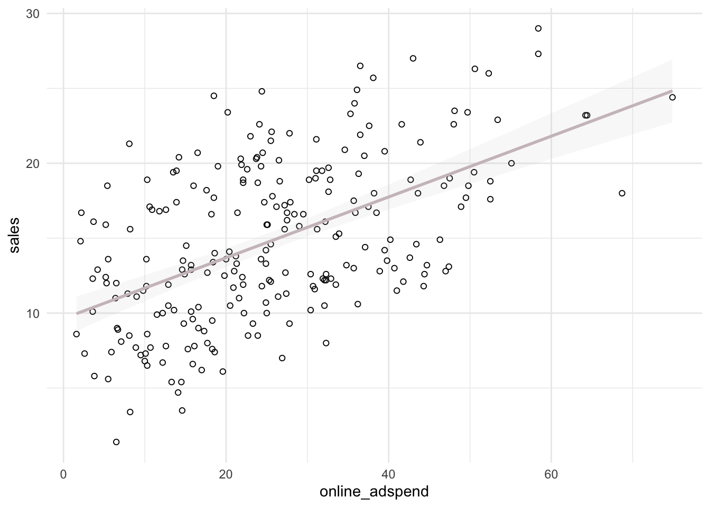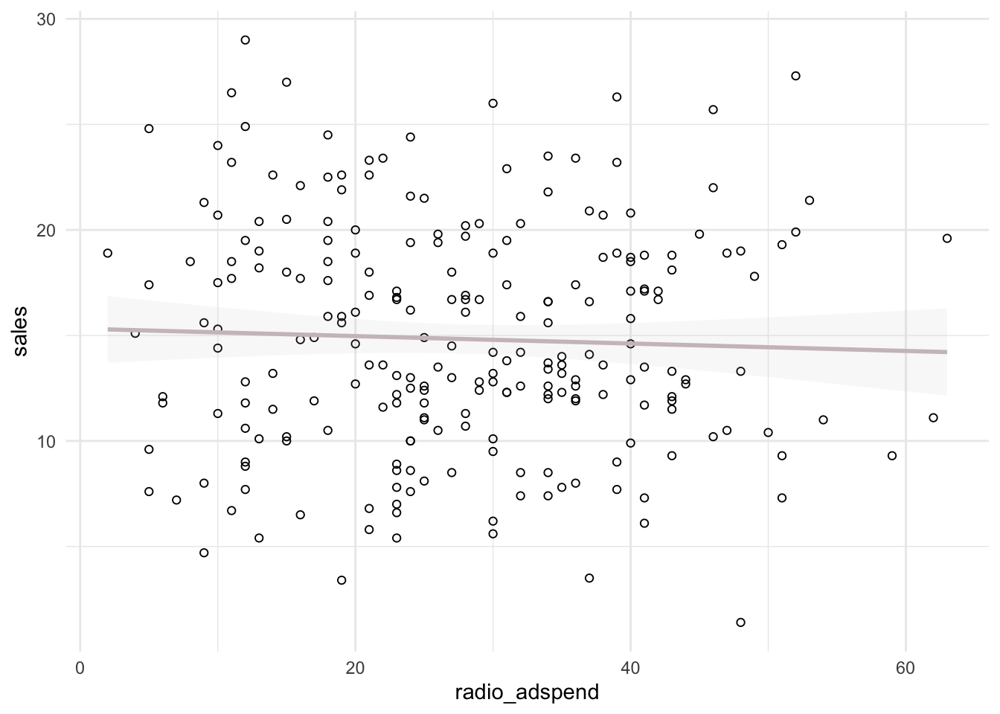

The plots including the fitted lines from a simple linear model already suggest that there might be a positive linear relationship between sales and TV- and online-advertising. However, there does not appear to be a strong relationship between sales and radio advertising. 

Further steps include estimate of a multiple linear regression model in order to determine the relative influence of each type of advertising on sales.

### Q3

The estimate the model, we will use the ```lm()``` function:
  

```r
linear_model <- lm(sales ~ tv_adspend + online_adspend +
    radio_adspend, data = sales_data)
```

In a next step, we will investigate the results from the model using the ```summary()``` function. 


```r
summary(linear_model)
```

```
## 
## Call:
## lm(formula = sales ~ tv_adspend + online_adspend + radio_adspend, 
##     data = sales_data)
## 
## Residuals:
##     Min      1Q  Median      3Q     Max 
## -5.1113 -1.4161 -0.0656  1.3233  5.5198 
## 
## Coefficients:
##                 Estimate Std. Error t value             Pr(>|t|)    
## (Intercept)     3.604140   0.460057   7.834    0.000000000000169 ***
## tv_adspend      0.045480   0.001491  30.508 < 0.0000000000000002 ***
## online_adspend  0.186859   0.009359  19.965 < 0.0000000000000002 ***
## radio_adspend  -0.011469   0.010656  -1.076                0.283    
## ---
## Signif. codes:  0 '***' 0.001 '**' 0.01 '*' 0.05 '.' 0.1 ' ' 1
## 
## Residual standard error: 2.048 on 232 degrees of freedom
## Multiple R-squared:  0.8582,	Adjusted R-squared:  0.8564 
## F-statistic: 468.1 on 3 and 232 DF,  p-value: < 0.00000000000000022
```


For each of the individual predictors, we test the following hypothesis: 
  
$$H_0: \beta_k=0$$
$$H_1: \beta_k\ne0$$
  
where k denotes the number of the regression coefficient. In the present example, we reject the null hypothesis for tv_adspend and online_adspend, where we observe a significant effect (i.e., p-value < 0.05). However, we fail to reject the null for the "radio_adspend" variable (i.e., the effect is insignificant). 

The interpretation of the coefficients is as follows: 
  
* tv_adspend (&beta;<sub>1</sub>): when TV advertising expenditures increase by 1000 Euro, sales will increase by 45 units;
* online_adspend (&beta;<sub>2</sub>): when online advertising expenditures increase by 1000 Euro, sales will increase by 187 units;
* radio_adspend (&beta;<sub>3</sub>): when radio advertising expenditures increase by 1000 Euro, sales will increase by -11 units (i.e., decrease by 11 units).

You should always provide a measure of uncertainty that is associated with the estimates. You could compute the confidence intervals around the coefficients using the ```confint()``` function.


```r
confint(linear_model)
```

```
##                      2.5 %     97.5 %
## (Intercept)     2.69771633 4.51056393
## tv_adspend      0.04254244 0.04841668
## online_adspend  0.16841843 0.20529924
## radio_adspend  -0.03246402 0.00952540
```

The results show that, for example, the 95% confidence interval associated with coefficient capturing the effect of online advertising on sales is between 0.168 and 0.205. 

Regarding the model fit, the R<sup>2</sup> statistic tells us that **approximately 86% of the variance can be explained by the model**. This can be visualized as follows: 
  

```r
sales_data$yhat <- predict(linear_model)
ggplot(sales_data, aes(yhat, sales)) + geom_point(size = 2,
    shape = 1) + scale_x_continuous(name = "predicted values") +
    scale_y_continuous(name = "observed values") +
    geom_abline(intercept = 0, slope = 1) + theme_minimal()
```


In addition, the output tells us that our predictions on average deviate from the observed values by 2048 units (see residual standard error, remember that the sales variable is measures in thousand units).

Of course, you could have also used the functions included in the ggstatsplot package to report the results from your regression model. 


```r
ggcoefstats(x = linear_model, k = 3, title = "Sales predicted by TV-, online-, & radio advertising")
```

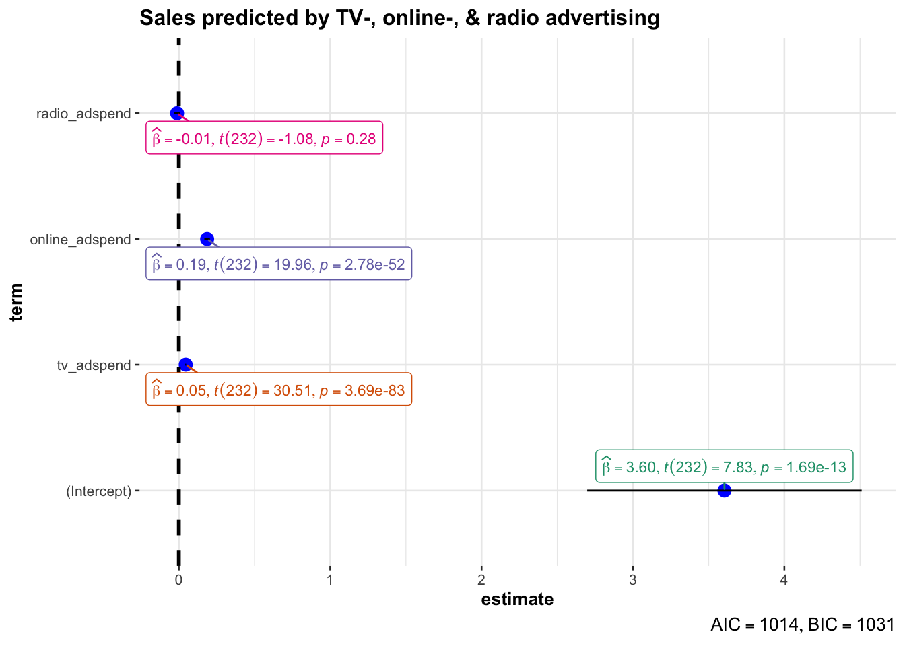

### Q4

Finally, we can predict the outcome for the given marketing mix using the following equation: 
  
$$\hat{Sales} = \beta_0 + \beta_1*150 + \beta_2*26 + \beta_3*15 $$
  
The coefficients can be extracted from the summary of the linear model and used for quick sales value prediction as follows:


```r
summary(linear_model)$coefficients[1, 1] + summary(linear_model)$coefficients[2,
    1] * 150 + summary(linear_model)$coefficients[3,
    1] * 26 + summary(linear_model)$coefficients[4,
    1] * 15
```

```
## [1] 15.11236
```

$$\hat{sales}= 3.6 + 0.045*150 + 0.187*26 + 0.011*15 = 15.11$$
  
This means that given the planned marketing mix, we would expect to sell around 15,112 units. 


## Assignment 3


```r
library(ggplot2)
library(psych)
library(dplyr)
library(ggiraph)
library(ggiraphExtra)
library(NbClust)
library(factoextra)
library(GPArotation)
options(scipen = 999)
set.seed(123)
track_data <- read.table("https://raw.githubusercontent.com/WU-RDS/RMA2022/main/data/tracks_cluster.csv",
    sep = ";", header = TRUE, dec = ",")  #read data
str(track_data)
```

```
## 'data.frame':	672 obs. of  14 variables:
##  $ isrc            : chr  "USCM51700084" "USUM71601827" "USCM51600080" "USCM51500238" ...
##  $ trackName       : chr  "Fake Love" "Into You" "Controlla" "Hotline Bling" ...
##  $ artistName      : chr  "Drake" "Ariana Grande" "Drake" "Drake" ...
##  $ danceability    : num  0.928 0.636 0.607 0.903 0.49 0.56 0.638 0.356 0.513 0.653 ...
##  $ energy          : num  0.481 0.727 0.476 0.62 0.743 0.442 0.924 0.924 0.683 0.839 ...
##  $ loudness        : num  -9.35 -5.85 -11.08 -8.09 -5.16 ...
##  $ mode            : int  0 1 0 1 0 1 1 1 1 1 ...
##  $ speechiness     : num  0.287 0.106 0.249 0.0587 0.0409 0.0243 0.0359 0.0808 0.032 0.0685 ...
##  $ acousticness    : num  0.105 0.0161 0.0773 0.0035 0.255 0.727 0.002 0.001 0.339 0.0369 ...
##  $ instrumentalness: num  0 0.00000112 0 0.0001 0.00000721 0 0.0002 0 0.739 0 ...
##  $ liveness        : num  0.176 0.151 0.113 0.0504 0.3 0.11 0.149 0.0953 0.0871 0.068 ...
##  $ valence         : num  0.613 0.358 0.347 0.539 0.363 0.212 0.529 0.232 0.153 0.669 ...
##  $ tempo           : num  134 108 123 135 90 ...
##  $ duration_ms     : int  210937 244453 245227 267067 258827 309600 263787 222587 355172 216281 ...
```

### Q1

We can standardize the relevant variables as follows:
  

```r
# standardize variables track_data <-
# distinct(track_data)
track_data_scale <- track_data %>%
    mutate_at(vars(danceability:duration_ms), scale)
track_data_scale <- track_data_scale %>%
    mutate_at(vars(danceability:duration_ms), as.vector)
```

### Q2

Now we can create histograms of the respective variables to inspect their distributions:
  

```r
ggplot(track_data_scale, aes(x = danceability)) + geom_histogram(color = "white",
    fill = "lavenderblush3") + theme_bw()
```


```r
ggplot(track_data_scale, aes(x = energy)) + geom_histogram(color = "white",
    fill = "lavenderblush3") + theme_bw()
```


```r
ggplot(track_data_scale, aes(x = loudness)) + geom_histogram(color = "white",
    fill = "lavenderblush3") + theme_bw()
```

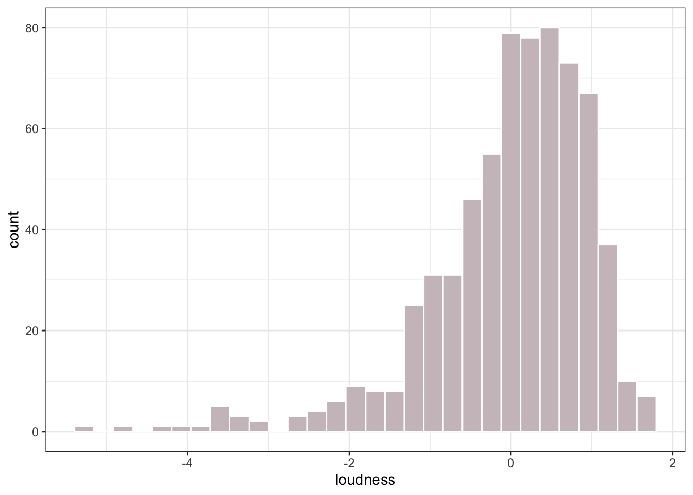

```r
ggplot(track_data_scale, aes(x = mode)) + geom_histogram(color = "white",
    fill = "lavenderblush3") + theme_bw()
```


```r
ggplot(track_data_scale, aes(x = speechiness)) + geom_histogram(color = "white",
    fill = "lavenderblush3") + theme_bw()
```

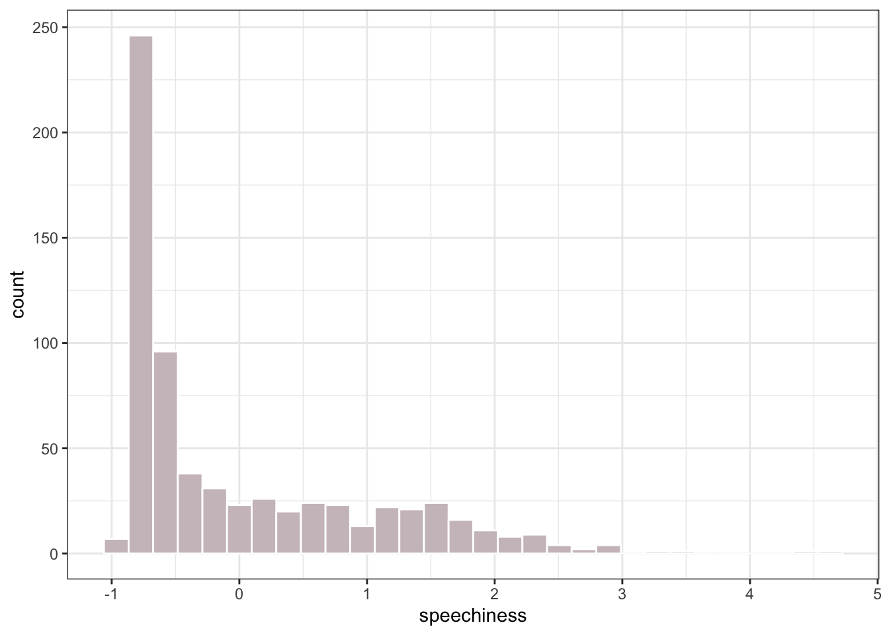

```r
ggplot(track_data_scale, aes(x = acousticness)) + geom_histogram(color = "white",
    fill = "lavenderblush3") + theme_bw()
```

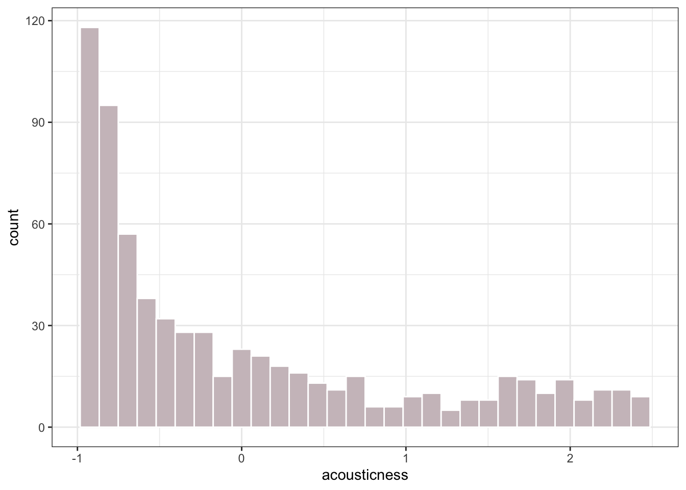

```r
ggplot(track_data_scale, aes(x = instrumentalness)) +
    geom_histogram(color = "white", fill = "lavenderblush3") +
    theme_bw()
```

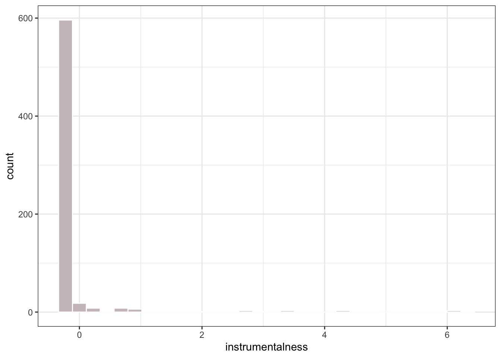

```r
ggplot(track_data_scale, aes(x = liveness)) + geom_histogram(color = "white",
    fill = "lavenderblush3") + theme_bw()
```


```r
ggplot(track_data_scale, aes(x = valence)) + geom_histogram(color = "white",
    fill = "lavenderblush3") + theme_bw()
```

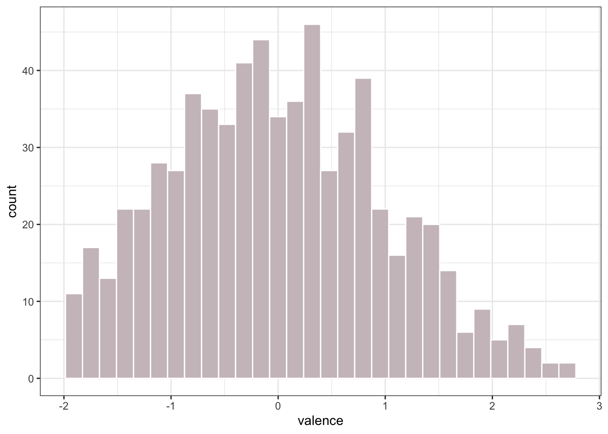

```r
ggplot(track_data_scale, aes(x = tempo)) + geom_histogram(color = "white",
    fill = "lavenderblush3") + theme_bw()
```

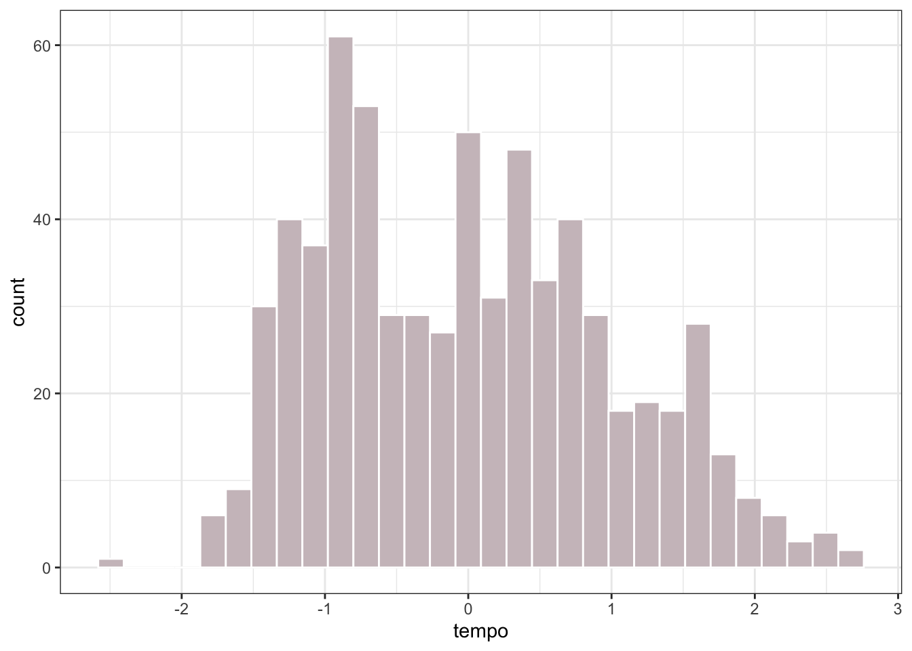

```r
ggplot(track_data_scale, aes(x = duration_ms)) + geom_histogram(color = "white",
    fill = "lavenderblush3") + theme_bw()
```

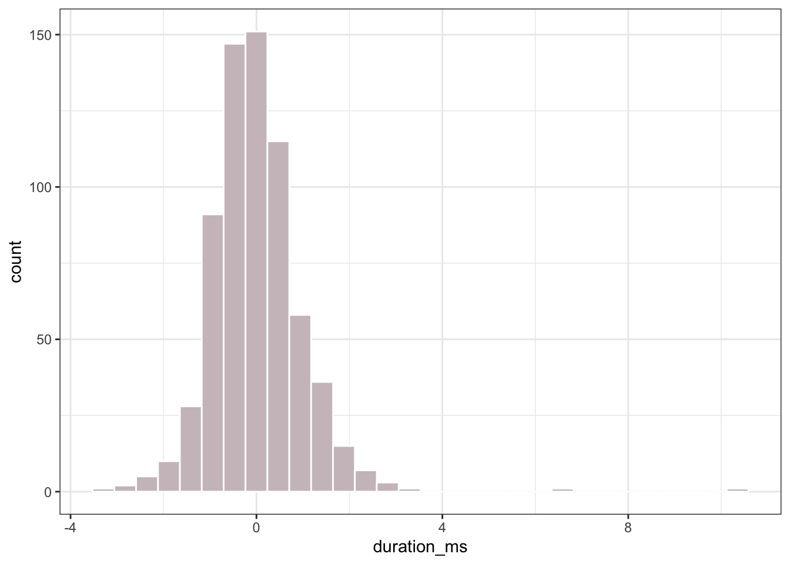

The distributions of the variables reveal nothing that would disqualify them from being included in the cluster analysis (e.g., severe outliers, etc.).

### Q3

The optimal number of clusters may be derived as follows (recall that you might get different results due to different starting values for the algorithm):
  

```r
# optimal number of clusters
opt_K <- NbClust(track_data_scale %>%
    select(danceability:duration_ms), method = "kmeans",
    max.nc = 11)
```

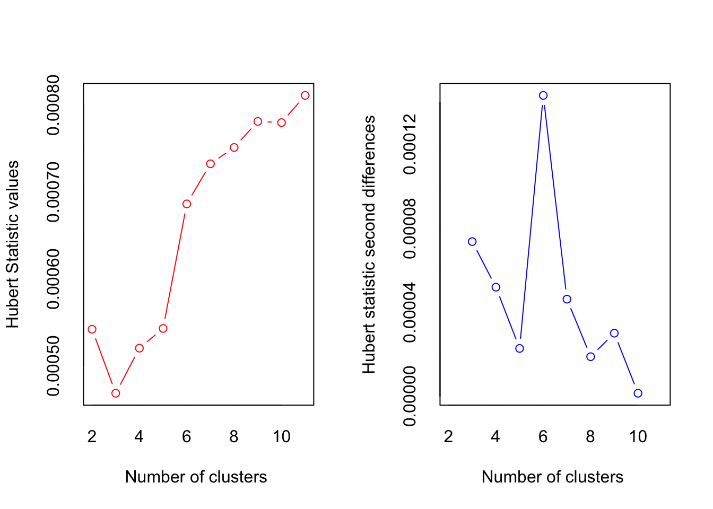

```
## *** : The Hubert index is a graphical method of determining the number of clusters.
##                 In the plot of Hubert index, we seek a significant knee that corresponds to a 
##                 significant increase of the value of the measure i.e the significant peak in Hubert
##                 index second differences plot. 
## 
```

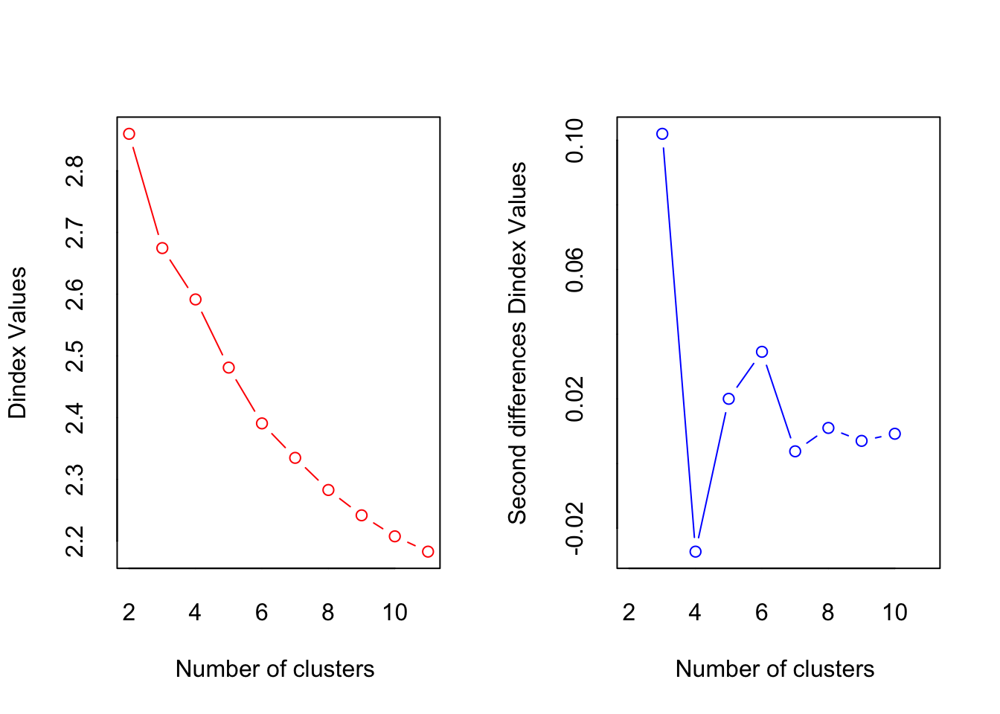

```
## *** : The D index is a graphical method of determining the number of clusters. 
##                 In the plot of D index, we seek a significant knee (the significant peak in Dindex
##                 second differences plot) that corresponds to a significant increase of the value of
##                 the measure. 
##  
## ******************************************************************* 
## * Among all indices:                                                
## * 6 proposed 2 as the best number of clusters 
## * 7 proposed 3 as the best number of clusters 
## * 5 proposed 6 as the best number of clusters 
## * 1 proposed 8 as the best number of clusters 
## * 3 proposed 10 as the best number of clusters 
## * 2 proposed 11 as the best number of clusters 
## 
##                    ***** Conclusion *****                            
##  
## * According to the majority rule, the best number of clusters is  3 
##  
##  
## *******************************************************************
```

```r
table(opt_K$Best.nc["Number_clusters", ])
```

```
## 
##  0  2  3  6  8 10 11 
##  2  6  7  5  1  3  2
```

According to the output, the optimal number of clusters is 3 (see the majority rule).

### Q4

Now we can run the analysis using 3 clusters by simply executing this code:
  

```r
kmeans_tracks <- kmeans(track_data_scale %>%
    select(danceability:duration_ms), 3)
```

### Q5

We can describe and characterize the clusters as follows. In a first step, we can inspect the mean values of the cluster variables by cluster. 
  

```r
kmeans_tracks$centers
```

```
##   danceability     energy    loudness       mode speechiness acousticness
## 1   -0.2602781  0.2417217  0.01501135  0.2147370  0.52514714   -0.2406802
## 2    0.1636830  0.3459136  0.38654145 -0.1179780  0.08249594   -0.3530631
## 3   -0.4121850 -1.2841741 -1.30190556  0.2829333 -0.55017187    1.3075661
##   instrumentalness   liveness     valence        tempo  duration_ms
## 1       -0.2361200  2.3128056  0.02472127 -0.004596109 -0.002528358
## 2       -0.2007537 -0.2636833  0.21054905  0.060654445 -0.063026825
## 3        0.7952815 -0.3239152 -0.71777967 -0.200662562  0.212321991
```

```r
centers <- data.frame(kmeans_tracks$centers)
centers$cluster <- 1:3
ggRadar(centers, aes(color = cluster), rescale = FALSE) +
    ggtitle("Centers") + theme_bw()
```

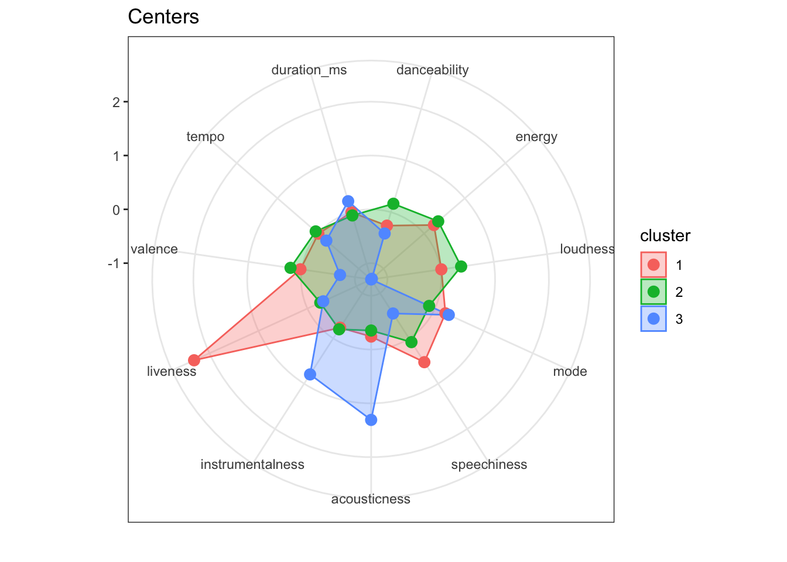
  
This analysis reveals that there is one cluster (cluster 1) that exhibits comparatively high levels of liveness and speechiness and another cluster (cluster 3) that is characterized by high levels of acousticness and instrumentalness. Cluster 2 appears to have moderate values on all dimensions. 

We can further characterize the clusters by inspecting the artists in each cluster:
  

```r
track_data$cluster <- as.factor(kmeans_tracks$cluster)
ggplot(track_data, aes(y = cluster, fill = artistName)) +
    geom_bar() + theme_bw()
```

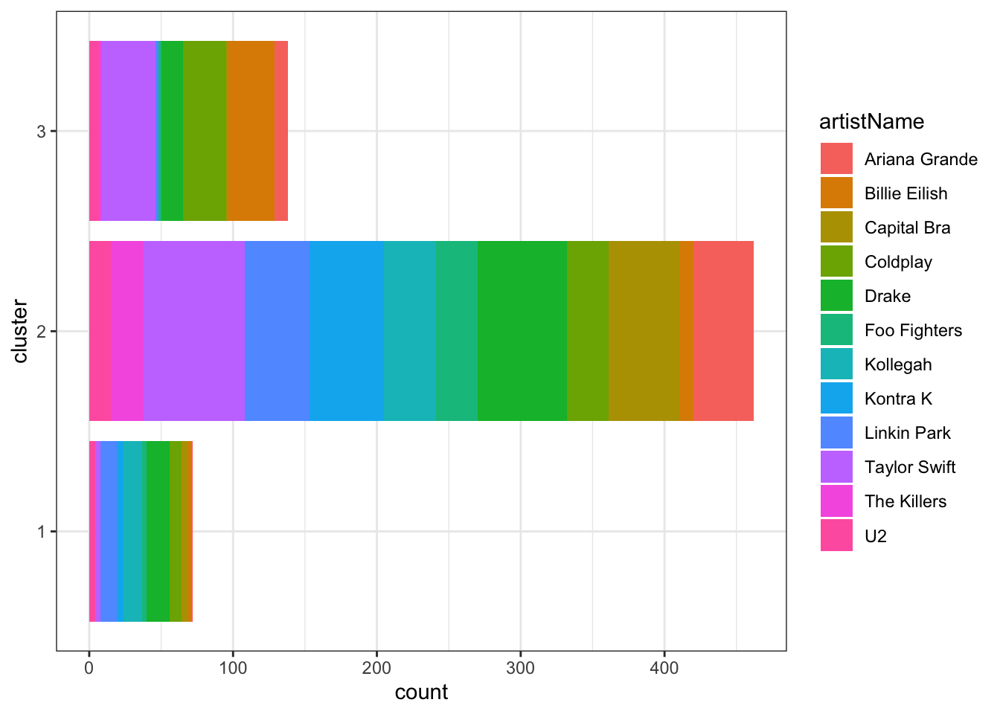

We can also count how many songs each artist has in each cluster:
  

```r
table(track_data$artistName, track_data$cluster)
```

```
##                
##                  1  2  3
##   Ariana Grande  1 42  9
##   Billie Eilish  2  9 32
##   Capital Bra    5 50  2
##   Coldplay       8 29 30
##   Drake         16 62 15
##   Foo Fighters   3 29  2
##   Kollegah      13 36  0
##   Kontra K       5 52  0
##   Linkin Park   11 45  2
##   Taylor Swift   4 70 37
##   The Killers    0 23  2
##   U2             4 15  7
```

It appears that cluster 1 consists of songs by rap artists such as Kontra K, Cpaital Bra, and Drake, while cluster 3 consists of songs by artists such as Coldplay and Taylor Swift. Cluster 2 is a mix of songs by different artists. This appears consistent with the analysis of the song features from the previous plot. 

Finally, we can group the songs by cluster and visualize their association with the first two principal components from a pca-analysis. Although this reduces the information compared to the original 11 variables, we cannot meaningfully display the 11 dimensions in detail.


```r
fviz_cluster(kmeans_tracks, data = track_data_scale %>%
    select(danceability:duration_ms), palette = hcl.colors(3,
    palette = "Dynamic"), geom = "point", ellipse.type = "convex",
    ggtheme = theme_bw())
```

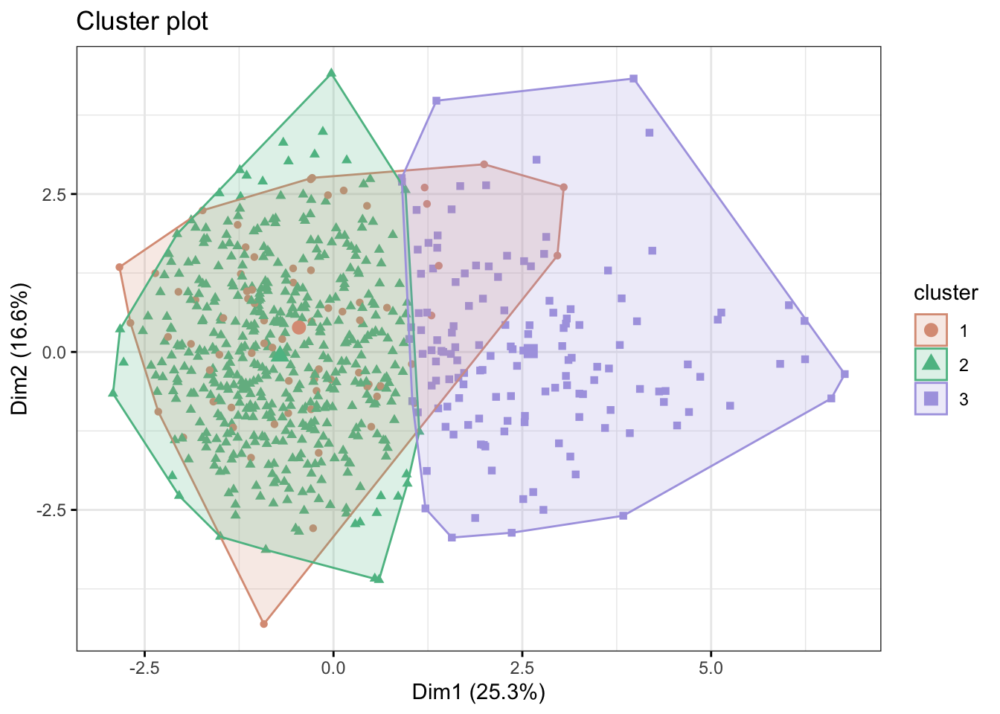

Although the two dimensions only represent a fraction (approx. 41%) of the variation across the 11 dimensions, the plot shows that the cluster separates the songs rather well, since each cluster has a sizable area that is not overlapping with any of the other clusters. 

### Q6

For our playlist, let's first see in which cluster the song is:
 

```r
track_data %>%
    filter(trackName == "Monkey Wrench") %>%
    select(trackName, artistName, cluster)
```

<div data-pagedtable="false">
  <script data-pagedtable-source type="application/json">
{"columns":[{"label":["trackName"],"name":[1],"type":["chr"],"align":["left"]},{"label":["artistName"],"name":[2],"type":["chr"],"align":["left"]},{"label":["cluster"],"name":[3],"type":["fct"],"align":["left"]}],"data":[{"1":"Monkey Wrench","2":"Foo Fighters","3":"2"}],"options":{"columns":{"min":{},"max":[10]},"rows":{"min":[10],"max":[10]},"pages":{}}}
  </script>
</div>

The song is in cluster number 2, so we can select any song from this cluster for our playlist:


```r
recommendations <- track_data %>%
    filter(cluster == 2)
head(recommendations)
```

<div data-pagedtable="false">
  <script data-pagedtable-source type="application/json">
{"columns":[{"label":["isrc"],"name":[1],"type":["chr"],"align":["left"]},{"label":["trackName"],"name":[2],"type":["chr"],"align":["left"]},{"label":["artistName"],"name":[3],"type":["chr"],"align":["left"]},{"label":["danceability"],"name":[4],"type":["dbl"],"align":["right"]},{"label":["energy"],"name":[5],"type":["dbl"],"align":["right"]},{"label":["loudness"],"name":[6],"type":["dbl"],"align":["right"]},{"label":["mode"],"name":[7],"type":["int"],"align":["right"]},{"label":["speechiness"],"name":[8],"type":["dbl"],"align":["right"]},{"label":["acousticness"],"name":[9],"type":["dbl"],"align":["right"]},{"label":["instrumentalness"],"name":[10],"type":["dbl"],"align":["right"]},{"label":["liveness"],"name":[11],"type":["dbl"],"align":["right"]},{"label":["valence"],"name":[12],"type":["dbl"],"align":["right"]},{"label":["tempo"],"name":[13],"type":["dbl"],"align":["right"]},{"label":["duration_ms"],"name":[14],"type":["int"],"align":["right"]},{"label":["cluster"],"name":[15],"type":["fct"],"align":["left"]}],"data":[{"1":"USCM51700084","2":"Fake Love","3":"Drake","4":"0.928","5":"0.481","6":"-9.350","7":"0","8":"0.2870","9":"0.1050","10":"0.00000000","11":"0.1760","12":"0.613","13":"134.007","14":"210937","15":"2"},{"1":"USUM71601827","2":"Into You","3":"Ariana Grande","4":"0.636","5":"0.727","6":"-5.852","7":"1","8":"0.1060","9":"0.0161","10":"0.00000112","11":"0.1510","12":"0.358","13":"107.988","14":"244453","15":"2"},{"1":"USCM51600080","2":"Controlla","3":"Drake","4":"0.607","5":"0.476","6":"-11.076","7":"0","8":"0.2490","9":"0.0773","10":"0.00000000","11":"0.1130","12":"0.347","13":"122.976","14":"245227","15":"2"},{"1":"USCM51500238","2":"Hotline Bling","3":"Drake","4":"0.903","5":"0.620","6":"-8.094","7":"1","8":"0.0587","9":"0.0035","10":"0.00010000","11":"0.0504","12":"0.539","13":"134.960","14":"267067","15":"2"},{"1":"GBAYE1500979","2":"Hymn for the Weekend","3":"Coldplay","4":"0.490","5":"0.743","6":"-5.155","7":"0","8":"0.0409","9":"0.2550","10":"0.00000721","11":"0.3000","12":"0.363","13":"89.974","14":"258827","15":"2"},{"1":"GBAYE1500981","2":"Adventure of a Lifetime","3":"Coldplay","4":"0.638","5":"0.924","6":"-3.887","7":"1","8":"0.0359","9":"0.0020","10":"0.00020000","11":"0.1490","12":"0.529","13":"111.995","14":"263787","15":"2"}],"options":{"columns":{"min":{},"max":[10]},"rows":{"min":[10],"max":[10]},"pages":{}}}
  </script>
</div>
